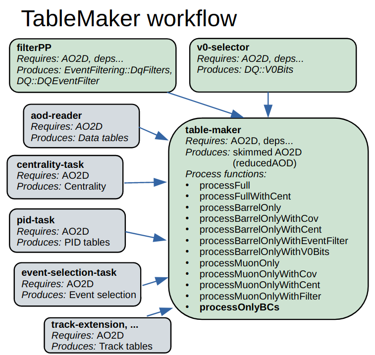

## Get started

In the past, some hands-on sessions have been organised within the PWG-DQ. A list of the corresponding indico events is down below:

**most recent:**
1. O2 DQ hands-on session (7 Dec 21) [indico event](https://indico.cern.ch/event/1098200/) , [ZOOM recordings of the first part of the session](https://indico.cern.ch/event/1098200/sessions/419561/attachments/2362418/4033057/videoPlenarySession.mp4)
2. O2 DQ hands-on session (April 2022) [indico event](https://indico.cern.ch/event/1150382/)
3. O2 Analysis tutorial (Oct 2022) [indico event](https://indico.cern.ch/event/1200252/timetable/?view=standard)
4. O2 DQ hands-on session (13 Dec 22) [indico event](https://indico.cern.ch/event/1220887/), [ZOOM recordings, DQ User Interfce](https://indico.cern.ch/event/1220887/contributions/5168779/attachments/2568116/4427919/afternoon_session.mp4)

# Dileptons-Quarkonia (DQ) analysis framework

## Contact

Coordinators: Ionut Christian Arsene, Fiorella Fionda, Michael Andreas Winn

Mattermost channel: [O2-DQ Analysis Framework Alpha](https://mattermost.web.cern.ch/alice/channels/o2-dq-analysis-framework-alpha)

## Code

* Tasks used by the dileptons-quarkonia analysis framework are in the
[`PWGDQ`](https://github.com/AliceO2Group/O2Physics/tree/master/PWGDQ) directory.
* Class to handle analysis variables are defined in
[`VarManager.h`](https://github.com/AliceO2Group/O2Physics/blob/master/PWGDQ/Core/VarManager.h).
* Class to define and fill histograms are defined in
[`HistogramManager.h`](https://github.com/AliceO2Group/O2Physics/blob/master/PWGDQ/Core/HistogramManager.h).
* Class to set predefined selection cuts (either AnalysisCut or AnalysisCompositeCut) are defined in
[`CutsLibrary.h`](https://github.com/AliceO2Group/O2Physics/blob/master/PWGDQ/Core/CutsLibrary.h).
* Class for analysis cuts applied on the variables defined in the VarManager is defined in
[`AnalysisCut.h`](https://github.com/AliceO2Group/O2Physics/blob/master/PWGDQ/Core/AnalysisCut.h) class.
* Cut class manipulating groups of cuts are defined in
[`AnalysisCompositeCut.h`](https://github.com/AliceO2Group/O2Physics/blob/master/PWGDQ/Core/AnalysisCompositeCut.h) class.
* Class to store the options for a Monte-Carlo prong history based on the particle identification (PID) defined in
[`MCProng.h`](https://github.com/AliceO2Group/O2Physics/blob/master/PWGDQ/Core/MCProng.h) class.
* Class for define a Monte-Carlo "signal" used to match a given Monte-Carlo truth is defined in
[`MCSignal.h`](https://github.com/AliceO2Group/O2Physics/blob/master/PWGDQ/Core/MCSignal.h) class.
* Class to handle analysis Monte Carlo Signals are defined in
[`MCSignalLibrary.h`](https://github.com/AliceO2Group/O2Physics/blob/master/PWGDQ/Core/MCSignalLibrary.h) class.
* Mixing handler for event mixing defined in
[`MixingHandler.h`](https://github.com/AliceO2Group/O2Physics/blob/master/PWGDQ/Core/MixingHandler.h) class.
* Mixing Library for event mixing defined in
[`MixingLibrary.h`](https://github.com/AliceO2Group/O2Physics/blob/master/PWGDQ/Core/MixingLibrary.h) class.
* DQ Data Model (Reduced tracks, events, muons etc.) is defined in
[`ReducedInfoTables.h`](https://github.com/AliceO2Group/O2Physics/blob/master/PWGDQ/DataModel/ReducedInfoTables.h) class.
* Code for easy running of the DQ tasks and output processing can be found in the
[Run3Analysisvalidation](https://github.com/AliceO2Group/Run3Analysisvalidation) repository.
  * Analysis code for postprocessing of the task output is collected in the
  [`FirstAnalysis`](https://github.com/AliceO2Group/Run3Analysisvalidation/tree/master/FirstAnalysis) directory.

## Existing Workflows

* [`TableMaker.cxx`](https://github.com/AliceO2Group/O2Physics/blob/master/PWGDQ/TableProducer/tableMaker.cxx) Create skimmed data tables for DQ analysis from central barrel and muon AODs. This contains a task which produces skimmed data tables with selected event information, barrel track and muon track information.
* [`TableReader.cxx`](https://github.com/AliceO2Group/O2Physics/blob/master/PWGDQ/Tasks/tableReader.cxx) Analyze DQ skimmed data tables. This workflow runs a few tasks: event selection, barrel track selection, muon track selection, jpsi candidate creation and selection, jpsi + track combination (invariant mass, correlations, etc)
* [`filterPP.cxx`](https://github.com/AliceO2Group/O2Physics/blob/master/PWGDQ/Tasks/filterPP.cxx) Produces a decision table for pp collisions. The decisions require that at least a selected pair (or just two tracks) exists for a given event. Currently up to 64 simultaneous decisions can be made, to facilitate studies for optimizing cuts. it computes multiple event-wise decisions based on “high-level” triggers, e.g. at least one dielectron / dimuon in the event
* [`TableMakerMC.cxx`](https://github.com/AliceO2Group/O2Physics/blob/master/PWGDQ/TableProducer/tableMakerMC.cxx) Create skimmed data tables for DQ analysis from central barrel MC AODs (MUON tables to be added). This contains a task which produces skimmed data tables with selected reconstructed and generator level event information, and barrel track reconstructed and generated information. The generator level particles are selected using the MCSignal class (see below for details).
* [`dqEfficiency.cxx`](https://github.com/AliceO2Group/O2Physics/blob/master/PWGDQ/Tasks/dqEfficiency.cxx) Analysis task for processing O2::DQ MC skimmed AODs.
* [`v0selector.cxx`](https://github.com/AliceO2Group/O2Physics/blob/master/PWGDQ/Tasks/v0selector.cxx) Select barrel tracks which belong to clean V0 and cascade topologies. This code loops over a V0Data table and produces some standard analysis output for select clean V0 sample.
* [`dileptonMuMu.cxx`](https://github.com/AliceO2Group/O2Physics/blob/master/PWGDQ/Tasks/dileptonMuMu.cxx) It refers to The dimuon analysis task. It’s a derivative of the tableReader, but with muon only informations.  takes tracks flaged as « muon » and creates Pairs calculating mass, rapidity, pT.

## Python Interface
To simplify the handling and usage of the O2-DQ framework a [python interface](https://github.com/ctolon/PythonInterfaceOOP) has been developed and will be maintained for further user support.

Its main features are:

- run tasks with simple commands (all main workflows are included)
- dependencies are selected and set with no need to specify them in the command line
- auto completion for workflows, settings and configurables

To get started, a [detailed introduction](https://github.com/ctolon/PythonInterfaceOOP#user-python-based-interface) has been written and an introduction was given in the [hands-on session](https://indico.cern.ch/event/1220887/) (Dec 22).

## AliHyperloop

[JIRA tickets](https://alice.its.cern.ch/jira/browse/PWGDQ-57?jql=project%20%3D%20PWGDQ%20AND%20issuetype%20%3D%20Analysis)
of the DQ analyses on [AliHyperloop](https://alimonitor.cern.ch/hyperloop/).

## DQ Data Model

Simplified graph of the data model involved in a single DQ analysis is shown in the following picture.

## DQ Skimmed Data Model

Simplified graph of the skimmed data model involved in a single DQ analysis is shown in the following picture.

## TableMaker Workflow

Simplified graph of the TableMaker workflow involved in a single DQ analysis is shown in the following picture.

## TableMakerMC Workflow

Simplified graph of the TableMakerMC workflow involved in a single DQ analysis is shown in the following picture.

## TableReader Workflow

Simplified graph of the TableReader workflow involved in a single DQ analysis is shown in the following picture.

## DQEfficiency WorkfFlow

Simplified graph of the DQEfficiency workflow involved in a single DQ analysis is shown in the following picture.

