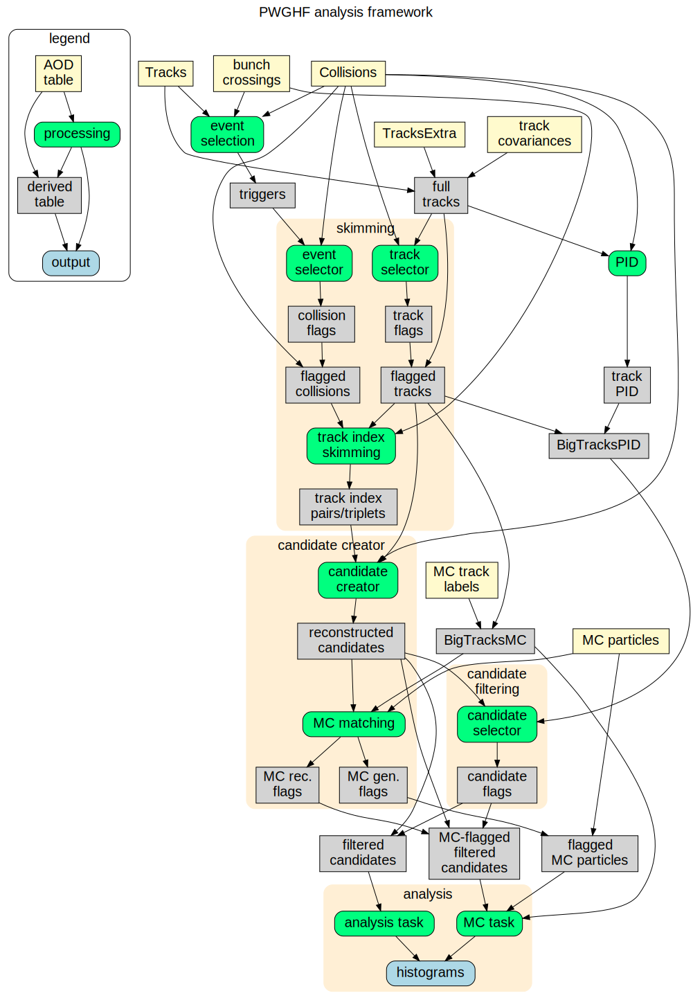

# Heavy-flavour (HF) analysis framework

## Get started

- See the materials from the [HF O2 hackathon](https://indico.cern.ch/event/1101005/)
(includes introduction to O2, O2 HF, tutorials,...) and watch the
[Zoom recordings of the sessions](https://videos.cern.ch/deposit/project/cbe4869a27f749b7b45ea66577ca8a9f) (7, 9 Dec 2021).
- See the [presentation on HF vertexing and analysis](https://indico.cern.ch/event/1200252/timetable/#10-hf-vertexing-and-analysis)
and the [HF analysis example](https://indico.cern.ch/event/1200252/timetable/#23-hands-on-session-4-analysis)
from the [O2 Analysis Tutorial](https://indico.cern.ch/event/1200252/) (13–14 Oct 2022).
- See the [HF hands-on session](https://indico.cern.ch/event/1267433/timetable/#b-504545-parallel-hands-on-pwg)
from the [O2 Analysis Tutorial 2.0](https://indico.cern.ch/event/1267433/) (17-28 Apr 2023).

## Contact

Coordinators: Francesco Prino, Vít Kučera

Mattermost channel: [hf-o2-analysis](https://mattermost.web.cern.ch/alice/channels/hf-o2-analysis)

## Code

- Code used by the heavy-flavour analysis framework are in the
[`PWGHF`](https://github.com/AliceO2Group/O2Physics/tree/master/PWGHF) directory.
- Tables produced by skimming and candidate creators are defined in
[`CandidateReconstructionTables.h`](https://github.com/AliceO2Group/O2Physics/blob/master/PWGHF/DataModel/CandidateReconstructionTables.h).
- Tables produced by candidate selectors are defined in
[`CandidateSelectionTables.h`](https://github.com/AliceO2Group/O2Physics/blob/master/PWGHF/DataModel/CandidateSelectionTables.h).
- Default parameters used in the selection of single tracks, track-index skims and candidates are defined in
[`SelectorCuts.h`](https://github.com/AliceO2Group/O2Physics/blob/master/PWGHF/Core/SelectorCuts.h).
- Secondary-vertex reconstruction algorithms are implemented in the
[`DCAFitterN`](https://github.com/AliceO2Group/AliceO2/blob/dev/Common/DCAFitter/include/DCAFitter/DCAFitterN.h) class.
- Functions for calculations of kinematic quantities and for MC matching are implemented in the
[`RecoDecay`](https://github.com/AliceO2Group/O2Physics/blob/master/Common/Core/RecoDecay.h) class.
- Selection of tracks based on the particle identification (PID) detectors is performed via the
[`TrackSelectorPID`](https://github.com/AliceO2Group/O2Physics/blob/master/Common/Core/TrackSelectorPID.h) class.
- Code for easy local running of the HF tasks and output processing can be found in the
[Run3Analysisvalidation](https://github.com/AliceO2Group/Run3Analysisvalidation) repository.
  - Analysis code for postprocessing of the task output is collected in the
  [`FirstAnalysis`](https://github.com/AliceO2Group/Run3Analysisvalidation/tree/master/FirstAnalysis) directory.

## AliHyperloop

<!-- markdown-link-check-disable -->
[AliHyperloop analyses](https://alimonitor.cern.ch/hyperloop/all-analyses)
<!-- markdown-link-check-enable -->
(Type "PWGHF" in the field "JIRA" to filter.) 
Corresponding [JIRA tickets](https://alice.its.cern.ch/jira/issues/?jql=project%20%3D%20PWGHF%20AND%20%22Run%203%20analysis%22%20%3D%20Yes)

## Framework structure

Simplified graph of the workflows and tasks involved in a single HF analysis is shown in the following picture.
Individual components are described in the next section below.

## Framework components

### Track index skimming

Workflow: `o2-analysis-hf-track-index-skim-creator` 
File: [`trackIndexSkimCreator.cxx`](https://github.com/AliceO2Group/O2Physics/blob/master/PWGHF/TableProducer/trackIndexSkimCreator.cxx)

#### Track and event selection

Tracks and collisions are flagged with selection decisions.
Tracks selection is based on reconstruction quality and kinematic criteria.
Collisions are selected based on the required triggers.

#### Track combination and protocandidate preselection

Double and triple loops over the selected tracks in each selected event are performed to combine tracks into *protocandidates*.
Very loose selection criteria are applied (invariant mass and *p*T of the protocandidate) to reject fake candidates before secondary-vertex finding.
Secondary vertex is reconstructed for the selected track pairs and triplets and the tracks are propagated to the decay vertex.
A first selection at the candidate level is applied (candidate *p*T, cosine of pointing angle, product of prong impact parameters).

Indices of the daughter tracks of selected candidates are stored as columns of a new derived table (*track index skim table*),
together with a flag indicating for which decay channel(s) the candidate was selected.

### Candidate creation and MC matching

Workflows: `o2-analysis-hf-candidate-creator-<particle|decay>` 
Files: `candidateCreator<Particle|Decay>.cxx` 
Directories: [`PWGHF/TableProducer`](https://github.com/AliceO2Group/O2Physics/tree/master/PWGHF/TableProducer), `PWGHF/*/TableProducer`

#### Candidate creation

Track indices in the track index skim table are used to build full decay candidates.
The secondary-vertex reconstruction is repeated and additional candidate properties,
that are needed for the signal selection and cannot be calculated dynamically on-the-fly,
are computed (e.g. uncertainties of quantities computed in the vertex reconstruction procedure).

The complete list of quantities needed for the final candidate selection and analysis are stored
in a derived table of reconstructed candidates (*candidate table*).

#### MC matching

For simulated data, reconstructed decay candidates are matched with their generated counterparts
by checking the correspondence between the candidate prongs and the expected decay tree.
The MC matching procedure is performed also for generated MC particles by checking their identity and their decay tree.
Particle origin is determined by inspecting the decay tree to identify non-prompt particles, produced from b quarks.

Derived tables with MC flags used for the estimation of the signal efficiencies and the optimisation of the signal and background selections are produced.

### Candidate selection

Workflows: `o2-analysis-hf-candidate-selector-<particle|decay>` 
Files: `candidateSelector<Particle|Decay>.cxx` 
Directories: [`PWGHF/TableProducer`](https://github.com/AliceO2Group/O2Physics/tree/master/PWGHF/TableProducer), `PWGHF/*/TableProducer`

In a dedicated selector task, tailored for each decay channel, accurate analysis level selection criteria
based on decay topology and PID are applied to the reconstructed candidates.

The selection results are stored in a column of a new dedicated table that is later joined with the candidate table to filter them.

### Analysis tasks

Workflows: `o2-analysis-hf-task-<particle|decay>` 
Files: `task<Particle|Decay>.cxx` 
Directories: [`PWGHF/Tasks`](https://github.com/AliceO2Group/O2Physics/tree/master/PWGHF/Tasks), `PWGHF/*/Tasks`

#### Real-data analysis

In the user analysis task, histograms needed for the analysis are filled with properties of selected candidates.

#### MC-data analysis

For MC events, histograms with quantities of generated MC particles and MC-matched candidates are produced.

### Tree creation

Candidate tables and other related derived tables are exported to disk as ROOT trees for
post-processing with external tools, e.g. for optimisation with Machine Learning techniques.

Workflows: `o2-analysis-hf-tree-creator-<particle|decay>` 
Files: `treeCreator<Particle|Decay>.cxx` 
Directories: [`PWGHF/TableProducer`](https://github.com/AliceO2Group/O2Physics/tree/master/PWGHF/TableProducer), `PWGHF/*/TableProducer`

### QA and helper workflows

Workflow                               | File                      | Type
---------------------------------------|---------------------------|----------------------------------------------------------------------------
`o2-analysis-hf-task-mc-validation`    | `taskMcValidation.cxx`    | validation of HF MC distributions
`o2-analysis-hf-task-sel-optimisation` | `taskSelOptimisation.cxx` | preselection optimisation
`o2-analysis-hf-refit-pv-dummy`        | `refitPvDummy.cxx`        | creation of a dummy table with primary-vertex position (for converted data)

## Contribute

### Code development guidelines

- Follow the [O2 coding guidelines](https://github.com/AliceO2Group/CodingGuidelines)
    (especially the [naming](https://rawgit.com/AliceO2Group/CodingGuidelines/master/naming_formatting.html)
    and [commenting](https://rawgit.com/AliceO2Group/CodingGuidelines/master/comments_guidelines.html) rules).
- Respect the alphabetic order and groups in `CMakeLists.txt` when adding a new workflow.
- Link only necessary libraries in `CMakeLists.txt`.
- Avoid code duplication and reuse existing code (e.g. `RecoDecay`, table columns, constants).
- Define variables for repeatedly used objects (histogram types, axes, strings, calculated values).
- Explicitly state when using the `std` namespace (e.g. `std::abs`, `std::array`, `std::vector`).
- Do not use ROOT features unnecessarily (e.g. `TMath::Abs` → `std::abs`, `Double_t` → `double`).
  - Use of macros for [bit manipulations](https://root.cern/doc/master/Rtypes_8h_source.html#l00083) (`BIT`, `SETBIT`, `TESTBIT`, `CLRBIT`) is encouraged.
- Do not use `M_PI`. Instead, use `PI`, `TwoPI`, `PIHalf`, `PIThird`, `PIQuarter` from the `o2::constants::math` namespace.
- Use `LOG`, `LOGF`, `LOGP` macros for logging (instead of `Printf`, `printf`, `std::cout`).
  - Use the right logging level:
    - `debug` for technical information useful for debugging and development,
    - `info` for information about what the code is doing that is useful to report at every execution,
    - `warn` for conditions that are likely to affect the expected behaviour of the code,
    - `error` for problems that lead to an unwanted behaviour of the code,
    - `fatal` for critical problems that make further running of the code impossible or useless.
- Include only needed headers but do not rely on implicitly included headers.
- Organise `#include`s into groups (separated by a blank line) in the following order:
  - C++
  - other external headers
  - ROOT
  - O2
  - O2Physics
  - PWG other than HF
  - PWGHF
    - Put PAG headers after the common ones.
- Sort `#include`s alphabetically within a group.
- Avoid using hard-coded PDG codes. Use their `enum` names instead
  (from [`PDG_t`](https://root.cern/doc/master/TPDGCode_8h.html) or
  [`o2::analysis::pdg::Code`](https://github.com/AliceO2Group/O2Physics/blob/master/PWGHF/Core/PDG.h)).
  See also [Magic numbers](https://rawgit.com/AliceO2Group/CodingGuidelines/master/coding_guidelines.html?showone=Magic_numbers#Magic_numbers).
- Use `Type const&` for table subscriptions in function arguments.
- Declare iterators in range-based `for` loops over tables with `const auto&`.
- Test your code before making a pull request.
  - Check that your branch compiles without warnings.
  - Propagate your changes into the [Run3Analysisvalidation](https://github.com/AliceO2Group/Run3Analysisvalidation/tree/master/codeHF#add-a-new-workflow) configuration.
  - Check that your code works and runs without errors and warnings.
    - Make sure your code is compatible with the expected input (Run 2/3/5, real/MC data, p–p/Pb–Pb).
    - Check that your changes do not alter unexpectedly the control plots produced by the [validation framework](https://github.com/AliceO2Group/Run3Analysisvalidation/tree/master/codeHF#run-the-example).
  - Make sure your tasks can be fully configured from Run3Analysisvalidation and AliHyperloop.

#### `struct` members

Organising the code in a well defined structure makes it easier to navigate through the source files.

- Group `struct` data members by category and separate the blocks by a single blank line.
  - If there is a reason to visually divide a category into smaller blocks, add a corresponding comment at the beginning of each block.
- Sort `struct` member categories in the following order:
  - `Produces`, `Spawns`, `Builds`
  - `Configurable`
    - scalars (`bool`, `int`, `float`, `double`,...)
    - vectors (`std::vector`)
    - arrays (`LabeledArray`)
  - other members (constants, objects)
  - `using` declarations
  - `Filter`
  - `Preslice`
  - `Partition`
  - `ConfigurableAxis`
  - `AxisSpec`
  - `HistogramRegistry`
  - output declarations (`OutputObj`,...)
  - `init` function
  - helper functions
  - `process` function(s)
    - Put one process function argument per line.
    - `PROCESS_SWITCH` follows immediately after the function definition.

### Naming conventions

- Use the `<object><attribute>` (or `<general><specific>`) naming scheme, so that names of the same kind of objects start with same string and the different attributes follow.
  This scheme makes names more readable, searchable and sortable.
  - Example: `ptTrackMin`, `etaTrackMax`, `trackPos`, `trackNeg` is more readable and sortable than `minTrackPt`, `maxTrackEta`, `posTrack`, `negTrack`.
- Word-like strings (acronyms, abbreviations, particle names, mathematical variables) are treated as words; i.e. capitalise only the first letter.
  It makes the names more readable in case of combinations (`PidTof` vs `PIDTOF`) or when hyphenated (e.g. `Mc` → `mc` vs `MC` → `m-c`).
  - Examples: `Hf`, `Pt`, `Lc`, `Dplus`, `Jpsi`, `Xicc`, `Mc`, `Pid`, `Tpc`, `Alice3`, `Pdg`, `Pv`, `Dca`
- Decay strings follow the `<Mother>To<Daughter1><Daughter2>...` pattern (e.g. `DplusToPiKPi`).

- Names of `struct` members follow the same conventions as
    [names of variables](https://rawgit.com/AliceO2Group/CodingGuidelines/master/naming_formatting.html#Variable_Names).
- In `Configurable` declarations, use the same name for the `struct` member and for the JSON string (e.g. `Configurable<bool> isRun2{"isRun2",...`).
- Use a single histograms registry declared as `HistogramRegistry registry{"registry",...`, unless you have good reasons to do otherwise.
- Quote all the axis variables (*x*, *y*,...) in the histogram names as `hXVsYVs...` so that the dimension and axes are obvious from the name (e.g. `hMassVsPt...`).
- Names of histograms start with `h` and follow the same conventions as names of variables.
  - Names of histograms of MC variables have the following suffixes:
    - `Gen` - generator level quantity of a signal particle
    - `GenSig` - generator level quantity of a reconstructed signal candidate
    - `RecSig` - reconstruction level quantity of a reconstructed signal candidate
    - `RecBg` - reconstruction level quantity of a reconstructed background candidate

The names of the source file, the executable and the task(s) should match. 
Note: The device name of a task is automatically generated from the name of the corresponding `struct` by replacing uppercase letters with lowercase letters preceded with a hyphen.
The device name can be explicitly defined using `TaskName` only when several instances of a templated task need to be defined. 
Example:

- source file name: `taskXY.cxx`
- executable name (without the automatic prefix `o2-analysis-hf-`): `task-x-y`
- main task (`struct`) name: `HfTaskXY` (results in the generated device name `hf-task-x-y`)
  - auxiliary-task name: `HfTaskXY<Suffix>` (results in the generated device name `hf-task-x-y-<suffix>`)

### Pull requests (PR)

- Update your branch and test it before creating a PR.
- Give your PR a short meaningful title.
  - Add the “PWGHF: ” prefix in the title of your PR. (It helps to search for PWGHF-related PRs in the commit history of the main branch.)
    - Note: If your PR has only one commit, add the prefix also in the commit title (because that is the title that will appear in the history after merging, unless the person merging the PR changes it by hand).
- Give further useful details about your changes in the PR description.
  - Add links to all related PRs (e.g. O2Physics, O2, AliPhysics, Run3Analysisvalidation) in the PR description.
