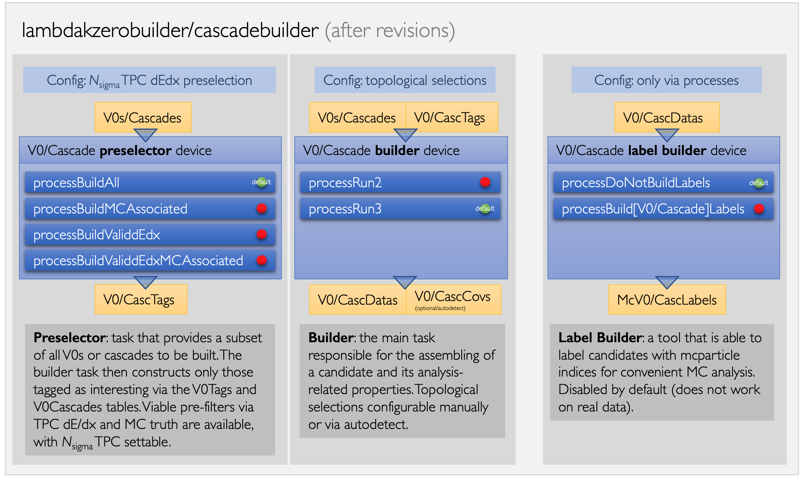

# Light-flavour (LF) analysis framework

## Get started

A number of tasks are included in `O2Physics` at the moment and can be consulted in the codebase. 

## Strangeness building 

In many analyses - not only PWG-LF exclusively - V0s and cascades are required. The new O2Physics data format stores only track index pairs or triplets for these objects, and all analysis-related properties have to be constructed from these indices. In order to take care of that centrally, `strangeness builders` are provided. They are: 

* `lambdakzerobuilder`: this task takes track index pairs and constructs the analysis information related to the V0, which can then be queried conveniently from the `V0Data` table. 
* `cascadebuilder`: this task takes track index triples and constructs the analysis information related to cascades, which can then be queried conveniently from the `CascData` table. 

Optionally, both builders can also produce covariance matrices (`V0Covs` or `CascCovs`) that are particularly useful to reconstruct decay chains that involve weakly decaying particles. 

The logical elements in these two tasks are outlined in the figure below: 

There are three relevant devices (subtasks) inside each of the builders, each with different configurations that are of interest to the users. They are: 

* `preselectors` allow the user to pre-filter the V0s or cascades that will be built, possibly selecting on MC truth (MC-exclusive), TPC dE/dx or both. This is done via the choice of process function: `processBuildAll` will have all V0s passing topological selections to be built and stored, while `processBuildMCAssociated` will configure the builder to build only MC true candidates of the desired (configurable) type and `processBuildValiddEdx` will configure the builder to only construct candidates for which the TPC dE/dx is compatible with one of the (configurable) hypotheses of interest. Finally, `processBuildValiddEdxMCAssociated` allows for both MC truth and TPC dE/dx to be preselected on.
* `builders` take the tags from the preselectors and build those V0s or cascades that the user is interested in. Builders have configurables that control the topological selections of the desired V0 and cascade candidates and also allow for topological selection autodetect (more below). 
* `label builders` run after the building has been done and provide indices to mcparticles for all analysis tables (`V0Datas` and `CascDatas`) via the two tables `MCV0Labels` and `MCCascLabels`, joinable with `V0Datas` and `CascDatas`, respectively. In order to switch label building on, the process functions `processBuildV0Labels` or `processBuildCascadeLabels` have to be used. This function is naturally only possible in simulations. .

### Topological selection autodetect in strangeness builders 

In order to make analysis more convenient and efficient, the strangeness builders have an option called `d_UseAutodetectMode` that, if enabled, will make the builders go through all user tasks set to run together with it and look for variables with the following names: 

* `v0setting_cospa` (V0 builder)
* `v0setting_dcav0dau` (V0 builder)
* `v0setting_dcapostopv` (V0 builder)
* `v0setting_dcanegtopv` (V0 builder)
* `v0setting_radius` (V0 builder)
* `cascadesetting_cospa` (cascade builder)
* `cascadesetting_dcacascdau` (cascade builder)
* `cascadesetting_dcabachtopv` (cascade builder)
* `cascadesetting_cascradius` (cascade builder)
* `cascadesetting_v0masswindow` (cascade builder)
* `cascadesetting_mindcav0topv` (cascade builder)

If found, the values of these 11 basic topological variables will then be the ones that the builders will use. If more than one task has specified desired topological selections, the builders will automatically configure for the loosest among the multiple selections requested, such that all tasks in the analysis chain get their requests adequately fulfilled. Please note that, because of this loosening in case of multiple requests, it is expected that analysis tasks also additionally select on these variables when processing data. 

## Code

- The codebase can be found in the
[`PWGLF`](https://github.com/AliceO2Group/O2Physics/tree/master/PWGLF) directory.
.h).
