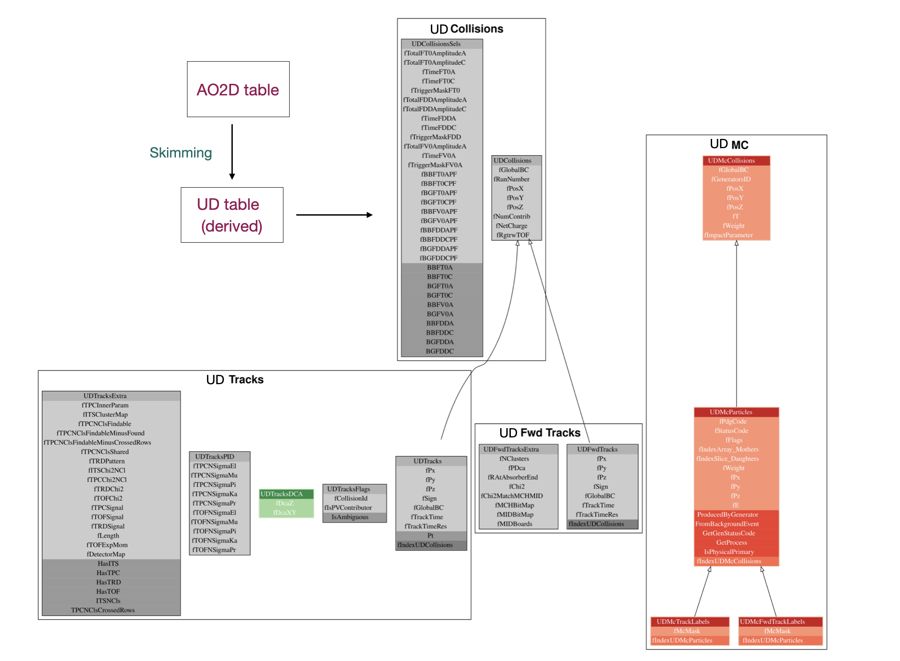

# Ultra-peripheral collisions and diffraction (UD) analysis framework
The **PWG-UD** (Ultra-peripheral and Diffractive) working group focuses on the study of photon-induced and diffractive processes in heavy-ion and proton–proton collisions, as well as cosmic rays.

## Get started

In the past, several hands-on sessions and tutorials have been organised within the **PWG-UD** to introduce the analysis framework.
A list of the corresponding Indico events is provided below.

### Past tutorials and hands-on sessions

<!-- markdown-link-check-disable -->

- **[UD/O2 hands-on sessions](https://indico.cern.ch/event/1425820/timetable/#b-571496-pwg-ud-ultra-peripher) from O2 Analysis Tutorial 4.0 (16 October 2024)** - Introduction to the O² framework for UD analyses with practical examples. Includes introduction, [Event selection for UPC](https://indico.cern.ch/event/1425820/contributions/6176711/attachments/2948608/5189086/0-ud-firstpart.mp4),
  [Data analysis with UD tables](https://indico.cern.ch/event/1425820/contributions/6176712/attachments/2948661/5189090/0-ud-anisa.mp4) and [MC simulation](https://indico.cern.ch/event/1425820/contributions/6176715/attachments/2948620/5189095/0-ud-simone.mp4).
  - Example tasks:
  - [`UDTutorial_05.cxx`](https://github.com/AliceO2Group/O2Physics/blob/master/Tutorials/PWGUD/UDTutorial_05.cxx) – Two-pion analysis at midrapidity
  - [`UDTutorial_06.cxx`](https://github.com/AliceO2Group/O2Physics/blob/master/Tutorials/PWGUD/UDTutorial_06.cxx) – Forward muon analysis
  - [`UDTutorial_07.cxx`](https://github.com/AliceO2Group/O2Physics/blob/master/Tutorials/PWGUD/UDTutorial_07.cxx) – Event-by-event tree creation

- **[UD/O2 hands-on sessions](https://indico.cern.ch/event/1326201/timetable/#b-528201-pwg-ud-ultra-peripher) from O2 Tutorial 3.0 (8 November 2023)** — Overview of UD tables and accesing MC data [Zoom recording part1](https://indico.cern.ch/event/1326201/contributions/5663204/attachments/2748184/4783585/ud1.mp4), [Zoom recording part2](https://indico.cern.ch/event/1326201/contributions/5663204/attachments/2748184/4783622/ud2.mp4).

- **[UD/O2 hands-on sessions](https://indico.cern.ch/event/1267433/timetable/#b-508750-parallel-hands-on-pwg) from O2 Tutorial 2.0 (27 April 2023)** — Introduction to UD tables, task developement and hands-on sessions, [Zoom recording part1](https://indico.cern.ch/event/1267433/sessions/490459/attachments/2636549/4565155/ud-piece1.mp4), [Zoom recording part2](https://indico.cern.ch/event/1267433/sessions/490459/attachments/2636549/4565156/ud2.mp4).

- **[O2 Analysis Tutorial (13–14 October 2022)](https://indico.cern.ch/event/1200252/timetable/#20221013.detailed)** — General introduction to the O2 analysis framework.

<!-- markdown-link-check-enable -->

## Contact
<!-- markdown-link-check-disable -->
Mattermost channels: [PWG-UD O2 analyses](https://mattermost.web.cern.ch/alice/channels/pwg-ud-o2-analyses), [PWG-UD general](https://mattermost.web.cern.ch/alice/channels/pwg-ud), [O2AT-PWG-UD](https://mattermost.web.cern.ch/alice/channels/o2at-pwg-ud)
<!-- markdown-link-check-enable -->

## Code

- The PWG-UD analysis code is located in the directory
[`PWGUD`](https://github.com/AliceO2Group/O2Physics/tree/master/PWGUD)
- Data model can be found here - [UDTables.h](https://github.com/AliceO2Group/O2Physics/blob/master/PWGUD/DataModel/UDTables.h)
- Table produced by skimming and selecting event with double gap topology at midrapidity - [DGCandProducer.cxx](https://github.com/AliceO2Group/O2Physics/blob/master/PWGUD/TableProducer/DGCandProducer.cxx)
- Class for event selection with double gap at midrapidity - [DGSelector.h](https://github.com/AliceO2Group/O2Physics/blob/master/PWGUD/Core/DGSelector.h)
- Table produced by skimming and selecting event with single gap topology at midrapidity - [SGCandProducer.cxx](https://github.com/AliceO2Group/O2Physics/blob/master/PWGUD/TableProducer/SGCandProducer.cxx)
- Class for event selection with single topology at midrapidity - [SGSelector.h](https://github.com/AliceO2Group/O2Physics/blob/master/PWGUD/Core/SGSelector.h)
- Class for track selection with single gap topology at midrapidity - [SGTrackSelector.h](https://github.com/AliceO2Group/O2Physics/blob/master/PWGUD/Core/SGTrackSelector.h)
- Table produced by skimming and selecting event with muon arm at forward rapidity - [UPCCandidateProducer.cxx](https://github.com/AliceO2Group/O2Physics/blob/master/PWGUD/TableProducer/UPCCandidateProducer.cxx)
- Utility and helper functions: [UDHelpers.h](https://github.com/AliceO2Group/O2Physics/blob/master/PWGUD/Core/UDHelpers.h)
- Utility and helper functions: [`Tasks/CMakeLists.txt`](https://github.com/AliceO2Group/O2Physics/blob/master/PWGUD/Tasks/CMakeLists.txt)
- Quality assurance (QA) tasks: [`AQC`](https://github.com/AliceO2Group/O2Physics/tree/master/PWGUD/AQC)

## AliHyperloop
<!-- markdown-link-check-disable -->
[UD Hyperloop analyses](https://alimonitor.cern.ch/hyperloop/all-analyses) with [JIRA tickets](https://its.cern.ch/jira/projects/PWGUD/issues/PWGUD-11?filter=allopenissues)
<!-- markdown-link-check-enable -->

## Framework structure
A schematic diagram of the typical workflow for a PWG-UD analysis is shown below.

  

