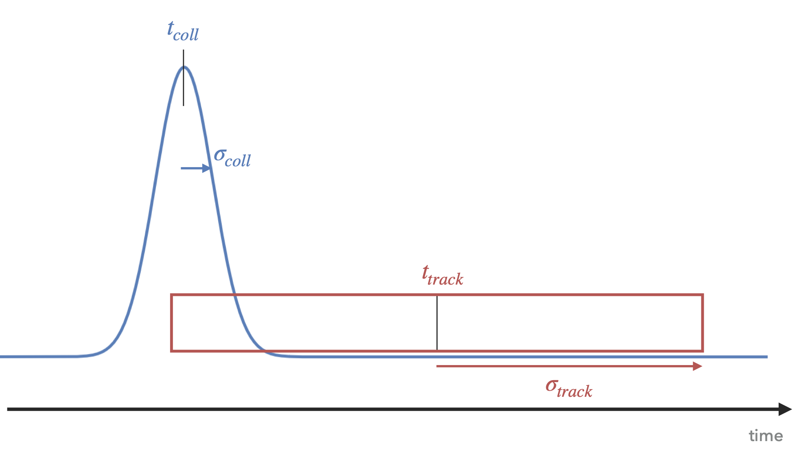
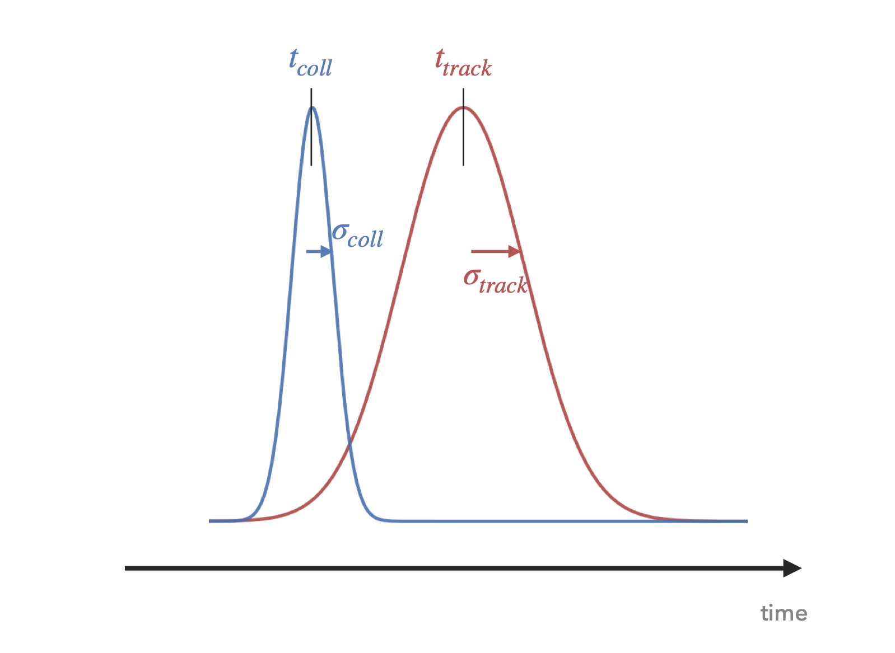

# Track to collision association

In Run 3, due to the increased interaction rate, a track time window can overlap in time with multiple collisions. For example, the standalone ITS has a default track time window (also called Read-Out Frame (ROF)) of 198 bunch crossings (BC) $$\approx$$ 4.95 $$\mu s$$. With an interaction rate of 500 kHz, there is approximately one collision every 2 $$\mu s$$, meaning that a standalone ITS track readout window overlaps with 2.5 collisions on average.

Knowing approximate time at which the track crossed the detector and the time of the different collisions, one can then associate a track to the different collisions it is time-compatible to.

In O2Physics this association is done using two different tasks for the different types of tracks:

- [o2-analysis-track-to-collision-associator](https://github.com/AliceO2Group/O2Physics/blob/master/Common/TableProducer/trackToCollisionAssociator.cxx) for central tracks
- [o2-analysis-fwdtrack-to-collision-associator](https://github.com/AliceO2Group/O2Physics/blob/master/Common/TableProducer/fwdtrackToCollisionAssociator.cxx) for muons and MFT tracks

Both of the tasks are based on the same code [CollisionAssociation.h](https://github.com/AliceO2Group/O2Physics/blob/master/Common/Core/CollisionAssociation.h) and use several configurables.

For a brief description of the configurables, one can have a look at the section below, and for a deeper dive into what this code does one can read the section **Description of the collision association procedure**.
Reading the description of the code is strongly recommended for the analysers that are piping this task to their workflow.

## fwdtrack-to-collision-associator

```cpp
Configurable<float> nSigmaForTimeCompat{"nSigmaForTimeCompat", 4.f, "number of sigmas for time compatibility"};
Configurable<float> timeMargin{"timeMargin", 0.f, "time margin in ns added to uncertainty because of uncalibrated TPC"};
Configurable<bool> includeUnassigned{"includeUnassigned", false, "consider also tracks which are not assigned to any collision"};
Configurable<bool> fillTableOfCollIdsPerTrack{"fillTableOfCollIdsPerTrack", false, "fill additional table with vector of collision ids per track"};
Configurable<int> bcWindowForOneSigma{"bcWindowForOneSigma", 115, "BC window to be multiplied by the number of sigmas to define maximum window to be considered"};
```

Definition of the configurables:

`float nSigmaForTimeCompat` : in how many sigmas we want to match the collision and the track, with

- $$\sigma$$ = RMS of gaussian-like time resolutions of track and collision, for tracks with a gaussian-like time resolution, and
- $$\sigma$$= gaussian standard deviation of the collision time for tracks with box-like errors

`float timeMargin` the time margin in ns added to the uncertainty on the collision time because of uncalibrated TPC

`bool includeUnassigned` if set to kTRUE, the tracks which were assigned to no collision in AO2D files are also reprocessed, meaning we try again to associate these tracks to collisions

`bool fillTableOfCollIdsPerTrack` if set to kTRUE, a table is filled containing for each track a list of the collision global indexes it can be time-associated to. This table can then be joined with the track table and allows further selections on the different compatible collisions.

`int bcWindowForOneSigma` sets the BC window around which we look for possible compatible collisions for one track. Needs to be greater than half of the track time window in case of tracks with box-like errors. It has been tuned to 115BC for MFT tracks with a ROF length of 198BC , which is 1.16$$\times \frac{ROF_{length}}{2}$$
One could then apply conservatively a factor 1.3 for higher ROF lengths.

## Description of the collision association procedure

[CollisionAssociation.h](https://github.com/AliceO2Group/O2Physics/blob/master/Common/Core/CollisionAssociation.h)  loops over each track, and for each track it loops over all collisions $$coll$$. For efficiency purposes, a hard cut is applied if the collision is too far (in time) from the track.

Let's define $$BC_{track}$$ the BC of the middle of the readout window of the track, and $$BC_{coll}$$ the BC of the collision $$coll$$.

In the AO2D files, $$BC_{track}$$ = `track.collision().bc() + track.trackTime() / o2::constants::lhc::LHCBunchSpacingNS;`

The cut applied on the BC difference $$\lvert BC_{track}-$BC_{coll} \rvert$$
is the following:

$$\lvert BC_{track}-$BC_{coll} \rvert$$ < `bcWindowForOneSigma * nSigmaForTimeCompat + timeMargin / o2::constants::lhc::LHCBunchSpacingNS;`

With `bcWindowForOneSigma`, `nSigmaForTimeCompat` and `timeMargin` being configurable variables.

These variables must be cautiously configured to avoid eliminating possible time-compatible collisions with the track, and to avoid looping on numerous collisions that are very far from the track in time.

If $$coll$$ passes this cut, then a stricter cut on the time difference between the collision and the track is applied, as will be described below.

The cut is different for tracks which come from detectors with readout windows and for detectors that detect track with a gaussian-like time precision.

For detectors that collect tracks in readout windows such as the ITS and the MFT, $$t_{track}$$ is the middle of the track readout window in $$ns$$. Its associated time uncertainty is $$\sigma_{track}=\frac{\text{readout window duration}}{2}$$. $$t_{track}$$ is then associated to a box-like time error, and meaning that the track crossed the detector in the time range $$[t_{track}-\sigma_{track}, t_{track}+\sigma_{track}]$$

<div align="center">

</div>

For other detectors, the time resolution of the track is gaussian-like, meaning that the track has crossed the detector around the time $$t_{track}$$, with a gaussian standard deviation $$\sigma_{track}$$.

<div align="center">

</div>

Defining $$t_{coll}$$ the time of the collision $$coll$$ and its associated gaussian time uncertainty $$\sigma_{coll}$$, one can then compute the time difference between the track and the collision as $$\Delta_t = \lvert t_{track}-t_{coll} \rvert$$

The collision $$coll$$ is considered compatible in time with the track if $$\Delta_t <$$ thresholdTime.

- thresholdTime = $$\sigma_{track}$$+nSigmaForTimeCompat $$\times ~\sigma_{coll}$$ + timeMargin,
for tracks with a box-like error.

- thresholdTime = nSigmaForTimeCompat $$\times ~\sqrt{\sigma_{track}^2+\sigma_{coll}^2}$$ + timeMargin,
for tracks with a gaussian-like error.
