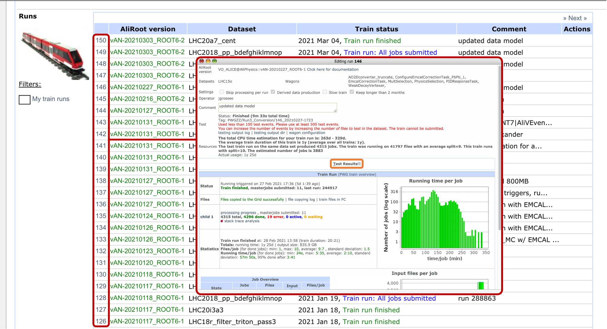

# Downloading AO2D from LEGO train conversion

If you need a single input files from a conversion train, please take them from the train test, by:

* Going to the train <a href="https://alimonitor.cern.ch/trains/train.jsp?train_id=132" target="_blank">Run3_Conversion</a>
* Click on the train number of the train you are interested in then open the test results by clicking the + button


* Scroll to "full train" and click on "output"


* Download the AO2D.root

* You can also click on processing progress and then follow the output directories to download a larger AO2D.root. All this is only suitable for manual downloading of a few files. For everything else see the next item:

# Downloading AO2D from the Grid

You can use the either JAliEn Cache Manager (Hyperloop downloading tool) or just `alien.py cp` (or `alien_cp`) commands of `xjalienfs` package.  
To get this up on your local box, you need a few steps:

* Install xjalienfs with aliBuild:
```bash
aliBuild install xjalienfs
```

### Use the JAliEn Cache Manager

* Checkout the cache manager from git:
```bash
git clone ssh://git@gitlab.cern.ch:7999/jalien/jalien-cache-manager.git
```
* Add the target directory `jalien-cache-manager` to your path or give the absolute path below.
* Install python dependencies:
```bash
pip install click humanfriendly cachier
```
* Create a directory for the files:
```bash
export CACHE_DIR=$HOME/jalien-cache
mkdir $CACHE_DIR
```
* Enter the environment:
```bash
alienv enter xjalienfs/latest-release,ROOT/latest
```

The download itself happens with the following command:
```bash
jcachemgr --cache-dir $CACHE_DIR pull --out wn.xml --parallel=8 --limit=50 /alice/data/2021/OCT/505637/apass1/AOD AO2D.root
```
which would download at maximum 50 files of type `AO2D.root` from `/alice/data/2021/OCT/505637/apass1/AOD`

When the command terminates it creates a `wn.xml` which contains the list of files. This is the input to a Grid job. If you want to get a text file list from this to use as input for O2, the following line does it for you:
```bash
sed -rn 's/.*turl="([^"]*)".*/\1/p' wn.xml > input.txt
```

### Use the `xjalienfs` package commands (`alienpy` in pypi repository)

General description of file transfer capabilities of `alien.py` can be found in [JAliEn documentation pages](https://jalien.docs.cern.ch/user/alienpy_files/#transfer-files)

General form of command: `alien.py cp args source destination`  
where local targets _*MUST*_ have the designator `file:`
and the lack of any designation imply remote (GRID) target

#### Brief list of options

Destination will be automatically taken as directory (and automatically created) if the source is directory or a file selection.
The source allow inside globbing so the source can have the form of `/alice/data/2021/OCT/505637/apass1/AOD*AO2D.root`
The other selection options are:
* `-glob STRING` : form like `-glob AO2D.root /alice/data/2021/OCT/505637/apass1/AOD file:local_destination`
* `-select PATTERN` : regex based selection of files in source directory (applied to full path)
* `-name PATTERN` : regex based selection of files in source directory (applied only to file name)


Force checking of destination: `-f`
When destination exists the file is skipped from re-downloading (it will change to always check the md5sum)
With `-f` the md5 will be checked (it will change to become default)


Nr Parallel downloads (defaults to 8 for downloads) : `-T Nr`


Retry Nr times the replica list for a failing LFN : `-retry Nr`


Keep Nr components of the full path for the destination file : `-parent Nr`
e.g. `alien.py cp -parent 99 /alice/data/2021/OCT/505637/apass1/AOD/001/AO2D.root file:/my_cache_dir`
will download the file to `/my_cache_dir/alice/data/2021/OCT/505637/apass1/AOD/001/`

{min, max}{Size, depth, time} selection is possible (see the linked manual)

For writing xml collections see `toXml` command (and the help content)
