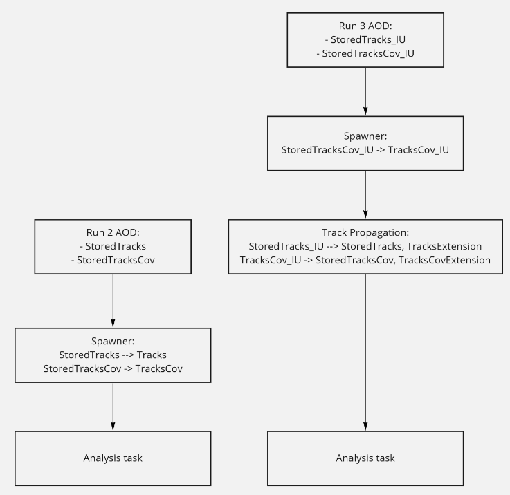

# Helper tasks

## Timestamp

The timestamp task is needed to fill the table [Timestamps](../datamodel/helperTaskTables.html#o2-analysis-timestamp). Timestamp contains the time of a bunch crossing since the start of the run. This time is often needed to retrieve objects in the CCDB (see Tutorial [CCDB](../tutorials/workingWithCCDB.html#ccdb)).

Since the Timestamps table has an entry per bunch crossing it can be joined with table BC. The join is defined by o2::aod::BCsWithTimestamps (see list of defined [joins and iterators](../datamodel/joinsAndIterators.html#list-of-defined-joins-and-iterators)).

## Event selection

Table of contents:

* [Concept](#concept)
* [Basic usage in user tasks](#basic-usage-in-user-tasks)
* [Trigger aliases](#trigger-aliases)
* [Event selection criteria](#event-selection-criteria)
* [Event selection decisions](#event-selection-decisions)
* [Found bunch crossings](#found-bunch-crossings)
* [Configurables](#configurables)
* [Remarks](#remarks)

### Concept

The main purpose of the event selection framework in O2 is to provide tools to select triggered events and reject pileup, beam-gas and poor quality collisions.
Event selection in O2 is based on the concept of derived tables created in dedicated tasks from available AOD contents.
_o2-analysis-event-selection_ executable produces two in-memory tables described in [EventSelection.h](https://github.com/AliceO2Group/O2Physics/blob/master/Common/DataModel/EventSelection.h):

* ```EvSels``` table joinable with ```Collisions``` table. To be used in analyses based on loops over ```Collisions```, i.e. majority of ALICE analyses.
* ```BcSels``` table joinable with ```BCs``` table. To be used in analyses based on loops over ```BCs``` table such as muon arm UPCs, luminosity monitoring etc.

The structure of ```BcSels``` and ```EvSels``` tables is kept the same for Run 2 and Run 3. However, there are conceptual differences between Run 2 and Run 3 workflows:

* Run 3 setup is significantly different from Run 2 setup, e. g. V0C detector is not available in Run 3 etc. Therefore Run-2 minimum bias trigger based on V0A & V0C is no longer available and is replaced with FT0A & FT0C requirement in Run 3. Many other selection criteria used in Run 2 are not applicable in Run 3 (e. g. tracklet-vs-cluser correlation cut).
* While in Run 2 there is a unique matching between _Collisions_ and _BCs_, it is not the case in Run 3. Time resolution for collisions (=primary vertices) is not precise enough to identify corresponding bunch crossing (=25 ns) without ambiguities. The collision time resolution depends on the number of contributed ITS-TPC tracks, availability of TOF-matched tracks and other factors. One of the main goals of event selection task in Run 3 is to find the original bunch crossing for each collision and check for relevant info in forward detectors (FIT, ZDC). Unambiguous association of collisions to bunch crossings might become very nontrivial in high rate environment.

```BcSels``` and ```EvSels``` tables contain the following information:

* fired trigger aliases, see [Trigger aliases](#trigger-aliases) section
* offline event selection criteria such as beam-beam and beam-gas decisions from forward detectors (FV0, FT0, FDD, ZDC) and various in-bunch and out-of-bunch pileup checks, see [Event selection criteria](#event-selection-criteria) section

In addition ```EvSels``` table contains additional info:

* event selection decisions (in ```EvSels``` table only), i.e. logical combinations of various offline event selection criteria, see [Event selection decisions](#event-selection-decisions) section. For example, _sel7_ is based on beam-beam decisions in V0A and V0C with additional background, pileup and quality checks
* indices to found bunch crossings and corresponding FT0 and FV0 entries (in ```EvSels``` table only), see [Found bunch crossings](#found-bunch-crossings) section.

```BcSels``` and ```EvSels``` tables are produced by _BcSelectionTask_ and _EventSelectionTask_, respectively, see [`Common/TableProducer/eventSelection.cxx`](https://github.com/AliceO2Group/O2Physics/blob/master/Common/TableProducer/eventSelection.cxx).
There are separate process functions for Run 2 and Run 3 in both tasks. One has to use _--process-run 2_ or _--process-run 3_ configurables in json files to switch between these process functions, see [Configurables](#configurables) section for more details.

### Basic usage in user tasks

In general, one has to follow the following steps:

* add [`EventSelection.h`](https://github.com/AliceO2Group/O2Physics/blob/master/Common/DataModel/EventSelection.h) header:

    ``` c++
    #include "Common/DataModel/EventSelection.h""
    ```

* join _Collisions_ and _EvSels_ tables and use corresponding iterator as an argument of the process function:

    ``` c++
    void process(soa::Join<aod::Collisions, aod::EvSels>::iterator const& col, ...)
    ```

* check if your trigger alias is fired if you run over Run1 or Run2 data (or future triggered Run3 data):

    ``` c++
    if (!col.alias()[kINT7]) {
      return;
    }
    ```

    Bypass this check if you analyse MC or continuous Run3 data.
* apply further offline selection criteria:
  * for Run 2 data and MC:

      ``` c++
      if (!col.sel7()) {
        return;
      }
      ```

  * for Run 3 data and MC:

      ``` c++
      if (!col.sel8()) {
        return;
      }
      ```

      Note that sel8 selection based on FT0A & FT0C requirement is not mandatory in Run 3 pilot beam data. It might be safer to work with unbiased sample.

* run your tasks in stack with timestamp and event-selection tasks:

    ``` bash
    o2-analysis-timestamp --aod-file AO2D.root -b | o2-analysis-event-selection -b | o2-analysis-user-task -b
    ```

  This workflow works for Run 2 data. Special settings are required for MC and Run 3 data, see [Configurables](#configurables) section.

  _o2-analysis-timestamp_ task [`Common/TableProducer/timestamp.cxx`](https://github.com/AliceO2Group/O2Physics/blob/master/Common/TableProducer/timestamp.cxx) is required to create per-event timestamps necessary to access relevant CCDB objects in the event selection task.

### Trigger aliases

Direct selection on trigger class names in O2 is rather complicated. In contrast to Run 2 AODs, there is no way to get the list of fired classes in a string-like format. Instead one has to check bits corresponding to trigger class ids either in ```triggerMask``` column in ```BCs``` table or ```triggerMaskNext50``` in ```Run2BCInfos``` table (for Run 2 if the trigger class id is larger than 50). This approach is complicated since trigger class ids for the same class vary from run to run.

To simplify trigger checks, we use trigger alias approach. Fired trigger classes are mapped to trigger alias bits in the ```alias``` array of ```BcSels``` and ```EvSels``` tables. Aliases have at least two advantages:

* several classes based on similar logic can be grouped together into one alias (see _kINT7_ for example)
* alias bits do not change from run to run in contrast to trigger class ids

The list of available trigger alises can be found in [`Common/CCDB/TriggerAliases.h`](https://github.com/AliceO2Group/O2Physics/blob/master/Common/CCDB/TriggerAliases.h). The mapping between trigger classes (and their indices) and trigger aliases is stored in [`CCDB`](http://alice-ccdb.cern.ch/browse/EventSelection/TriggerAliases) run-by-run in dedicated _TriggerAliases_ objects.
Current mapping can be checked in [upload_trigger_aliases.C](https://github.com/AliceO2Group/O2Physics/blob/master/Common/CCDB/macros/upload_trigger_aliases.C#L24) macro:

``` c++
  mAliases[kINT7] = "CINT7-B-NOPF-CENT,CV0L7-B-NOPF-CENT,CINT7-B-NOPF-CENTNOTRD,CINT7ZAC-B-NOPF-CENTNOPMD";
  mAliases[kEMC7] = "CEMC7-B-NOPF-CENTNOPMD,CDMC7-B-NOPF-CENTNOPMD";
  mAliases[kINT7inMUON] = "CINT7-B-NOPF-MUFAST";
  mAliases[kMuonSingleLowPt7] = "CMSL7-B-NOPF-MUFAST";
  mAliases[kMuonUnlikeLowPt7] = "CMUL7-B-NOPF-MUFAST";
  mAliases[kMuonLikeLowPt7] = "CMLL7-B-NOPF-MUFAST";
  mAliases[kMuonSingleHighPt7] = "CMSH7-B-NOPF-MUFAST";
  mAliases[kCUP8] = "CCUP8-B-NOPF-CENTNOTRD";
  mAliases[kCUP9] = "CCUP9-B-NOPF-CENTNOTRD";
  mAliases[kMUP10] = "CMUP10-B-NOPF-MUFAST";
  mAliases[kMUP11] = "CMUP11-B-NOPF-MUFAST";
```

This list of trigger aliases and classes is not complete but it should be enough for tests in various PWGs. New trigger classes and aliases can be added upon request (contact Evgeny Kryshen).

### Event selection criteria

Full list of event selection criteria can be found in [`Common/CCDB/EventSelectionParams.h`](https://github.com/AliceO2Group/O2Physics/blob/master/Common/CCDB/EventSelectionParams.h#L21)

``` c++
enum EventSelectionFlags {
  kIsBBV0A = 0,       // cell-averaged time in V0A in beam-beam window
  kIsBBV0C,           // cell-averaged time in V0C in beam-beam window (for Run 2 only)
  kIsBBFDA,           // cell-averaged time in FDA (or AD in Run2) in beam-beam window
  kIsBBFDC,           // cell-averaged time in FDC (or AD in Run2) in beam-beam window
  kNoBGV0A,           // cell-averaged time in V0A in beam-gas window
  kNoBGV0C,           // cell-averaged time in V0C in beam-gas window (for Run 2 only)
  kNoBGFDA,           // cell-averaged time in FDA (AD in Run2) in beam-gas window
  kNoBGFDC,           // cell-averaged time in FDC (AD in Run2) in beam-gas window
  kIsBBT0A,           // cell-averaged time in T0A in beam-beam window
  kIsBBT0C,           // cell-averaged time in T0C in beam-beam window
  kIsBBZNA,           // time in common ZNA channel in beam-beam window
  kIsBBZNC,           // time in common ZNC channel in beam-beam window
  kIsBBZAC,           // time in ZNA and ZNC in beam-beam window - circular cut in ZNA-ZNC plane
  kNoBGZNA,           // time in common ZNA channel is outside of beam-gas window
  kNoBGZNC,           // time in common ZNC channel is outside of beam-gas window
  kNoV0MOnVsOfPileup, // no out-of-bunch pileup according to online-vs-offline VOM correlation
  kNoSPDOnVsOfPileup, // no out-of-bunch pileup according to online-vs-offline SPD correlation
  kNoV0Casymmetry,    // no beam-gas according to correlation of V0C multiplicities in V0C3 and V0C012
  kIsGoodTimeRange,   // good time range
  kNoIncompleteDAQ,   // complete event according to DAQ flags
  kNoTPCLaserWarmUp,  // no TPC laser warm-up event (used in Run 1)
  kNoTPCHVdip,        // no TPC HV dip
  kNoPileupFromSPD,   // no pileup according to SPD vertexer
  kNoV0PFPileup,      // no out-of-bunch pileup according to V0 past-future info
  kNoSPDClsVsTklBG,   // no beam-gas according to cluster-vs-tracklet correlation
  kNoV0C012vsTklBG,   // no beam-gas according to V0C012-vs-tracklet correlation
  kNsel               // counter
};
```

Technically there are three types of criteria:

* based on flags from bc-joinable ```aod::Run2BCInfos``` table (_kIsGoodTimeRange_, _kNoIncompleteDAQ_, _kNoTPCLaserWarmUp_, _kNoTPCHVdip_, _kNoPileupFromSPD_, _kNoV0PFPileup_)
* based on information from FIT and ZDC detectors (_kIsBB..._, _kIsBG..._) and/or additional information stored in ```aod::Run2BCInfos``` table (_kNoV0MOnVsOfPileup_,_kNoSPDOnVsOfPileup_)
* based on additional information from ```aod::Collisions``` table

Decisions on inidividual selection criteria are stored in _selection_ array ```BcSels``` and ```EvSels``` tables. E.g. one can check if a given collision passed _kIsBBV0A_ selection:

``` c++
  bool isBBV0Apassed = col.selection()[evsel::kIsBBV0A];
```

### Event selection decisions

Offline event selection decisions (e.g. sel7) are constructed based on a subsample of individual checks stored in _selection_ array. The default list of checks may depend on colliding system, specific run conditions and specific analysis requirements. Default set of checks can be found in [Common/CCDB/EventSelectionParams.cxx](https://github.com/AliceO2Group/O2Physics/blob/master/Common/CCDB/EventSelectionParams.cxx). The default _selectionBarrel_ masks for pp, pA, Ap and AA are summarized below:

* default sel7 selection in pp is based on the requirement of beam-beam timing in V0A and V0C and a number of pileup, beam-gas and othe quality checks

``` c++
    selectionBarrel[kIsBBV0A] = 1;
    selectionBarrel[kIsBBV0C] = 1;
    selectionBarrel[kNoV0MOnVsOfPileup] = 1;
    selectionBarrel[kNoSPDOnVsOfPileup] = 1;
    selectionBarrel[kNoV0Casymmetry] = 1;
    selectionBarrel[kIsGoodTimeRange] = 1;
    selectionBarrel[kNoIncompleteDAQ] = 1;
    selectionBarrel[kNoTPCHVdip] = 1;
    selectionBarrel[kNoPileupFromSPD] = 1;
    selectionBarrel[kNoV0PFPileup] = 1;
    selectionBarrel[kNoSPDClsVsTklBG] = 1;
    selectionBarrel[kNoV0C012vsTklBG] = 1;
```

* checks for pA system are similar to pp but in addition they include no beam-gas in ZNA:

``` c++
    selectionBarrel[kNoBGZNA] = 1;
```

* checks for Ap system are similar to pp but in addition they include no beam-gas in ZNC:

``` c++
    selectionBarrel[kNoBGZNC] = 1;
```

* default checks for AA are much simpler compared to pp since hadronic pileup is at per-mile level and can be ignored in the first approximation. Default checks include beam-beam timing in V0A, V0C, ZNA and ZNC detectors and a couple of quality checks.

``` c++
    selectionBarrel[kIsBBV0A] = 1;
    selectionBarrel[kIsBBV0C] = 1;
    selectionBarrel[kIsBBZAC] = 1;
    selectionBarrel[kIsGoodTimeRange] = 1;
    selectionBarrel[kNoTPCHVdip] = 1;
```

In addition we define _selectionMuonWithPileupCuts_ and _selectionMuonWithoutPileupCuts_ with reduced set of checks, see [Common/CCDB/EventSelectionParams.cxx](https://github.com/AliceO2Group/O2Physics/blob/master/Common/CCDB/EventSelectionParams.cxx) for more details.

Besides, there are special settings for some run ranges, e.g. we remove checks on out-of-bunch pileup for runs with isolated bunches:

``` c++
  selectionBarrel[kNoV0MOnVsOfPileup] = 0;
  selectionBarrel[kNoSPDOnVsOfPileup] = 0;
  selectionBarrel[kNoV0Casymmetry] = 0;
  selectionBarrel[kNoV0PFPileup] = 0;
```

These special settings are stored in CCDB. One can find relevant details in [upload_event_selection_params.C](https://github.com/AliceO2Group/O2Physics/blob/master/Common/CCDB/macros/upload_event_selection_params.C) macro.

Finally, it is worth mentioning that out-of-bunch pileup cuts as well as ZDC timing checks are disabled in MC
[eventSelection.cxx#L265](https://github.com/AliceO2Group/O2Physics/blob/master/Common/TableProducer/eventSelection.cxx#L265):

``` c++
    if (isMC) {
      applySelection[kIsBBZAC] = 0;
      applySelection[kNoV0MOnVsOfPileup] = 0;
      applySelection[kNoSPDOnVsOfPileup] = 0;
      applySelection[kNoV0Casymmetry] = 0;
      applySelection[kNoV0PFPileup] = 0;
    }
```

Selection mask _applySelection_ is obtained from CCDB in [eventSelection.cxx](https://github.com/AliceO2Group/O2Physics/blob/master/Common/TableProducer/eventSelection.cxx#L263):

``` c++
  EventSelectionParams* par = ccdb->getForTimeStamp<EventSelectionParams>("EventSelection/EventSelectionParams", bc.timestamp());
```

Then _sel7_ decision is constructed from active checks:
[Common/TableProducer/eventSelection.cxx#L321](https://github.com/AliceO2Group/O2Physics/blob/master/Common/TableProducer/eventSelection.cxx#L321)

``` c++
    bool sel7 = 1;
    for (int i = 0; i < kNsel; i++) {
      sel7 &= applySelection[i] ? selection[i] : 1;
    }
```

### Found bunch crossings

One of the main goals of the event selection task in Run 3 is to find the original bunch crossing for each collision. The basic approach is to start from estimated collision bc and search for closest BC containing FT0 entries in a +/-4 sigma window where sigma corresponds to the estimated collision time resolution from ```col.collisionTimeRes()```. Implementation details can be found in [eventSelection.cxx#L348](https://github.com/AliceO2Group/O2Physics/blob/master/Common/TableProducer/eventSelection.cxx#L348).

There is a possibility to set custom search window using _customDeltaBC_ configurable. At the moment we use _customDeltaBC_ set to 300 bunch crossings.

Users can access found bunch crossings and FT0 entries using _foundBC_ or _foundFT0_ indices stored in the _EvSels_ table:

``` c++
if (collision.has_foundBC()) {
  auto bc = collision.foundBC();
  uint64_t globalBC = bc.globalBC();
}
```

or

``` c++
if (collision.has_foundFT0()) {
  auto ft0 = collision.foundFT0();
  int triggersignals = ft0.triggerMask();
}
```

If bunch crossing with FT0 entries is not found, _foundBC_ and _foundFT0_ indices are set to -1 therefore one has to check ```collision.has_foundBC()``` or ```collision.has_foundFT0()``` before accessing corresponding info.

### Configurables

Event selection task supports several configurables:

* _muonSelection_ allows to activate reduced set of checks for muon analyses

  ``` c++
  Configurable<int> muonSelection{"muonSelection", 0, "0 - barrel, 1 - muon selection with pileup cuts, 2 - muon selection without pileup cuts"};
  ```

* _customDeltaBC_ allows to set custom search window for FIT-collision matching in Run 3, see [Found bunch crossings](#found-bunch-crossings) section.

  ``` c++
  Configurable<int> customDeltaBC{"customDeltaBC", 300, "custom BC delta for FIT-collision matching"};
  ```

* _isMC_ allows to suppress several checks for Run 2 MC, see [Event selection decisions](#event-selection-decisions):

  ``` c++
  Configurable<bool> isMC{"isMC", 0, "0 - data, 1 - MC"};
  ```

  Note that one has to enable _isRun2MC_ flag in the timestamp task in this case:

  ``` bash
  o2-analysis-timestamp --aod-file AO2D.root -b --isRun2MC 1 | o2-analysis-event-selection -b --isMC 1 | o2-analysis-user-task -b
  ```

In the case of Run 3 processing, one has to set ```processRun2=false``` and ```processRun3=true``` flags in ```bc-selection-task``` and ```event-selection-task```. These configurables cannot be set in the command line. Instead one has to use json files. Typical content of the json file for Run 3 processing:

``` json
    "bc-selection-task": {
        "processRun2": "false",
        "processRun3": "true"
    },
    "event-selection-task": {
        "processRun2": "false",
        "processRun3": "true"
    },
```

One can set other configurables in the json file. This json file has to be provided using ```--configuration``` option:

  ``` bash
  o2-analysis-timestamp -b | o2-analysis-event-selection --configuration json://config.json -b
  ```

### Remarks

* One has to apply offline selections in O2 explicitly in contrast to AliPhysics where these selections were applied together with trigger alias selection.
* EvSel table might be also useful in user tasks relying on beam-beam and beam-gas decisions in forward detectors, e.g. in UPC tasks.
* Trigger class aliases for Run 3 are not available yet (pilot beam data taking was focused on continuous readout)

## Multiplicity and centrality selection in O2

### Concept

The multiplicity and centrality selection in O2 is based on the concept of derived tables created in dedicated tasks from available AOD contents:

* _o2-analysis-multiplicity-table_ task [`Analysis/Tasks/multiplicityTable.cxx`](https://github.com/AliceO2Group/AliceO2/blob/dev/Analysis/Tasks/multiplicityTable.cxx) stores relevant multiplicity values (V0A, V0C, ZNA, ZNC) and their dynamic sums (V0M) in [`Mults`](https://github.com/AliceO2Group/AliceO2/blob/dev/Analysis/DataModel/include/Analysis/Multiplicity.h) table joinable with _Collisions_ table.
* _o2-analysis-multiplicity-qa_ task [`Analysis/Tasks/multiplicityQa.cxx`](https://github.com/AliceO2Group/AliceO2/blob/dev/Analysis/Tasks/multiplicityQa.cxx) creates multiplicity distributions in minimum bias triggers necessary for centrality calibration.
* _o2-analysis-centrality-table_ task [`Analysis/Tasks/centralityTable.cxx`](https://github.com/AliceO2Group/AliceO2/blob/dev/Analysis/Tasks/centralityTable.cxx) takes multiplicity values from the [`Mults`](https://github.com/AliceO2Group/AliceO2/blob/dev/Analysis/DataModel/include/Analysis/Multiplicity.h) table and stores centrality values in [`Cents`](https://github.com/AliceO2Group/AliceO2/blob/dev/Analysis/DataModel/include/Analysis/Centrality.h) table joinable with _Collisions_ table. Relevant cumulative multiplicity distributions are stored in [CCDB](http://ccdb-test.cern.ch:8080/browse/Multiplicity/CumMultV0M). At the moment, centrality calibration objects are available only for LHC15o. The centrality calibration relies on 90% anchor points but doesn't take into account vertex dependence yet. The difference with AliPhysics centrality calibration doesn't exceed 0.5%.
* _o2-analysis-centrality-qa_ task [`Analysis/Tasks/centralityQa.cxx`](https://github.com/AliceO2Group/AliceO2/blob/dev/Analysis/Tasks/centralityQa.cxx) creates centrality distributions for minimum bias triggers and can be used for control and QA purposes.

Note that _o2-analysis-multiplicity-qa_ and _o2-analysis-centrality-qa_ tasks rely on the minimum bias trigger selection therefore one has to run event selection in stack with these tasks, see [here](evsel.md) for more details.

### Usage in user tasks

One can check _o2-analysis-centrality-qa_ task for example usage: [`Analysis/Tasks/centralityQa.cxx`](https://github.com/AliceO2Group/AliceO2/blob/dev/Analysis/Tasks/centralityQa.cxx). Usually, analysers perform event selection before the centrality selection therefore one has to consider the following steps:

* add [`EventSelection.h`](https://github.com/AliceO2Group/AliceO2/blob/dev/Analysis/DataModel/include/Analysis/EventSelection.h) and [`Centrality.h`](https://github.com/AliceO2Group/AliceO2/blob/dev/Analysis/DataModel/include/Analysis/Centrality.h) headers:

    ``` c++
    #include "Analysis/EventSelection.h"
    #include "Analysis/Centrality.h"
    ```

* join _Collisions_, _EvSels_ and _Cents_ tables and use corresponding iterator as an argument of the process function:

    ``` c++
    void process(soa::Join<aod::Collisions, aod::EvSels, aod::Cents>::iterator const& col, ...)
    ```

* check if your trigger alias is fired if you run over Run1 or Run2 data (or future triggered Run3 data):

    ``` c++
    if (!col.alias()[kINT7])
      return;
    ```

    Bypass this check if you analyse MC or future continuous Run3 data.
* apply further offline selection criteria:

    ``` c++
    if (!col.sel7())
      return;
    ```

* apply centrality selection, for example:

    ``` c++
    // analyse 0-20% central events
    if (col.centV0M()>20)
      return;
    ```

* run your tasks in stack with timestamp, event-selection, multiplicity and centrality tasks:

    ``` bash
    o2-analysis-timestamp --aod-file AO2D.root -b | o2-analysis-event-selection -b | o2-analysis-mulitplicity-table -b | o2-analysis-centrality-table -b | o2-analysis-user-task -b
    ```

    _o2-analysis-timestamp_ task [`Analysis/Tasks/timestamp.cxx`](https://github.com/AliceO2Group/AliceO2/blob/dev/Analysis/Tasks/timestamp.cxx) is required to create per-event timestamps necessary to access relevant CCDB objects in the event selection and/or centrality tasks.

## Particle identification

Here are described the PID working principles in O2 as well as how to get PID information (expected values, separation et cetera) in your task.

### Introduction

PID is handled in O2 via the reimplementation of base classes found in [`Common/Core/PID/`](https://github.com/AliceO2Group/O2Physics/tree/master/Common/Core/PID).

The parametrization of the expected detector response (e.g. signal, resolution, separation) is handled in the classes derived from [`Common/Core/PID/ParamBase.h`](https://github.com/AliceO2Group/O2Physics/tree/master/Common/Core/PID/ParamBase.h).
Examples of these derived classes can be found in [`PIDTOF.h`](https://github.com/AliceO2Group/O2Physics/blob/master/Common/Core/PID/PIDTOF.h), in this example the the TOF resolution response is implemented.

The interface between the detector and the Analysis Framework is fully enclosed in [`DetectorResponse.h`](https://github.com/AliceO2Group/O2Physics/tree/master/Common/Core/PID/DetectorResponse.h).
Here are defined the tables for the PID.

The filling of the PID tables is delegated to dedicated tasks in [`Common/TableProducer/PID/`](https://github.com/AliceO2Group/O2Physics/tree/master/Common/TableProducer/PID)
Examples of these tasks can be found in [`pidTOF.cxx`](https://github.com/AliceO2Group/O2Physics/tree/master/Common/TableProducer/PID/pidTOF.cxx) and [`pidTPC.cxx`](https://github.com/AliceO2Group/O2Physics/tree/master/Common/TableProducer/PID/pidTPC.cxx) for TOF and TPC tables respectively.

### Usage in tasks

Tables for PID values in O2 are defined in [`PIDResponse.h`](https://github.com/AliceO2Group/O2Physics/blob/master/Common/DataModel/PIDResponse.h).
You can include it in your task with:

``` c++
#include "Common/DataModel/PIDResponse.h"
...

```

In the process functions you can join the table to add the PID (per particle mass hypothesis) information to the track.

* For the TOF PID as:

    ``` c++
    void process(aod::Collision const& collision, soa::Join<aod::Tracks, aod::TracksExtra, aod::pidTOFEl> const& tracks)
    ```

* For the TPC PID as:

    ``` c++
    void process(aod::Collision const& collision, soa::Join<aod::Tracks, aod::TracksExtra, aod::pidTPCEl> const& tracks)
    ```

* For both TOF and TPC PID as:

    ``` c++
    void process(aod::Collision const& collision, soa::Join<aod::Tracks, aod::TracksExtra, aod::pidTOFEl, aod::pidTPCEl> const& tracks)
    ```

### Task for PID spectra (and to fill PID tables!)

O2 tasks dedicated to the filling of the PID tables are called with

* TOF PID Table

    ``` bash
    o2-analysis-pid-tof
    ```

    This requires a helper class for the building of the event time information

    ``` bash
    o2-analysis-pid-tof-base
    ```

    This can be configured according to needs

* TPC PID Table

    ``` bash
    o2-analysis-pid-tpc
    ```

### Example of tasks that use the PID tables (and how to run them)

* TOF PID task [`pidTOF.cxx`](https://github.com/AliceO2Group/O2Physics/tree/master/Common/TableProducer/PID/pidTOF.cxx)
    You can run the TOF spectra task with:

    ``` bash
    o2-analysis-spectra-tof --aod-file AO2D.root -b | o2-analysis-pid-tof -b | o2-analysis-pid-tof-base -b
    ```

* TPC PID task [`pidTPC.cxx`](https://github.com/AliceO2Group/O2Physics/tree/master/Common/TableProducer/PID/pidTPC.cxx)
    You can run the TPC spectra task with:

    ``` bash
    o2-analysis-spectra-tpc --aod-file AO2D.root -b | o2-analysis-pid-tpc -b
    ```

### Enabling QA histograms

* QA histograms should come with the PID tasks, they can be enabled with the option `--add-qa 1` when running locally or with the corresponding QA tasks as in:

    ``` bash
    ... | o2-analysis-pid-tof -b --add-qa 1

    ... | o2-analysis-pid-tpc -b --add-qa 1
    ```

## Track Selection

The track selection in the O2 analysis framework is provided in form of a stand-alone workflow that you can run in front of your analysis:

```
o2-analysis-trackselection | o2-analysis-myTask
```

Based on a set of track quality criteria, the track selection workflow produces a flag.
Provided that the user uses the standard supported `o2-analysis-trackselection` track tables can be filtered, e.g. by requiring global tracks (with cuts on pT and eta), in the following manner:

``` c++
#include "Analysis/TrackSelectionTables.h"
   ...
// NB: this only works provided that you use the supported task o2-analysis-trackselection to perform the track selection
Filter filter1 = requireTrackCutInFilter(TrackSelectionFlags::kTPCNCls); // General filter, defined using flags
Filter filter2 = requireQualityTracksInFilter();                         // Predefined filter, for kQualityTracks tracks
Filter filter3 = requirePrimaryTracksInFilter();                         // Predefined filter, for kPrimaryTracks tracks
Filter filter4 = requireInAcceptanceTracksInFilter();                    // Predefined filter, for kInAcceptanceTracks tracks
Filter filter5 = requireGlobalTrackInFilter();                           // Predefined filter, for kGlobalTrack tracks
Filter filter6 = requireGlobalTrackWoPtEtaInFilter();                    // Predefined filter, for kGlobalTrackWoPtEta tracks
Filter filter7 = requireGlobalTrackWoDCAInFilter();                      // Predefined filter, for kGlobalTrackWoDCA tracks
Filter filter8 = requireTrackWithinBeamPipe();                           // Tracks starting from within the beam pipe

void process(soa::Filtered<soa::Join<aod::Tracks, aod::TrackSelection>>::iterator const& track)
{
   ...
}

```

In general it is advised to use the filter decisions only in the filter expressions, so the framework can optimize the processing.
However, if really needed you can also access the filtering decisions in the following way:

``` c++
#include "Analysis/TrackSelectionTables.h"
   ...

void process(soa::Join<aod::Tracks, aod::TrackSelection>::iterator const& track)
{
   // Check single cuts
   track.passedTrackType();             // Passed the track cut: kTrackType
   track.passedPtRange();               // Passed the track cut: kPtRange
   track.passedEtaRange();              // Passed the track cut: kEtaRange
   track.passedTPCNCls();               // Passed the track cut: kTPCNCls
   track.passedTPCCrossedRows();        // Passed the track cut: kTPCCrossedRows
   track.passedTPCCrossedRowsOverNCls();// Passed the track cut: kTPCCrossedRowsOverNCls
   track.passedTPCChi2NDF();            // Passed the track cut: kTPCChi2NDF
   track.passedTPCRefit();              // Passed the track cut: kTPCRefit
   track.passedITSNCls();               // Passed the track cut: kITSNCls
   track.passedITSChi2NDF();            // Passed the track cut: kITSChi2NDF
   track.passedITSRefit();              // Passed the track cut: kITSRefit
   track.passedITSHits();               // Passed the track cut: kITSHits
   track.passedGoldenChi2();            // Passed the track cut: kGoldenChi2
   track.passedDCAxy();                 // Passed the track cut: kDCAxy
   track.passedDCAz();                  // Passed the track cut: kDCAz
   // Check combiation of cuts (filterbit like)
   track.isQualityTrack();       // Passed the combined track cut: kQualityTracks
   track.isPrimaryTrack();       // Passed the combined track cut: kPrimaryTracks
   track.isInAcceptanceTrack();  // Passed the combined track cut: kInAcceptanceTracks
   track.isGlobalTrack();        // Passed the combined track cut: kGlobalTrack
   track.isGlobalTrackWoPtEta(); // Passed the combined track cut: kGlobalTrackWoPtEta
   track.isGlobalTrackWoDCA();   // Passed the combined track cut: kGlobalTrackWoDCA
}

```

Some of the track parameters used in the track selection require additional calculation effort and are then stored in a table called ```TracksExtended``` which is produced by either the ```o2-analysis-trackextension``` task (Run 2) or ```o2-analysis-track-propagation``` (Run 3).
The quantities contained in this table can also be directly used in the analysis.
For instance if you require the distance of closest approach (dca) to the primary vertex, you do not need to (and should not!) re-calculate it in your task.
You can simply obtain it by extending the ``` Tracks ``` table in the following way and then access it directly as a property of the track:

``` c++
void process(soa::Filtered<soa::Join<aod::Tracks, aod::TrackSelection, aod::TracksDCA>>::iterator const& track)
{
  track.dcaXY();
  track.dcaZ();
}
```

Both the definition of `TrackSelection` and the `TracksDCA` tables can be found here: [`TrackSelectionTables`](https://github.com/AliceO2Group/O2Physics/blob/master/Common/DataModel/TrackSelectionTables.h).
If you want to have a look at the track parameters after the selection, you can use the [`o2-analysis-qa-event-track`](https://github.com/AliceO2Group/O2Physics/blob/master/DPG/Tasks/qaEventTrack.cxx) task:

``` bash
o2-analysis-trackselection | o2-analysis-qa-event-track | ...
```

At the moment there are two 'FilterBits' available in the TrackSelection table, which are defined as follows:

 | Cuts                                                 | globalTrack                                                            | globalTrackSDD                               |
 |------------------------------------------------------|------------------------------------------------------------------------|----------------------------------------------|
 | min number of crossed rows TPC                       | 70                                                                     | 70                                           |
 | min ratio of crossed rows over findable clusters TPC | 0.8                                                                    | 0.8                                          |
 | max chi2 per cluster TPC                             | 4.0                                                                    | 4.0                                          |
 | max chi2 per cluster ITS                             | 36.0                                                                   | 36.0                                         |
 | require TPC refit                                    | true                                                                   | true                                         |
 | require ITS refit                                    | true                                                                   | true                                         |
 | max DCA to vertex z                                  | 2.0                                                                    | 2.0                                          |
 | max DCA to vertex xy                                 | 0.0105 * 0.035 / p<sub>T</sub><sup>1.1</sup>                           | 0.0105 * 0.035 / p<sub>T</sub><sup>1.1</sup> |
 | cluster requirement ITS                              | Run 2 (Run 3): at least one hit in SPD (in 3 innermost ITS layers) [*] | no hit in SPD and hit in first SDD layer     |
 | p<sub>T</sub> range                                  | 0.1 - 1e10                                                             | 0.1 - 1e10                                   |
 | &eta; range                                          | -0.8 - 0.8                                                             | -0.8 - 0.8                                   |

```note
[*]

_RUN2 data/MC analyses_
The default set of global-track selections requires at least 1 hit between the two innermost ITS layers (function `getGlobalTrackSelection` in [`TrackSelectionDefaults.h`](https://github.com/AliceO2Group/O2Physics/blob/master/Common/Core/TrackSelectionDefaults.h)).
This is a Run 1, 2 refuse when the SPD was equipped, and currently this is enabled ONLY for analyses on Run2 converted data (`isRun3 == false`).

_RUN3 data/MC analyses_
The same set of global-track selections, but with different ITS requirements for Run3 data are available in [`trackselection.cxx`](https://github.com/AliceO2Group/O2Physics/blob/master/Common/TableProducer/trackselection.cxx). This is possible thanks to the `getGlobalTrackSelectionITSMatch` in [`TrackSelectionDefaults.h`](https://github.com/AliceO2Group/O2Physics/blob/master/Common/Core/TrackSelectionDefaults.h), which can be enabled with different ITS requirements via the integer configurable `itsMatching` in [`trackselection.cxx`](https://github.com/AliceO2Group/O2Physics/blob/master/Common/TableProducer/trackselection.cxx). The available configurations are the following:

* `itsMatching == 0`: at least one hit between the two innermost ITS layers (default for `isRun3 == false`).
                      IMPORTANT: in case `isRun3 == true`, then `itsMatching == 0` enables `itsMatching == 1` automatically (a WARNING is dumped at runtime);
* `itsMatching == 1`: at least one hit among the three innermost ITS layers (`Run3ITSibAny`, default for `isRun3 == true`);
* `itsMatching == 2`: at least one hit among all the ITS layers (`Run3ITSallAny`);
* `itsMatching == 3`: one hit on all the ITS layers (`Run3ITSall7Layers`);
```

The goal of the track selection task is to provide the most common selections for all analyses.
If you really require a completely different set of tracks not covered by the standard filter bits, you can create your own TrackSelection object (see [`TrackSelection.h`](https://github.com/AliceO2Group/AliceO2/blob/dev/Analysis/Core/include/Analysis/TrackSelection.h) and [`TrackSelectionTables.cxx`](https://github.com/AliceO2Group/AliceO2/blob/dev/Analysis/Core/src/TrackSelection.cxx)) :

``` c++

TrackSelection myTrackSelection()
{
  TrackSelection selectedTracks;
  selectedTracks.SetTrackType(aod::track::Run2GlobalTrack);
  selectedTracks.SetPtRange(0.1f, 1e10f);
  selectedTracks.SetEtaRange(-0.8f, 0.8f);
  selectedTracks.SetRequireITSRefit(true);
  selectedTracks.SetRequireTPCRefit(true);
  selectedTracks.SetRequireGoldenChi2(true);
  selectedTracks.SetMinNCrossedRowsTPC(70);
  selectedTracks.SetMinNCrossedRowsOverFindableClustersTPC(0.8f);
  selectedTracks.SetMaxChi2PerClusterTPC(4.f);
  selectedTracks.SetRequireHitsInITSLayers(1, {0, 1}); // one hit in any SPD layer
  selectedTracks.SetMaxChi2PerClusterITS(36.f);
  selectedTracks.SetMaxDcaXYPtDep([](float pt) { return 0.0105f + 0.0350f / pow(pt, 1.1f); });
  selectedTracks.SetMaxDcaZ(2.f);
  ...
  return selectedTracks;
}

...

// member of analysis task
TrackSelection mySelection;

...

// in init()
mySelection = myTrackSelection();

...

// in process()
bool isSelected = mySelection.IsSelected(track)
```

### Remarks

Please note that this documentation only represents the status quo of the track selection implementation and many things can and will change.
In particular the cut values will most likely change with the 'new' detector in Run 3 and some of the legacy cuts will be removed or only available for converted Run 2 data.
In case of questions or suggestions don't hesitate to contact us.

## Track Propagation

The Run 3 AO2D stores the tracks at the point of innermost update. For a track with ITS this is the
innermost (or second innermost) ITS layer. For a track without ITS, this is the TPC inner wall or
for loopers in the TPC even a radius beyond that. In the AO2D.root the trees are therefore called O2tracks_IU
and O2tracksCov_IU (IU = innermost update). The corresponding O2 data model tables are TracksIU and TracksCovIU, respectively.
If your task needs tracks at the collision vertex it will fail because it looks for O2tracks and O2tracksCov.

In order to propagate the tracks to the collision vertex, include the task `o2-analysis-track-propagation` into your workflow.
This task produces the tables Tracks and TracksCov (in order to get the latter, please enable `processCovariance` through the json configuration).

```note
This task also produces the `TrackExtended` table needed for `o2-analysis-track-selection`, therefore `o2-analysis-trackextension` does not need to be added to the workflow at the same time.
```

This task is not needed for Run 2 converted data where the tracks are already propagated to the collision vertex.

The overall table flow is illustrated here:

<div align="center">

</div>
