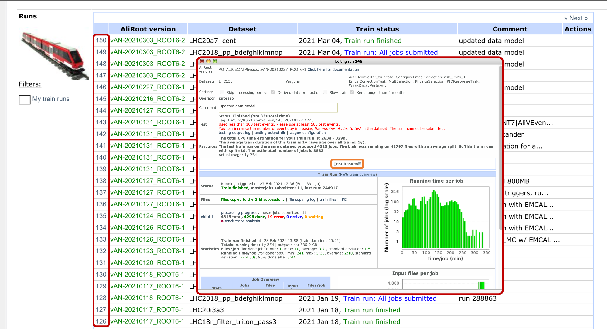
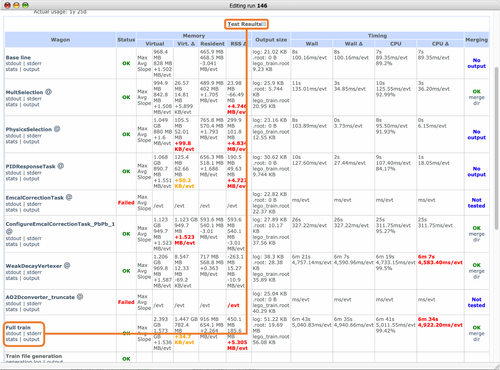

# Downloading AO2D

If you need single input files from the same train, please take them from the train test, by:

* Going to the train <a href="https://alimonitor.cern.ch/trains/train.jsp?train_id=132" target="_blank">Run3_Conversion</a>
* Click on the train number of the train you are interested in then open the test results by clicking the + button

* Scroll to "full train" and click on "output"

* Download the AO2D.root
