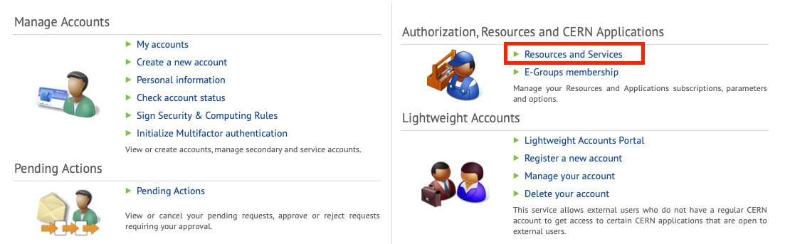

# Getting started

Welcome to the first steps of the analysis framework documentation!

Let's start with some basics.

## Are you a registered ALICE member?
Use [this link](https://alisw.cern.ch/check) to check if your CERN account is connected to ALICE. In case you see a message saying that you are not an ALICE member, you need to fix the problem: many services are not accessible if you are not considered an ALICE member.

Drop an email to the ALICE Secretariat, they will help you: <alice.secretariat@cern.ch>

## Do you have access to lxplus?
When you have a CERN account you can typically login to lxplus via SSH:
```bash
ssh USERNAME@lxplus.cern.ch
```
If, in spite of providing the correct password, you are not allowed to connect, go on your [CERN account management page](https://cern.ch/account). You need to **Sign in** and to select **Resources and Services** like in the picture below:


<div align="center">

</div>

Then click the big **List Services** button and check if the following services are enabled for you:

<div align="center">

</div>

You need:
* LXPLUS and Linux
* AFS Workspaces
* EOS/CERNBox

In case some of them are missing, just click on the service to subscribe. For Linux, you may be requested to provide a "group" and a "reason" for requesting the subscription.

* **Group**: `z2` (it corresponds to ALICE)
* **Reason**: just type something like "new ALICE member", it's enough
It will take at least two full working hours before you will be able to use the services

Here's a list of further topics that will get you going with our software:


