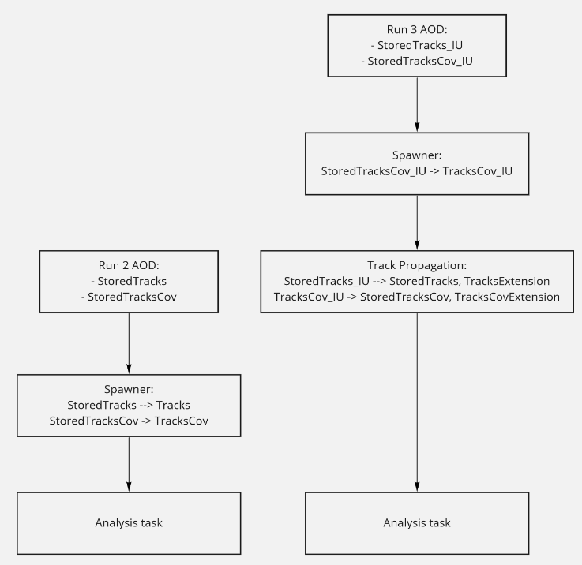

# Track Propagation

The Run 3 AO2D stores the tracks at the point of innermost update. For a track with ITS this is the 
innermost (or second innermost) ITS layer. For a track without ITS, this is the TPC inner wall or 
for loopers in the TPC even a radius beyond that. In the AO2D.root the trees are therefore called O2tracks_IU
and O2tracksCov_IU (IU = innermost update). The corresponding O2 data model tables are TracksIU and TracksCovIU, respectively.
If your task needs tracks at the collision vertex it will fail because it looks for O2tracks and O2tracksCov.

In order to propagate the tracks to the collision vertex, include the task `o2-analysis-track-propagation` into your workflow.
This task produces the tables Tracks and TracksCov (in order to get the latter, please enable `processCovariance` through the json configuration).

```note
This task also produces the `TrackExtended` table needed for `o2-analysis-track-selection`, therefore `o2-analysis-trackextension` does not need to be added to the workflow at the same time. 
```

This task is not needed for Run 2 converted data where the tracks are already propagated to the collision vertex.

The overall table flow is illustrated here:

<div align="center">

</div>


