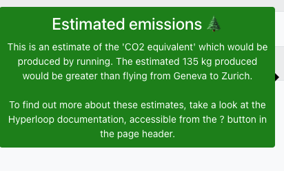

## CO2 equivalent estimates

    

 

* In Hyperloop, an estimate of the CO2eq produced by your trains is shown in order to give an idea of the environmental impact. We need to run analysis to achieve our scientific goals but we can optimize the code and sometimes work efficiently even with less trains. The displayed value should help educate the decision if a train is needed.
The value is shown before trains have been run (an estimate based using the wagon test) and then when a train run has finished. 
* The estimate is visible in:
  * Wagon test view and train submission view (an estimate based on the wagon test)
  * Train test view (an estimate based on the train test. So, this estimate accounts for all wagons in the train)
  * In the 'General' tab of the train view, when a train is in the state 'Done'. This estimate directly uses the CPU usage of the train run. 

##  How is it calculated?

Principle:
* There are a few studies for estimating CO2eq of computing, and there are many factors to consider such as the efficiency of the machines used and the power grid which the machines are on.
* Furthermore, grey energy (the energy to produce the machines) and the transfers of the data could be considered.
* It would be difficult to give justice to all these details and check for each train where exactly the jobs were running.
* Therefore, in Hyperloop, estimates of CO2eq are directly derived from CPU usage using an average conversion factor.

Calculation input:
* Power per computing core: We use an optimistic value of 10 W/core for pure power consumption and assume a 50/50 split between the carbon from power and carbon from embodied / embedded emissions, therefore working effectively with 20 W/core. Some literature estimates up to 53 W/core for power alone in high-performance computing (see https://www.nature.com/articles/s41550-020-1169-1).
* Electricity emission factors (kgCO2eq per kWh) vary depending how electricity is produced. However, carbon is not everything and we do not want to enter a debate on how energy should be produced here. Therefore we use an average value from https://arxiv.org/pdf/2011.02839.pdf of 0.301 kgCO2eq / kWh, noting that even for the same country the estimates vary significantly depending on the source (e.g. comparing to https://arxiv.org/pdf/2101.02049).
* Hyperloop estimations do not account for the power consumption of data transfer, central infrastructure, or power for storage. The paper 'electricity intensity of internet data transmission', https://onlinelibrary.wiley.com/doi/pdf/10.1111/jiec.12630, estimates 0.06kWh/GB in data transfer. This would mean that a petabyte of data transfer needs 18 tCO2eq. Additionally, the carbon produced by storing the data would not be negligible. For simplicity, we do not account for these aspects, so that our estimates are more directly linked to individual train runs, and not the wider Grid infrastructure.
* At 20W per core, and 0.301 kgCO2eq / kWh, this gives us: **6t CO2eq per 1MCPUh** or **1 CPU year = 53.3 kgCO2eq**
* In order to compare these emissions to something we know, we use CO2eq produced by flights based on curb6.com