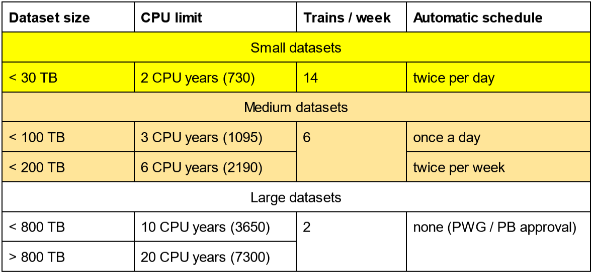

## General resource rules

The very large amount of data that will be collected in Run 3 represents a challenge for analysis, for both the CPU needs and the read data from storage, and therefore a resource usage policy has been put in place to ensure proper use of computing resources. The policy has been openly discussed in multiple meetings, including ALICE weeks, and is subject to adjustments as necessary and as the collaboration gains experience with the Run 3 analysis. If you have questions or doubts, please first refer to your PWG convener who will then bring up the case with the analysis coordinator.

The image below summarizes the policy: 

In general, four categories of trains exist: 

* Trains below 30 TB and taking more than 1.5y of CPU time (red shaded area) are very strongly discouraged. In those cases, please resort to very small trains (where throughputs of even 100 KB/s are allowed with autosubmission) to run. 
* Trains that are lower than 1.5y in CPU usage and loop over less than 200 TB are free to execute and can be executed on Hyperloop via autosubmission. In a certain region between 30-200 TB, slightly more than 1.5y in CPU time is allowed as long as performance is better than 1 MB/s (green shaded area). 
* Trains that loop over more than 200 TB and have a throughput of at least 3 MB/s can run, provided that PWG conveners approve them (pink shaded area). 
* Heavy trains looping over datasets bigger than 200 TB or with low throughput above 30 TB, as marked in the blue region in the plot, require Physics Board approval to run. For those trains, a special analysis budget can be negotiated with the Physics Board.

***Exceptionally***, trains based on metadata (i.e. trains covering multiple periods) are allowed to have throughput between 1 MB/s and 3 MB/s (and not just above 3 MB/s) for a few selected high-priority datasets. This is to provide incentives to running over master datasets and therefore will also increase the likelihood of running common trains with more than one wagon at a time. This exception is marked in the resource group map above.

## Implementation in Hyperloop datasets

In practice the chart above is mapped on a number of distinct resource groups which determine the limits assigned to each dataset:

The smaller the dataset size, the more often it is automatically submitted per week and the more often you are allowed to run on it per week. Manual requests to datasets above 50 TB are only fulfilled at the automatical submission times defined. This is in order to allow grouping of wagons to large trains.

## Derived data

Derived datasets can be created on Hyperloop which are by construction much smaller than the original datasets. Those are advantagous because steps which are identical in each analysis train run (e.g. event selection and centrality calculation, secondary-vertex finding) are only executed once which saves CPU. Furthermore, as the size is smaller such trains cause less load on the storages. 

As an example, you can imagine that you run a derived data train on a dataset of 500 TB where you need explicit approval. Say you have a reduction factor of 100, then your output derived data is about 5 TB. You will be allowed to run on that dataset much more frequent, see the table above.

However, it may be that your analysis remains CPU hungry even if the input dataset is reduced. By default the operators who create your dataset will assign the resources based on the table above. The person who has requested the dataset can request to change that assignement. This will increase the CPU limit but reduce the trains/week and auto-submission slots by moving down one row in the table above. Obviously, running on a derived dataset should never take more resources than the limits that apply to the original parent dataset.
