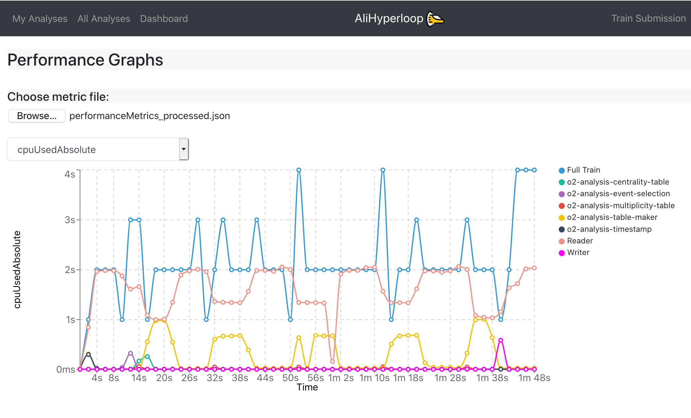

## For the Run 2 LEGO train expert. What has changed?

* There are different webpages for users and train operators:
  1. **My Analyses**, the user will see only _Analyses_ where the user belongs to, this is [defined through JIRA](userdocumentation.md#joinanalysis). The user has writing permits to all elements in this webpage.
  2. **All Analyses** is a read only view of all the _Analyses_ available in the system. The only action permitted is [cloning a wagon](#clonewagon).
  3. **Train Submission** is a webpage designed for operators. It displays only datasets which have enabled wagons, allowing train composition. Submitting, modifying and killing a train is also allowed.
  4. **Train Runs** is a webpage designed for operators. It displays all train runs available in the system. The actions permitted are submitting, modifying and killing a train.
  5. **Datasets**, for the users, it is a read only view of all the _Datasets_ available in the system. For the train operators, it allows creation,configuration and deletion of _Datasets_. The _Datasets_ are directly created from runlists already defined in the _DPG Runlists_ webpage instead of copying from a text file in the twiki page like the LEGO trains.
  6. **DPG Runlists** is a webpage designed for the DPG. For the DPG experts, it allows creation, configuration and deletion of runlists, instead of defining them in a twiki page. For the users it offers a read only view of all DPG runlists available in the system.
  7. **Dashboard** provides a summary of the current state of the system by displaying a set of status parameters. The user can check information such as the number of ongoing tests, the number running trains and the current grid jobs. Moreover, an overview of the previous week is presented.

* There is a history feature for wagons and datasets. You can access it by clicking on the button `📜` available inside of a wagon/dataset view. A detailed view of what has been created/updated/removed from the wagon/dataset is shown, as well as the username and the time when the change was made.

* There are automated notifications. These notifications are created per user, and display changes made to tools, like _Datasets_, that are being used by the user. They are displayed per _Analysis_ in the _My Analyses_ page, or globally in the button `🔔` which can be found on the top menu.

* There is an impersonation feature `🕵` that can be used by experts in order to help users if they have a problem with the UI.

* When [enabling a wagon](#enablewagon) in a dataset the user can choose whether to enable it with a fixed package tag, latest package tag or a [pull request](#pullrequest).

* After [enabling a wagon](#enablewagon) in a dataset, the wagon is automatically tested, and the user can follow the test status (`⌛️`,`⏳`,`❗️`,`🌟`,`💣`) in the _My Analyses_ page.

* **Performance Graphs** page allows the user to upload his own local metrics file, and then generate the test graphs specific to that file. You produce a local _performanceMetrics.json_ by running the o2 workflow with the argument _--resources-monitoring 2_ which, in this example, produces monitoring information every 2 seconds. These are the same type of graphs produced in the _Test Graphs_ tab of the train run. This page can be accessed at: <https://alimonitor.cern.ch/hyperloop/performance-graphs>.

