## Introduction
* There are different types of notifications that the user receives, each related to a specific topic. A notification does not necessarily request an action to be taken, but informs the user about a specific element, and depending on the situation, the user can decide the possible next steps.
* The notifications can be seen in the _My Analyses_ page and in the _Notifications_ page, by clicking `🔔` in the menu bar.

    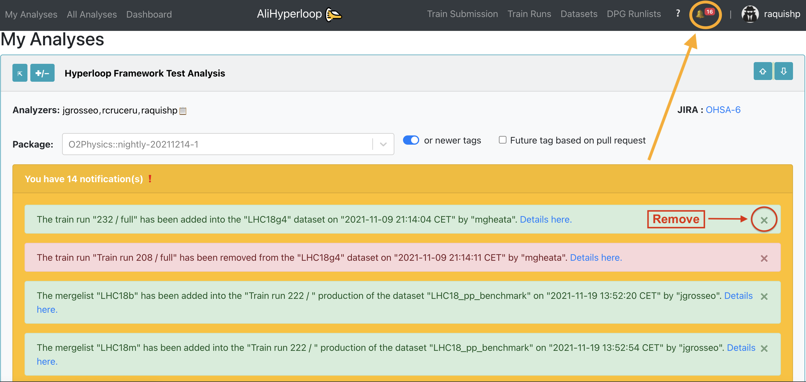

* The user can click the `✖️` button to remove a notification. In order to remove all the notifications, go to the Notifications page, and click the `❌`_Dismiss all_ button.

    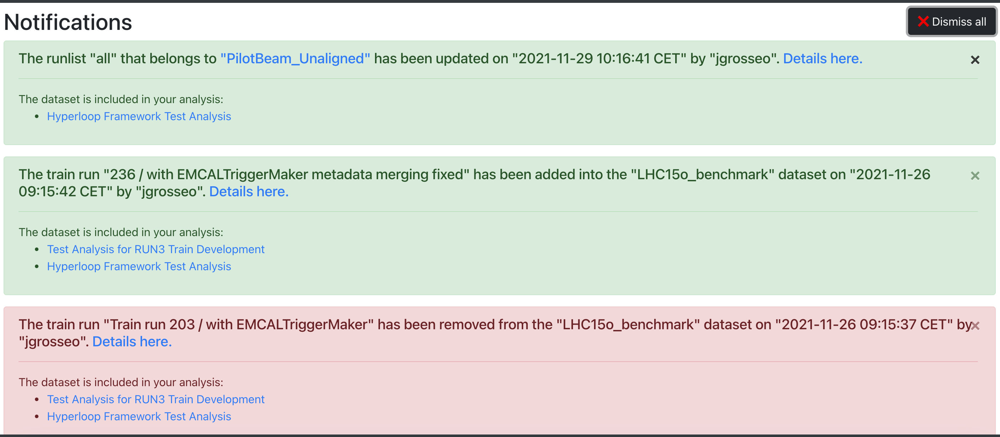

## Dataset changed

* Notifies the user that an update has been made to one of the datasets included in his or her analyses. The notification message contains a link to the history of the dataset that has been modified, as well as a link to the analysis this dataset is included in. The update here indicates that:
  * The list of runs to be excluded in a production has been modified
  * The dataset has been staged or unstaged to a target
  * A linked dataset had been added or removed
  * The automatic composition settings have changed, e.g. the schedule

    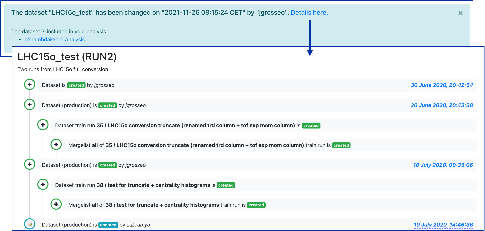

## Dataset activated / deactivated

* Notifies the user when a dataset included in his or her analyses has been successfully activated or deactivated.

    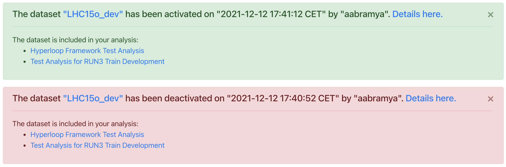

## Dataset production added or removed

* For RUN 3 data and MC, the user is informed if the production has been successfully added to or removed from the dataset.

    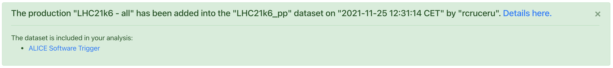

* For RUN 2 data, the user is notified when a conversion train run has been added to or removed from the dataset.

  

  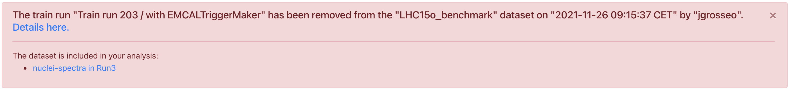

* For derived data, a notification is sent when a Hyperloop train that produced derived data has been added or removed.

## DPG runlist updated

* The user is informed when a run has been added to or removed from the DPG runlist. This change is usually done by the DPG experts.

  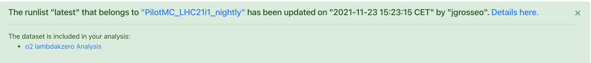

## Mergelist updated

* The mergelist defines which runs are merged into one file at the end of the train running. The user is informed when a mergelist has been modified, added to or removed from the dataset production.

  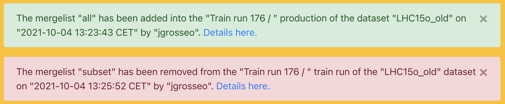

## Linked datasets

* When a dataset has linked datasets, it cannot be part of an analysis. If a dataset was part of an analysis, and then the dataset is modified to have linked datasets, then the dataset is removed from the analysis. If there were enabled wagons, they are disabled.

## Disabled wagon

Informs the user when a wagon has been disabled in different circumstances:

* When the dataset the wagon was enabled for is deactivated.

* When the directories corresponding to a dataset production (job types or train runs) are not found.

* Local tests are cleaned if the wagons are not submitted in a period of 4 weeks. The user is notified that the respective wagons are automatically disabled.

  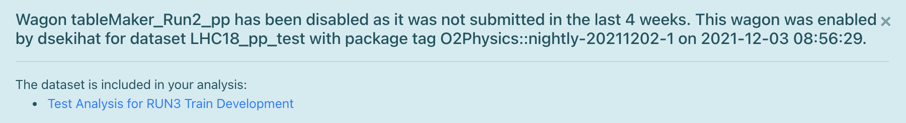

* When a wagon with derived data output is enabled, the test cannot start if the wagon and its dependencies share the same workflow. As a result, the wagon is disabled and the user is notified about the wagons which share the same task.

  * The notification format is: The wagon _"wagon_name"_ was disabled in _"dataset_name"_. There is derived data. The following wagons have the same workflows {_wagon1_, _wagon2_: _common_workflow_},...,{_wagonX_, _wagonY_: _common_workflow_}

  

    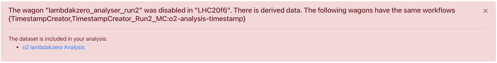
  

* If among the wagon and its dependencies there are identical derived data outputs, the test cannot start, and the wagon is disabled.

  * The notification format is:  The wagon _"wagon_name"_ was disabled in _"dataset_name"_. The following wagons have the same derived data outputs {_wagon1_, _wagon2_: _common_derived_data_},...,{_wagonX_, _wagonY_: _common_derived_data_}

  

    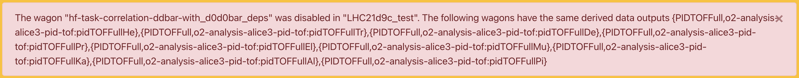
  

## Inconsistent parameters

* Hyperloop makes a comparison between the wagon configuration and the configuration defined in O2 for the package tag selected for the wagon. If they do not coincide, the user will be informed about the mismatch. The comparison is case sensitive, therefore a Configurable will not match if its name does not contain the identical lowercase / uppercase combination.

* The user is notified if there is a configurable present in the wagon configuration that is not defined in O2 for the selected package tag tag. Likewise, it informs the user when the wagon configuration misses one or more of the Configurables defined in O2 for the specific tag.

  

    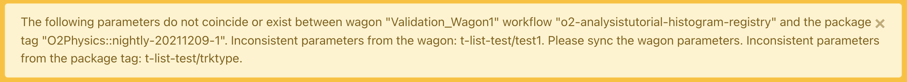
  

* If the **wagon configuration is old**, and the wagon is enabled with the latest package tag, the user is advised to sync the wagon in order to get the present configuration. Following this, the test will start automatically. Likewise, the test is reset whenever there is a change in the database, such as updating or syncing the wagon configuration or its dependencies.

  

    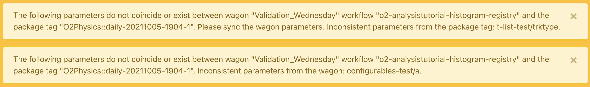
  

* If the **wagon is enabled with an older tag**, the configuration might not match (hence the notification). If the old tag is needed, then syncing is not an option because this will set the package to the latest one. Therefore, the wagon configuration has to be modified as needed. The user can take as a reference _full_config.json_ in the test output, which shows the configuration the test is being run with, and compare it to the wagon configuration.
