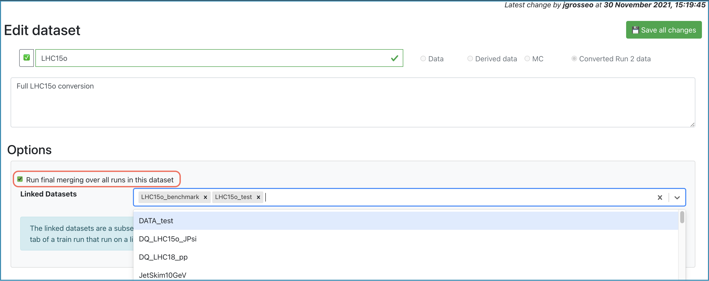
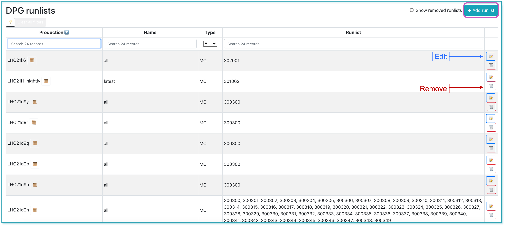
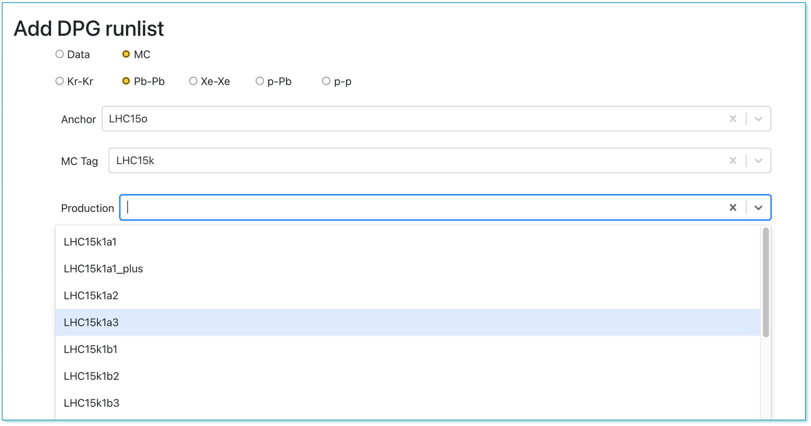

## Dashboard

* The Dashboard displays the current state of the system by showing a number of status parameters related to wagons, trains and grid jobs. Additionally, the user can see the summary of the last week: average completion time, number of finished trains and wagon tests. 
* Below, a display of the grid jobs state during the previous week is displayed, for every site.

* By clicking the number of wagons waiting to be included in a train, the user can directly open the [_Train Submission_](#trainsubmission). Similarly, a link to the [_Train Runs_](#trainruns) is available by clicking the number of trains to be submitted to the grid, the number of running tests, or the number of finished trains.

## Train Submission
* For a user, the _Train Submission_ page displays a read view only of datasets which have enabled wagons.
* For a train operator, the  _Train Submission_ page displays only datasets which have enabled wagons, and allows train composition, as well as submitting, modifying and killing a train.
### Train Composition
* Trains are composed per dataset. Only wagons which have a test status of success `🌟` or warning `❗️` can be composed in a train.
* By default, wagons that were enabled at most one week ago are shown. In order to display all enabled wagons, click on `off` in the _Enabled_ column.
* In order to compose a train, click `☑️` in the _Compose_ column. The package tag will be automatically chosen, and other wagons that can be included in the train run are signalized with 🟢, and the ones which are not compatible with 🔴. All wagons that are compatible can be automatically chosen by clicking on `✅ Select all compatible wagons`, or by selecting them one by one.
* `☑️ automatic composition`: Train composition schedule is defined in the dataset settings. If the dataset has a defined schedule, the trains will be automatically composed at the specified time if the tests have finished without a warning.

* If a wagon has _Derived data_ tables activated, it will be signalized with the icon 🗂️ in the _Test status_ column. 
* `☑️ slow train`: If enabled, the express train features are disabled. This means that you may have up to 2% more jobs which finish but the train run may take several days more.
* `☑️ derived data`: If enabled, this train produces derived data to be used for further analysis. The results will not be merged and can be used as input for future train runs.
* `☑️ automatic submission`: If enabled will submit the train automatically after the test is done and succeeds `🌟`.
* `Target`: Sets the facility/cores where the train will be run.
* Finally, after defining the configuration, click on `Compose 🚂` to compose a train. After composing a train run, the wagons selected cannot be selected for a different train run unless the current train run is [decomposed](#decompose). After the train run is [submitted](#submit), the wagons will be disabled. 
* If a user changes a configuration between train composition and submission, the new configuration is not taken into account. The train runs with the wagons and dataset configuration corresponding to the time at which it was _created_.
* The train will be automatically tested, and its progress can be followed in the _Train Runs_ table, or in the [**Train Runs**](#trainruns) page by clicking on the TRAIN_ID link.

### Staged Submission

* Linked datasets are subsets of a big dataset
* First, a train run needs to be _Done_ on a smaller linked dataset before being run on a bigger dataset
* Any user who is part of the analysis can **request a long train**, by going on the train result to the _Request long train_ tab
* Choose the dataset, target and wagons you want to include and click the _Compose and request approval_ button.
* Approval from the participating analyses PWGs conveners is required in order to submit a long train 

## Train Runs
* For a user, the _Train Runs_ page displays a read view only of all train runs available in the system.
* For a train operator, the _Train Runs_ page displays all trains available in the system, and allows submitting, modifying and killing a train.
* The train run detail can be accessed by clicking on the TRAIN_ID, or with the url <a href="https://alimonitor.cern.ch/hyperloop/train-run/TRAIN_ID" target="_blank">https://alimonitor.cern.ch/hyperloop/train-run/TRAIN_ID</a>.
* The actions allowed in a train run:
  * Adding a _comment_.
  * Decomposing a train run by clicking on `Decompose ☠️`. When decomposing a train run, the wagons in it will be allowed to be composed in a new train run.
  * Submitting a train run. Only train runs which test status is success `🌟` or warning `❗️` can be submitted. By default, the train run is submitted to the _Grid - single core_, but a different target can be chosen. To submit a train run, click on `Submit 🚂`.
  * When a dataset has activate final merge, a button `Submit final merge` appears after all the masterjobs are finished successfully.
  * Killing a train by clicking on `Kill ☠️`.
  * Cloning a train in the tab `Clone`. When cloning a train, the wagons and dataset configuration used will be the same as of the original train. Other settings can be changed: package tag, target facility, slow train, derived data, automatic submission.
* In the _Test Graphs_ tab, the user can plot the available metrics for the specific _Train run_. By hovering over the graph, the corresponding values are displayed in a dynamic window, stating the value for each participating wagon.

  

    
  

  * The metric can be selected from the upper-left dropdown, and the graph will change accordingly.
  * The user can choose to plot the metric data per device, by checking the _Per Device_ near the dropdown.

  

    
  

  * In order to plot the highest ten graphs, that means the graphs with the highest average, the user can click the **Show top 10 largest** checkbox.
  
  
  

    
  

  
  * The user can zoom into the graph by clicking and dragging the mouse along the area of interest. For zooming out, the user can double-click on the graph.

  

    
  

  
   

    
   

  
  
## Trains with issues

* This page displays the list of train runs that are in state _submitted_ but could not be merged due to specific problems:
  * More than 30% of the jobs have errors 
  * The Analysis job has all jobs in a final state, but there is no merging job
  * There is a merging job which is in a final state, but there is no final merge job
  * There is a final merge job in final state, but the merging is not declared as _done_ in the database

  

    
  

  
  
* The operator must analyse this cases and decide upon resubmitting some of the jobs, launching the final merging submission where the errors are not significant, or killing the train when there are too many errors.
  
## Datasets

* Displays all the datasets available. The operator can add, remove, activate or deactivate a dataset. Likewise, by clicking the `📝` button, the operator is able to modify the dataset in the [**Edit Dataset**](#editdataset) page.

  

    
  

* The runlists will be received programmatically from the DPG.

### Edit Dataset

* Allows the operator to update the dataset properties. Firstly, the operator can update the name and description of the dataset, and activate or deactivate it by clicking the `❌` / `✅` button. In order to save the changes you made, click the _Save all changes_ button.

    
  

* In the **Options** box, you can add linked datasets to the current dataset, which will be used for the [**staged submission**](#stagedsubmission). Enabling _Run final merging over all runs in this dataset_ will merge all the runs of all the productions during the final merging.
* In the **Analysis Facility Staging**, the user is able to stage or unstage the data to the available targets displayed in the dropdown.
  * Choose a target from the dropdown list, and you will be notified of the amount of data required for the staging process. Confirm by clicking OK. The staging process will start once clicking the _Save all changes_ button at the top right of the page. 
  * You can hover over the staging percentage to get a detailed status of the staging progress. By clicking on the percentage, you will be lead to a new tab where you can see the elaborate overview of the transfer requests on MonALISA.
  * To unstage the data to a specific target, click the _Unstage_ button. The unstaging process will start once clicking _Save all changes_.

  

    
  

* In the **Automatic Composition** box, the user is able to enable the automatic train composition. Choose the composition type, the maximum CPU time that can be consumed and the maximum number of trains that can be composed per week for an analysis.
  * _Scheduled_: If within schedule, trains will be composed with the compatible wagons in the dataset, regardless of the occupation in target memory.
  * _Train full_: The train will be composed only if the compatible wagons add up to at least 75% of the target memory.
  * _Scheduled and train full_: The train will be composed if it is within schedule. If not in schedule, the train will only be composed if the compatible wagons occupy at least 75% of the target memory.
* For all these cases, the trains will only be composed if the tests finished without a warning and if they do not store derived data.

  

    
  

  
* Choose the days and times at which the trains should be composed.

  

    
  

  
### Deciding on data to be processed depends on the dataset type

* For RUN 2 data, the operator can add or remove a [**RUN 2 conversion train run**](https://alimonitor.cern.ch/trains/train.jsp?train_id=132#runs).

  

    
  

  
* For RUN 3 data and MC, the operator can add or remove a production. In order to create a new production, click on the _+ Production_ button. After choosing the collision type, anchor and MC Tag, select the runlist defined by the DPG and click _+Add_. If no runlist is available, contact the DPG specialists for creating one.
  
  

    
  

* For derived data, you can add or remove a production. Create a production by selecting _Data_, choose the desired _Period_ and select the required _Derived train_ from the dropdown list.

 

    
  

  
* Within the dataset production you can update the list of runs to be excluded.
* The mergelist defines which runs are merged into one file at the end of the train running. The operator can add, update, activate or deactivate a mergelist in the dataset. 

    
  

## DPG Runlists

* This page is dedicated to the DPG experts and displays all the DPG runlists created for the datasets. The DPG expert can add, edit or remove a runlist.

 

    
  

  
* Clicking on the the `📝` button will lead to the edit view, where the DPG expert can change the list of runs.

 

    
  

  
* DPG experts can create a new runlist by clicking the **+Add runlist** button. In order to create the list of runs, the correct data type, anchor, tag and production must be selected.

 

    
  

