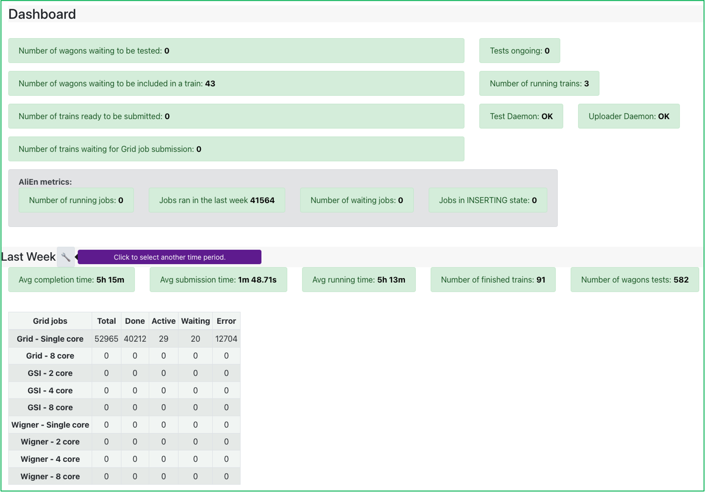
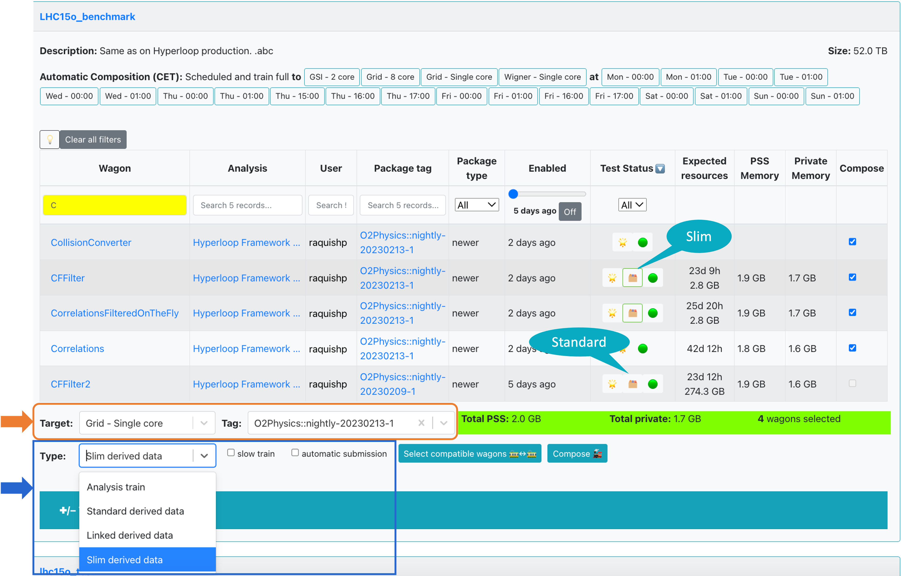
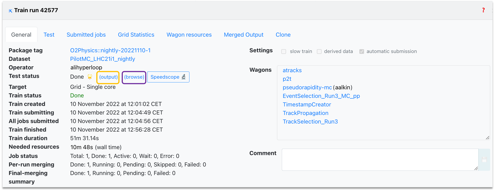
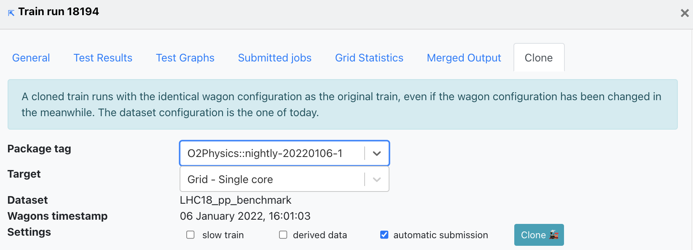
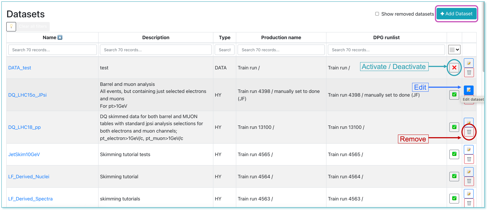
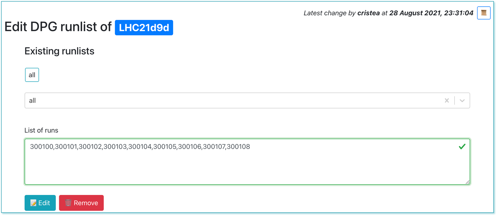

## Dashboard

* The <a href="https://alimonitor.cern.ch/hyperloop/dashboard" target="_blank">**Dashboard**</a> displays the current state of the system by showing a number of status parameters related to wagons, trains and grid jobs. Additionally, the user can see the summary of the last week: average completion time, number of finished trains and wagon tests. 
* Below, a display of the grid jobs state during the previous week is displayed, for every site.

* By default, the dashboard displays the last week summary on the lower section of the page. Use the interval selection tool to select the period of time that you are interested in: either select one from the left menu (e.g. last 3 months, last year), or choose the start and end date of the interval. Click **Save** to update the dashboard.

* By clicking the number of wagons waiting to be included in a train, the user can directly open the [_Train Submission_](#trainsubmission). Similarly, a link to the [_Train Runs_](#train-runs) is available by clicking the number of trains to be submitted to the grid, the number of running tests, or the number of finished trains.

## Train Submission
* For a user, the <a href="https://alimonitor.cern.ch/hyperloop/train-submission" target="_blank">**Train Submission**</a> page displays a read view only of datasets which have enabled wagons.
* For a train operator, the  _Train Submission_ page displays only datasets which have enabled wagons, and allows train composition, as well as submitting, modifying and killing a train.
### Train Composition
* Trains are composed per dataset. Only wagons which have a test status of success `🌟` or warning `❗️` can be composed in a train. If a wagon has _Derived data_ tables activated, it will be signalized with the icon 🗂️ in the _Test status_ column.
* By default, wagons that were enabled at most one week ago are shown. In order to display all enabled wagons, click on `off` in the _Enabled_ column.
* In order to compose a train, select wagons by checking `☑️` in the _Compose_ column. The Package `Tag` will be automatically chosen, and other wagons that can be included in the train run are signalized with 🟢, and the ones which are not compatible with 🔴. All wagons that are compatible can be automatically chosen by clicking on `✅ Select all compatible wagons`, or by selecting them one by one.

&nbsp;

There are a number of settings that you can decide on when composing a train:
* `Target`: Sets the facility/cores where the train will be run. 
* `Type`: This setting defines the type of train to be composed, and decides if derived data will be stored. The dropdown offers 4 possible options:
  * **Analysis train** - this will be a standard analysis train and no derived data will be produced.
  * **Standard derived data** - this train will produce derived data to be used for further analysis. The results will not be merged across runs and can be used as input for future train runs.
  * **Linked derived data** - this option is for derived data which needs to access its parent file when it is processed. The derived data file produced will remember its parent files, inheriting also their storage location. The results will not be merged across runs and can be used as input for future train runs. Datasets composed from this train need to have parent access level activated. **`NOTE`**: at present (November 2022) this option is not yet implemented.
  * **Slim derived data** - similarly to the standard derived data case, this train will produce derived data to be used for further analysis. This is reserved for derived data of small output size. The results will be merged across runs and are not available to use in future train runs. The data will be automatically deleted after a preset period of time. **`NOTE`**: at present (November 2022) this option is not yet implemented. 
* `☑️ slow train`: If enabled, the express train features are disabled. This means that you may have up to 2% more jobs which finish but the train run may take several days more.

* `☑️ automatic submission`: If enabled, the train will be automatically submitted after the test is done and succeeds `🌟`.
* Finally, after defining the configuration, click `Compose 🚂`. After composing a train run, the wagons that are part of it cannot be selected for a different train run unless the current one is [decomposed](#decompose). After the train run is [submitted](#submit), the wagons will be disabled. 

* `☑️ automatic composition`: The train composition schedule is defined in the dataset settings. If the dataset has a defined schedule, the trains will be automatically composed at the specified times if the tests have finished without a warning and there is no derived data activated.

&nbsp;

* If a user changes a configuration between train composition and submission, the new configuration is not taken into account. The train runs with the wagons and dataset configuration corresponding to the time at which it was _created_.

* The train will be automatically tested, and its progress can be followed in the _Train Runs_ table, or in the [**Train Runs**](#train-runs) page by clicking on the TRAIN_ID link.

### Staged Submission

* Linked datasets are subsets of a big dataset
* First, a train run needs to be _Done_ on a smaller linked dataset before being run on a bigger dataset
* Any user who is part of the analysis can **request a long train**, by going on the train result to the _Request long train_ tab
* Choose the dataset, target and wagons you want to include and click the _Compose and request approval_ button.
* Approval from the participating analyses PWGs conveners is required in order to submit a long train 

## Train Runs
* For a user, the <a href="https://alimonitor.cern.ch/hyperloop/train-runs" target="_blank">**Train Runs**</a> page displays a read view only of all train runs available in the system.
* For a train operator, the _Train Runs_ page displays all trains available in the system, and allows submitting, modifying and killing a train.
* To compare two trains, select them in the Compare column and click Compare. This will open a new tab displaying the differences between the two trains.

 

    
 

 
* The train run detail can be accessed by clicking on the TRAIN_ID, or with the url <a href="https://alimonitor.cern.ch/hyperloop/train-run/TRAIN_ID" target="_blank">https://alimonitor.cern.ch/hyperloop/train-run/TRAIN_ID</a>.

   

* The actions allowed in a train run:
  * Adding a _comment_.
  * Decomposing a train run by clicking on `Decompose ☠️`. When decomposing a train run, the wagons in it will be allowed to be composed in a new train run.
  * Submitting a train run. Only train runs which test status is success `🌟` or warning `❗️` can be submitted. By default, the train run is submitted to the _Grid - single core_, but a different target can be chosen. To submit a train run, click on `Submit 🚂`.
  * When a dataset has activate final merge, a button `Submit final merge` appears after all the masterjobs are finished successfully.
  * Killing a train by clicking on `Kill ☠️`. This will stop all running jobs.
  * Closing a train by clicking `Close ❌`. This will stop further activity, but will keep the jobs running.
  * Cloning a train in the tab `Clone`. When cloning a train, the wagons and dataset configuration used will be the same as of the original train. Other settings can be changed: package tag, target facility, slow train, derived data, automatic submission.

### Train Run Result

* The _General_ tab displays the summary of the train's progress, direct links to dataset and participating wagon configuration, as well as direct links to the test output and the <a href="https://johnysswlab.com/speedscope-visualize-what-your-program-is-doing-and-where-it-is-spending-time/" target="_blank">speedscope</a> profiling of the task. Additionally, you can use the `(browse)` button to open the content of AnalysisResults.root in the web browser.

   

* The _Test_ tab displays the performance metrics and interactive graphs. This is split in three subtabs: Full Test, Per Wagon and Graphs.
* The _Full test_ tab shows the performance metrics for the full test and plots the proportional set size on a responsive graph that can be zoomed in (click and drag) and out (double click). The table on the right side of the graph summarizes the resources used, including information such as the PSS memory and private memory, as well as the expected resources.

   

* The _Per Wagon_ tab displays the metrics per device (reader, workflows and writer), offering the same type of responsive graph for the monitoring of the PSS memory. To access / hide the graphs, click on the icon next to the device names. Additionally, you can check the number of calls to CCDB per device in the right-most column.
 

   

 
* In the _Graphs_ tab, the user can plot the available metrics for the specific _Train run_. By hovering over the graph, the corresponding values are displayed in a dynamic window, stating the value for each participating wagon.

  

    
  

* You can choose the metric of interest from the upper-left dropdown, which will update the graph accordingly. To plot the metric data per device, select the `Per device` checkbox.

 

* In order to plot the highest ten graphs, that means the graphs with the highest average, the user can click the **Show top 10 largest** checkbox.

  

* To zoom into the graph, click and drag over the area of interest, and release. Double click on the graph to zoom out.

  
  

* In _Submitted jobs_, you can see the summary of the master jobs, along with links to the **IO Statistics** and **Stack trace**.

   

* Click the **IO Statistics** button to be redirected to the site activity information.

   

* Click the **Stack trace** button to be redirected to the stack trace information in MonALISA. Here you can see a summary of failures of your jobs.
  

   

 

* This information is collected when the masterjobs have finished from all ERROR_V jobs. Some information is already available while the train is running but make sure to check again when the train is in a final state. Common errors are grouped and counted. This allows you to investigate failures and debug them using the provided stack trace.

* The _Grid statistics_ tab presents a summary of the jobs performance and plots the Files/Job, CPU time/Job and Wall time/Job statitics.

   

 

* If the train is run as a derived data production and there are activated tables, the Derived data tab will be showed. This displays the tables which are produced by the task and saved to the output.

   

* _Merged output_ displays the jobs status after submitting the train. The mergelists are defined in the dataset settings.

   

 

* When the final merge is started manually by the operator, some of the runs may not be merged. You can copy the list of merged runs or the total list of runs by clicking on the (red) number.
* Here you can also track the submission process, and debug issues that may have taken place.

   

 

* You can use the _Clone train_ tab to clone the train. The cloned train will have **the same wagon timestamp** of the original train, with the **current dataset configuration**. This means that if the users have changed the wagon configuration in the meanwhile, this is not taken into account (this is different from the LEGO trains).
* Other settings can be modified: package tag, target facility, slow train option, derived data, automatic submission.

   

 

* The _Request long train_ tab allows users to request a long train after the train ran on a linked dataset. Linked datasets are subsets of a big dataset (_set up in the Dataset settings_). First, a train run needs to be **Done on a smaller linked dataset** before being run on a bigger dataset.
* Any user who is part of the analysis can request a long train. Approval from the participating analyses PWGs conveners is required in order to submit a long train. Train operators or admins can also approve a long train, but it is usually done by the PWG. 

   

 

* Once the long train is approved:
  * If Automatic Submission is enabled and the train test finished without memory warning and within the CPU time limit, the train is submitted
  * Otherwise the Submit button is enabled and the operator can submit the train
  
   

    
   
 
  
  
## Trains with issues

* This page displays the list of train runs that are in state _submitted_ but could not be merged due to specific problems:
  * More than 30% of the jobs have errors 
  * The Analysis job has all jobs in a final state, but there is no merging job
  * There is a merging job which is in a final state, but there is no final merge job
  * There is a final merge job in final state, but the merging is not declared as _done_ in the database

  

    
  

  
  
* The operator must analyse this cases and decide upon resubmitting some of the jobs, launching the final merging submission where the errors are not significant, or killing the train when there are too many errors.
  
## Datasets

* The <a href="https://alimonitor.cern.ch/hyperloop/datasets" target="_blank">**Datasets**</a> page displays all the datasets available. The operator can add, remove, activate or deactivate a dataset. 

*  The user can browse and click on the _Dataset_ they want to add to their analysis.

* Inside of the _Dataset_ view page, click on the button `✚ Add dataset to analysis`. It will display a list of all the analyses you belong to. Select the _Analysis_ you want to add the dataset to, and click on `💾 Save`.

* By clicking the `📝` button, the operator is able to modify the dataset in the [**Edit Dataset**](#edit-dataset) page.

  

    
  

* The runlists will be received programmatically from the DPG.

### Edit Dataset

* Allows the operator to update the dataset properties. Firstly, the operator can update the name and description of the dataset, and activate or deactivate it by clicking the `❌` / `✅` button. In order to save the changes you made, click the _Save all changes_ button.

    
  

* In the **Options** box, you can add linked datasets to the current dataset, which will be used for the [**staged submission**](#stagedsubmission). Enabling _Run final merging over all runs in this dataset_ will merge all the runs of all the productions during the final merging.
* In the **Analysis Facility Staging**, the operator is able to stage or unstage the data to the available targets displayed in the dropdown.
  * Choose a target from the dropdown list, and you will be notified of the amount of data required for the staging process. Confirm by clicking OK. The staging process will start once clicking the _Save all changes_ button at the top right of the page. 
  * You can hover over the staging percentage to get a detailed status of the staging progress. By clicking on the percentage, you will be lead to a new tab where you can see the elaborate overview of the transfer requests on MonALISA.
  * To unstage the data to a specific target, click the _Unstage_ button. The unstaging process will start once clicking _Save all changes_.

  

    
  

* In the **Automatic Composition** box, the operator is able to enable the automatic train composition. Choose the composition type, the maximum CPU time that can be consumed and the maximum number of trains that can be composed per week for an analysis.
  * _Scheduled_: If within schedule, trains will be composed with the compatible wagons in the dataset, regardless of the occupation in target memory.
  * _Train full_: The train will be composed only if the compatible wagons add up to at least 75% of the target memory.
  * _Scheduled and train full_: The train will be composed if it is within schedule. If not in schedule, the train will only be composed if the compatible wagons occupy at least 75% of the target memory.
* For all these cases, the trains will only be composed if the tests finished without a warning and if they do not store derived data.

  

    
  

  
* Choose the days and times at which the trains should be composed.

  

    
  

  
### Deciding on data to be processed depends on the dataset type

* For RUN 2 data, the operator can add or remove a [**RUN 2 conversion train run**](https://alimonitor.cern.ch/trains/train.jsp?train_id=132#runs).

  

    
  

  
* For RUN 3 data and MC, the operator can add or remove a production. In order to create a new production, click on the _+Production_ button. After choosing the collision type, anchor and MC Tag, select the runlist defined by the DPG and click _+Add_. If no runlist is available, contact the DPG specialists for creating one.
  
  

    
  

* For derived data, you can add or remove a production. Create a production by selecting _Data_, choose the desired _Period_ and select the required _Derived train_ from the dropdown list.

 

    
  

  
* Within the dataset production you can update the list of runs to be excluded.

  

    
  

* The mergelist defines which runs are merged into one file at the end of the train running. The operator can add, update, activate or deactivate a mergelist in the dataset. 

## Derived Data

* Accessed from the **Datasets** view, this page summarizes the derived data available in Hyperloop. The information displayed can be grouped by Dataset, Analysis or PWG (use the upper buttons to switch between the views).

 

 

* Make use of the available filters of the table to search for the derived data of interest. Expand or collapse groups to focus on a specific derived data or use the Expand all/Collapse all button to expand/collapse all groups.

* By clicking on the derived data train number, this will open the Train result view (the same one accessed from pages such as Train runs or Trains with issues). You can schedule derived data for deletion by clicking on the **Delete** button in the train view or in the Delete column of the table. The deletion will only be available if the derived data is not used in any datasets or if the datasets using this derived data are not activated. In case these conditions are not met, you can ask the analyzers if the derived data is still needed for the activated datasets or they can be removed.

 

 

* To see all the datasets in which a derived data is used, click **See dependent datasets** button in the Train result view (right next to the Delete button). This will redirect you to a new tab displaying the **Datasets** page, filtered to show all the datasets (activatd or not) which are using the derived data. To see specifically only the activated or deactivated datasets dependent on this derived data, use the activated / deactivated buttons inside the In datasets column of the table. This will open the same Datasets page, but filtered depending on the datasets' activated state.

 

* Click on the name within the Analysis column to be redirected to a new tab showing a read-only view of the analysis within which the derived data was created.

 

* The total size of the derived data in Hyperloop is displayed below the table, on the right side. Keep in mind that this is the total size of all derived data and it is not affected by the filtering of the table.

 

## Staging status

* Accessed from the **Datasets** view, this page displays the staging status of all the datasets in Hyperloop for which a staging process was initiated. Use it to follow up the progress and check if the staging is completed, ongoing, or if there are any issues. 

 

* Click on the staging percentage in the right-most column to view the detailed staging progress in a new tab: this shows the status of each transfer request.

 

## DPG Runlists

* The <a href="https://alimonitor.cern.ch/hyperloop/runlists" target="_blank">**DPG Runlists**</a> page is dedicated to the DPG experts and displays all the DPG runlists created for the datasets. The DPG expert can add, edit or remove a runlist.

 

    
  

  
* Clicking on the the `📝` button will lead to the edit view, where the DPG expert can change the list of runs.

 

    
  

  
* DPG experts can create a new runlist by clicking the **+Add runlist** button. In order to create the list of runs, the correct data type, anchor, tag and production must be selected.

 

    
  

