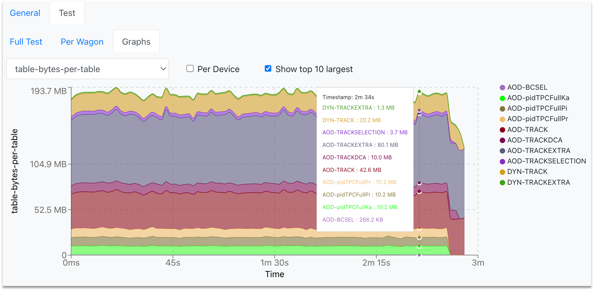

## Dashboard

* The Dashboard displays the current state of the system by showing a number of status parameters related to wagons, trains and grid jobs. Additionally, the user can see the summary of the last week: average completion time, number of finished trains and wagon tests. 

* By clicking the number of wagons waiting to be included in a train, the user can directly open the [_Train Submission_](#trainsubmission). Similarly, a link to the [_Train Runs_](#trainruns) is available by clicking the number of trains to be submitted to the grid, the number of running tests, or the number of finished trains.

## Train Submission
* For a user, the _Train Submission_ page displays a read view only of datasets which have enabled wagons.
* For a train operator, the  _Train Submission_ page displays only datasets which have enabled wagons, and allows train composition, as well as submitting, modifying and killing a train.
### Train Composition
* Trains are composed per dataset. Only wagons which have a test status of success `🌟` or warning `❗️` can be composed in a train.
* By default, wagons that were enabled at most one week ago are shown. In order to display all enabled wagons, click on `off` in the _Enabled_ column.
* In order to compose a train, click `☑️` in the _Compose_ column. The package tag will be automatically chosen, and other wagons that can be included in the train run are signalized with 🟢, and the ones which are not compatible with 🔴. All wagons that are compatible can be automatically chosen by clicking on `✅ Select all compatible wagons`, or by selecting them one by one.
* If a wagon has _Derived data_ tables activated, it will be signalized with the icon 🗂️ in the _Test status_ column. 
* `☑️ slow train`: If enabled, the express train features are disabled. This means that you may have up to 2% more jobs which finish but the train run may take several days more.
* `☑️ derived data`: If enabled, this train produces derived data to be used for further analysis. The results will not be merged and can be used as input for future train runs.
* `☑️ automatic submission`: If enabled will submit the train automatically after the test is done and succeds `🌟`.
* `Target`: Sets the facility/cores where the train will be run.
* Finally, after defining the configuration, click on `Compose 🚂` to compose a train. After composing a train run, the wagons selected cannot be selected for a different train run unless the current train run is [decomposed](#decompose). After the train run is [submitted](#submit), the wagons will be disabled. 
* If a user changes a configuration between train composition and submission, the new configuration is not taken into account. The train runs with the wagons and dataset configuration corresponding to the time at which it was _created_.
* The train will be automatically tested, and its progress can be followed in the _Train Runs_ table, or in the [**Train Runs**](#trainruns) page by clicking on the TRAIN_ID link.

## Train Runs
* For a user, the _Train Runs_ page displays a read view only of all train runs available in the system.
* For a train operator, the _Train Runs_ page displays all trains available in the system, and allows submitting, modifying and killing a train.
* The train run detail can be accessed by clicking on the TRAIN_ID, or with the url <a href="https://alimonitor.cern.ch/hyperloop/train-run/TRAIN_ID" target="_blank">https://alimonitor.cern.ch/hyperloop/train-run/TRAIN_ID</a>.
* The actions allowed in a train run:
  * Adding a _comment_.
  * Decomposing a train run by clicking on `Decompose ☠️`. When decomposing a train run, the wagons in it will be allowed to be composed in a new train run.
  * Submitting a train run. Only train runs which test status is success `🌟` or warning `❗️` can be submitted. By default, the train run is submitted to the _Grid - single core_, but a different target can be chosen. To submit a train run, click on `Submit 🚂`.
  * When a dataset has activate final merge, a button `Submit final merge` appears after all the masterjobs are finished successfully.
  * Killing a train by clicking on `Kill ☠️`.
  * Cloning a train in the tab `Clone`. When cloning a train, the wagons and dataset configuration used will be the same as of the original train. Other settings can be changed: package tag, target facility, slow train, derived data, automatic submission.
* In the _Test Graphs_ tab, the user can plot the available metrics for the specific _Train run_. By hovering over the graph, the corresponding values are displayed in a dynamic window, stating the value for each participating wagon.

  

    
  

  * The metric can be selected from the upper-left dropdown, and the graph will change accordingly.
  * The user can choose to plot the metric data per device, by checking the _Per Device_ near the dropdown.
  
  

    
  

  
## Datasets

## DPG Runlist

