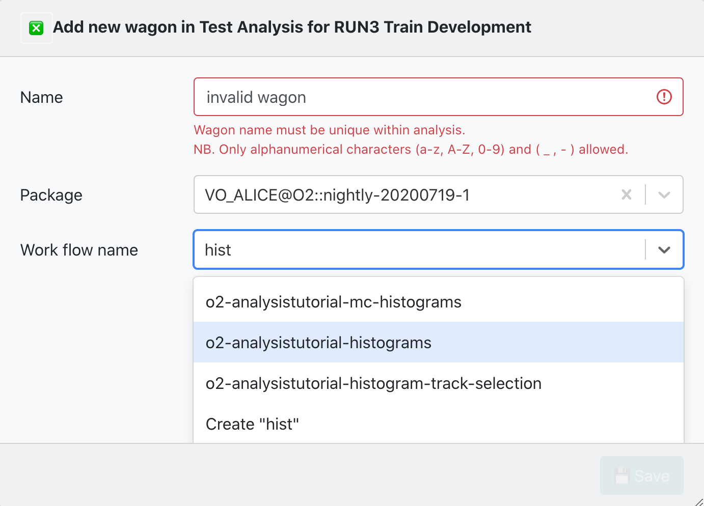
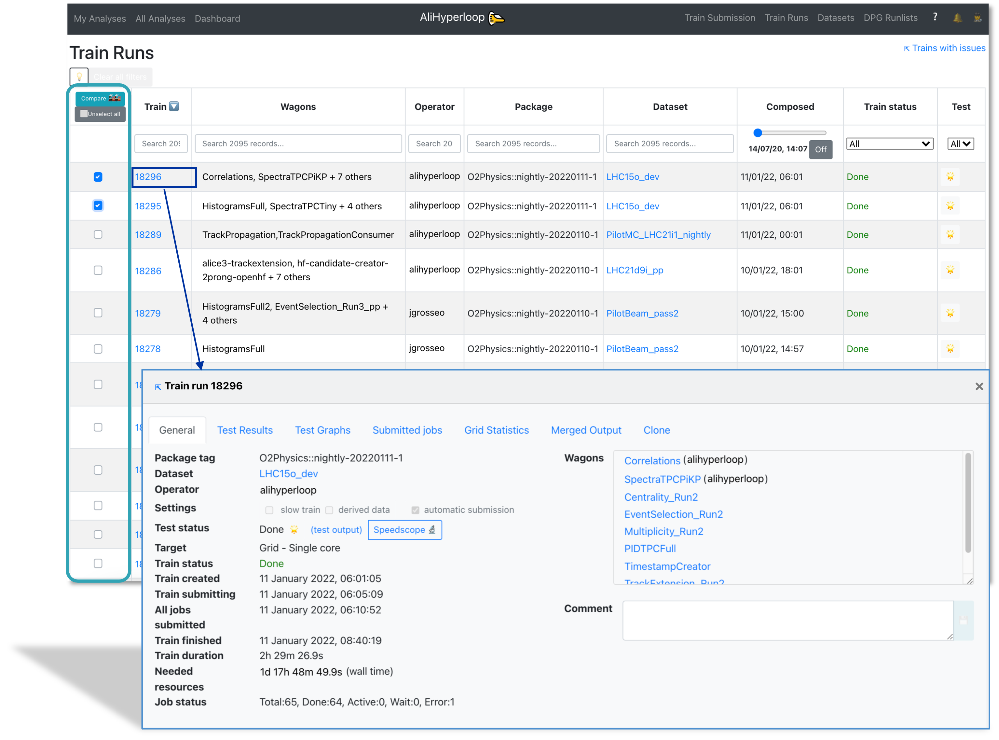
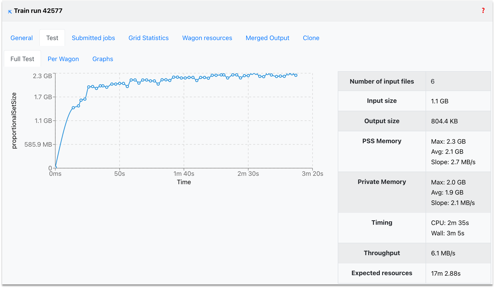
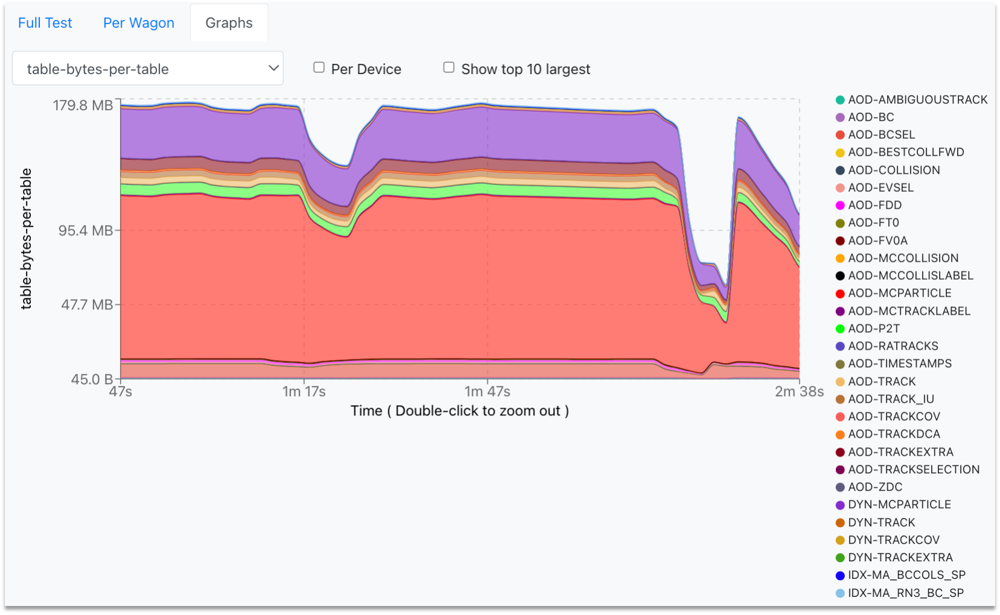
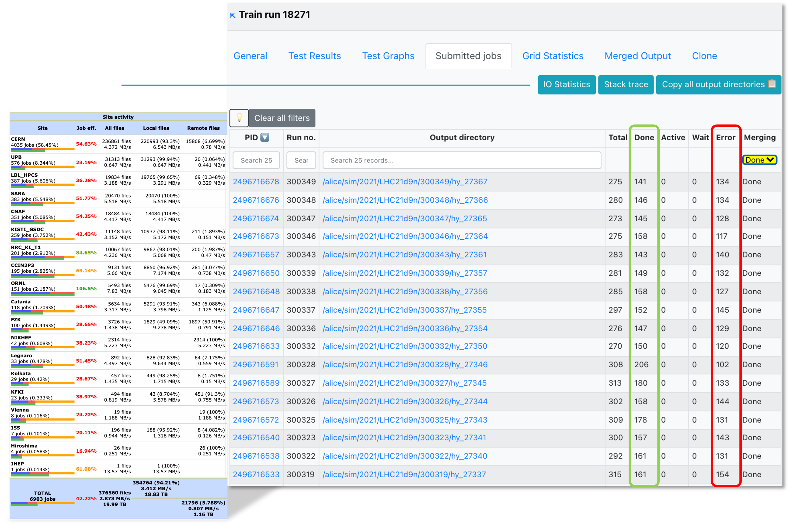
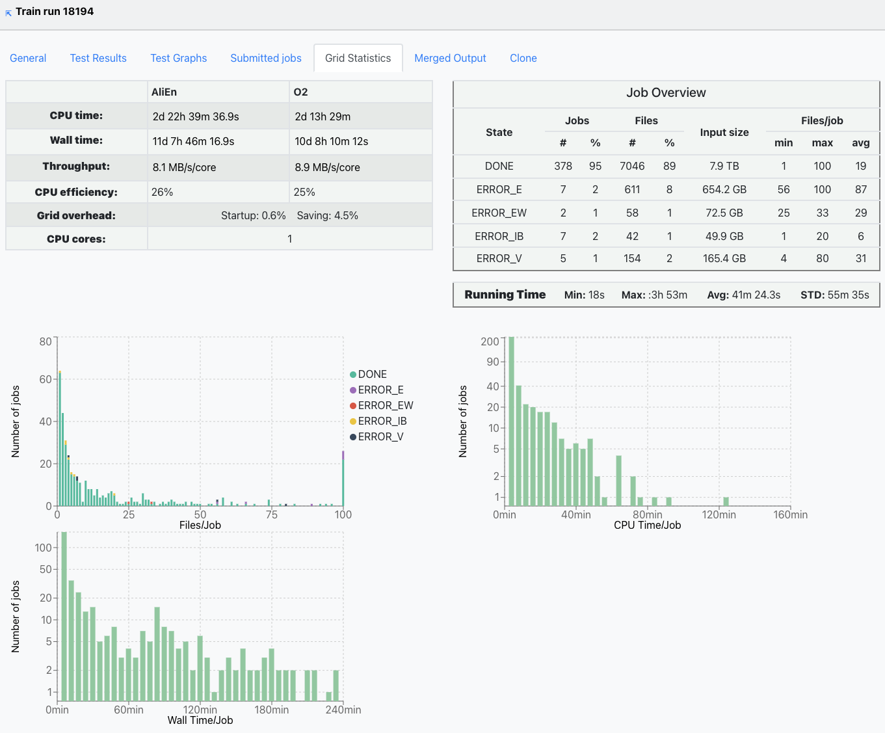
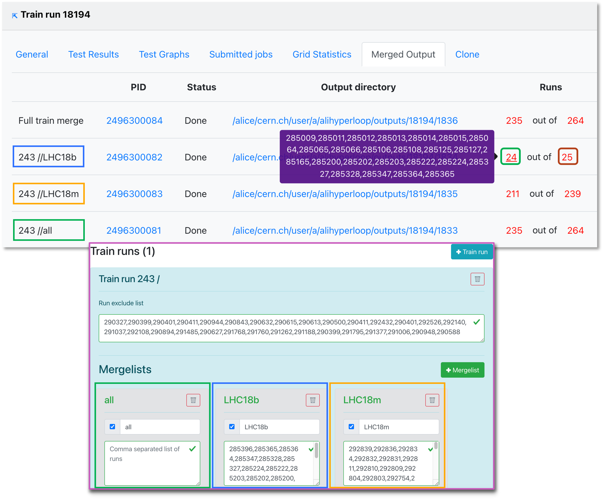
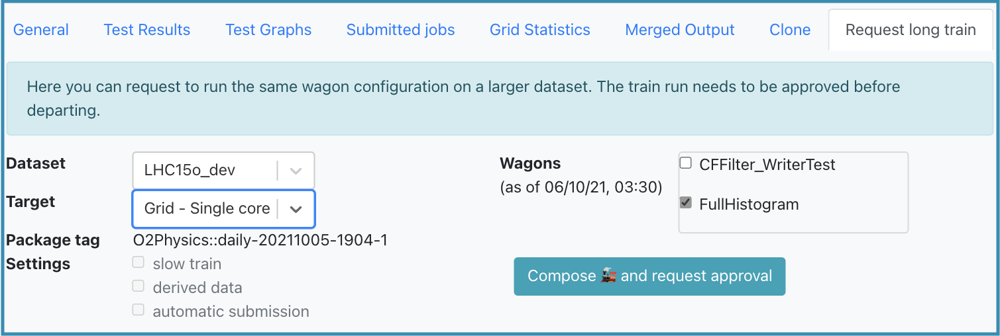

## My Analyses

* [**My Analyses**](https://alimonitor.cern.ch/hyperloop/) is a personalized webpage which displays all the analyses where the user belongs to.
* The analyses display can be expanded/collapsed and reordered with the buttons `✚/-`,`⇧` and `⇩`, or by dragging and dropping. This configuration is saved per user.
* The user can add/remove, configure and enable/disable wagons in this page.
* The user can add/remove datasets per analysis.
* Receiving emails on wagon test failure can be configured per analysis in `Datasets and Settings 📝`. It can be set to: none, all analyzers or only user who enabled the wagon.

### Service wagons

The _Service wagons_ are wagons which are dependencies to other wagons. They are created by experts, and you can add it as a dependency to your wagon in [edit wagon](#editwagon).

* For the users, in the _My Analyses_ page, there is a read only view of the _Service Analyses_ available on the top of the page.
* For the experts, if you need to create _Service wagons_, you need to have an analysis with the project type _O2 Hyperloop Service Wagons (OHSW)_ which can be [created in JIRA](#joinanalysis). Once the analysis is created, you can [add a new wagon](#addwagon) inside of the analysis available in _My Analyses_.

##  Adding and configuring a wagon to an analysis

### 1. Adding a new wagon

Using the _My Analyses_ page, inside of the _Analysis_ you want to add the wagon to, click on `✚ Add new wagon`.

There are 2 parameters required to create a new wagon:

* Name: The _newWagonName_ has to be unique within an _Analysis_, and it only accepts alphanumerical characters, no spaces.
* Work flow name: You can either select from a list of _workflow_Names_ from an existing package tag. Or create a _workflow_Name_ which belongs to a [pull request](#pullrequest).

By clicking on `💾 Save` the wagon will be added, and you will be redirected to [_Edit **Wagon**_](#editwagon) where you can modify the wagon's configuration.

### 2. Cloning a wagon

* Using the _My Analyses_ page, click on the button `🧬` to clone a wagon.

A list of _Analyses_ you belong to will be displayed. You have to select the _Analysis_ where you want to clone the _Wagon_ to, and name the _NewWagon_ (the wagon name has to be unique within _Analysis_). By clicking on `🧬 Clone`, a new wagon will be added with the same configuration as the _Wagon_ including subwagons and derived data.

* Using the _All Analyses_ page:

You can get to the _All Analyses_ page by using the main menu, or by the link in _My Analyses_ page: `(or clone wagon from other analysis)`. In the _All Analyses_ page, a read only view of all the analyses available in the system will be displayed. Browse and click on the _Analysis_ you want to clone the wagon from, and follow the procedure mentioned above.

###  3. Edit a wagon

* You can edit a wagon by clicking on the _Wagon_ name in the _My Analyses_ page. There are different tabs: Wagon settings, Configuration, Test Statistics.
* <a name="view-wagon">By clicking on the top-left corner, you will be redirected to a read-only view of the wagon, that can be shared with colleagues and support. The top right corner history symbol leads to the [_Wagon **History**_](#wagonhistory) page, which will display the state evolution of the wagon.

* In _Wagon settings_ you can modify the wagon name, work flow name, and select wagon's dependencies. The dependencies offered are wagons from the same _Analysis_ or from [_Service wagons_](#servicewagons).

* In _Configuration_ the wagon configuration corresponding to the workflow will be available in the _Base_. The configuration is divided per _Task_, hence if you need to add a new parameter, you will need add it in the following order: task, parameter and value.
* The wagon configuration supports a variety of parameter types defined in task as _Configurable_ including: primitive type parameters, fixed-length arrays, variable-length arrays, matrices, labelled matrices and histogram binning.

* The _Variable-length arrays_ allow the user to add/remove elements in the _Base_ wagon, and the change will be propagated in all the subwagons.

* There are three options for _histogram binning_:
  * _Fixed width_: Enter the number of bins, minimal and maximal value.
  * _Variable width_: Enter a comma-separated list of bin edges.
  * _Inherit from base_: This option is available for subwagons only and, if selected, the axis configuration will be the same as in the Base.

* If you need to run the same workflow, but modify one (or more) of the parameter's value, you can use a subwagon instead of creating a new wagon. In order to create a subwagon, type the name of the new subwagon, the name has to be unique within the wagon, and type the value of at least one parameter in the configuration. The configuration of a subwagon will be kept the same as the _Base_ and overwrite only the parameters that you provide.

* The subwagons added to the wagon will be represented with an automatically assigned suffix in _AnalysisResults.root_. Here you can see an example where we have added two subwagons called _smalleta_ and _verysmalleta_.

* In order to update the base and subwagon configuration with the latest version of the workflow, click on the button `↻ sync` in _Configuration_. By synchronizing the configuration, the parameters which no longer belong to the workflow will be removed, and the values of the wagon's _Base_ will be updated as well if they have not been modified by the user.

* In _Derived Data_ the tables which are produced by the task are displayed. If activated, these are saved to the output if the train is run as a derived data production. The produced derived data can be made available by the operators and serve as input for subsequent trains. Note that derived data train do not submit automatically and may need additional approval. If in doubt, please seek advise before enabling derived data tables in your wagon configuration.

* In order to update the derived data configuration with the latest version of the workflow, click on the button `↻ sync` in _Derived data_. By synchronizing the derived data, the tables which no longer belong to the workflow will be removed, and the values of the tables will be updated.

* _Test Statistics_ contains three graphs that display different metrics following the tests this wagon was part of. The first graph plots the _PSS Memory_ corresponding to each test run. The second one diplays the _CPU Time_, _Wall time_ and _Throughput_ along the test runs for this wagon. Finally, the third graph shows the _Output size_ at each test run.

* Depending on the datasets this wagon is using, the user is able to choose the _Dataset_ on which the metrics mentioned above are plotted, from the upper-left dropdown. In case no tests were run on the chosen dataset, a message will appear stating this.

* By clicking on the bullets representing the metric value at any of the test runs plotted, the user will open a new tab displaying a read-only view of the wagon test output.

* In order to zoom into the graph, the user needs to click and drag over the are of interest, which will automatically show the zoomed-in graph portion. By double-clicking, it will zoom out and show the entire graph.

###  4. Wagon History

* In the _Wagon History_ page, there is a summary of the wagon's state from the creation until the last update. By clicking on the _+_ symbol, one can expand the information, showing the subwagons' details and the derived data at each timestamp.

* On the right side of the page, the user can select two timestamps in order to compare the state of the wagon between the two by clicking _Compare_. This will lead to [_Compare Wagons_](#comparewagons) page. You can cancel your current selection by clicking _Unselect all_.

###  5. Compare wagon at different timestamps

* In the _Compare Wagons_ view, we can analyse the state of a wagon at two different timestamps. The _Wagon settings_ tab shows the changes regarding the name, workflow and dependencies and/or the common features between the two. By clicking on one of the dependencies, a new tab will open showing the comparison between the same two timestamps for the wagon clicked.

* The Derived data tab reflects the differences concerning the derived data at the two timestamps.

### 6. Compare individual wagons

* The user is able to compare a wagon with any of their individual wagons.
* Using the _My Analyses_ page, click on the button `🆚` to compare the wagon. A list of all your wagons will be displayed. Once you select the desired wagon, this will open the comparison view in a new tab. This has a similar structure to the different timstamps comparison.

##  Creating or joining an analysis

The Analyses to which a user belongs to, is defined through a [JIRA](https://alice.its.cern.ch/jira/secure/Dashboard.jspa) ticket.
In the JIRA page, create an issue by clicking on the button `Create`, and fill the information with the following parameters:

* In _Project_ select your PWG.
* In _Issue Type_ select _Analysis_.
* In _Summary_ write the name of your _Analysis_.
* In _Components_ select your PAG.
* In _Run 3 analysis_ choose `Yes`.
* In _Analyzers_ select all the users that will be part of this analysis. All the analyzers will have writing permits to all components in the analysis.
* (Optional) In _Description_ give a brief description of the analysis.
The rest of the parameters are not relevant for the Hyperloop train system.

After all the parameters have been set, click on `Create` and your _Analysis_ will be available in the _My Analyses_ and _All Analyses_ page.

The synchronization from JIRA to the Hyperloop train system can take up to 30 minutes.

## Enabling datasets

### 1. Using the _My Analyses_ page

* Inside of an analysis, click on the button `Datasets and Settings 📝`.

* There is a list of _Enabled datasets in **Analysis**_. You can disable a dataset for that analysis by clicking on the button `❌`.
* Inside of _Enable dataset_ you can search for an active dataset by filtering by data type, collision system, anchor and period. And add it to your analysis by clicking on the button `✚ Add to analysis`. Or you can click the button `ℹ️ All datasets` to be redirected to the [**Datasets**](#datasets) page.

### 2.  Using the _Datasets_ page

* The [**Datasets**](https://alimonitor.cern.ch/hyperloop/datasets) page displays all the datasets available.
* You can browse and click on the _Dataset_ you want to add to your analysis.

* Inside of the _Dataset_ view page, click on the button `✚ Add dataset to analysis`. It will display a list of all the analyses you belong to. Select the _Analysis_ you want to add the dataset to, and click on `💾 Save`.

## Enabling a wagon and wagon test

You can enable a wagon in the _My Analyses_ page. Inside of the _Analysis_ there are the datasets available for that analysis, or you can [_enable/disable_ datasets](#enabledatasets). There are 3 options for enabling a wagon:

  1. Latest package tag: You can select a package tag with the option `or newer`. This means that your wagon can be tested and composed in a train with the package tag chosen or the latest package tag available.
  2. Fixed package tag: You can select a package tag and disable the option `or newer`. This means that your wagon can be tested and composed in a train with that package tag only.
  3. Pull request: Select the option `☑️ Future tag based on pull request`. There will be a list of the latest merged/unmerger pull requests available with their corresponding description. By choosing a pull request, your wagon will be tested as soon as the pull request is merged in a package tag. Then your wagon will be composed in a train with the latest package tag available.

 

  After choosing the package tag to be used, click on the button `❌` to enable your wagon in a dataset, the icon will change from `❌` to `✅`. If you hover over `✅` you can see the information about the enabled wagon: package tag, time and username. If you need to disable a wagon in a dataset, click on the button `✅`. After enabled, the wagon will be automatically tested and you can follow the progress of the [test](#wagontest) on the button next to `✅`: `⌛️` queued,`⏳` ongoing,`🌟` done, `❗️` warning and `💣` failed.

  If a wagon has dependencies, there is no need to enable the dependencies as well. The wagon's dependencies will be automatically tested by the system as well.

### Wagon tests

* The wagon test can be accessed in the _My Analyses_ page by clicking on the buttons: `⏳`,`🌟`, `❗️` or `💣`.
* If the TEST_ID is known, it can be directly accessed using the url <https://alimonitor.cern.ch/hyperloop/wagon-test/TEST_ID>.
* Inside of a wagon test, the test configuration, results, graphs and statistics are displayed.

*  The General tab displays the summary of the wagon test, direct links to dataset and participating wagon configuration, as well as direct links to the test output and the [speedscope](https://johnysswlab.com/speedscope-visualize-what-your-program-is-doing-and-where-it-is-spending-time/) profiling of the task. The test output can be accessed by clicking on the buttons: `⏳`,`🌟`, `❗️` or `💣`, or the link `(test output)`.
* If a wagon test has failed, one can study the failure source by clicking the test output button. This will open in a new tab the list of files that can be used to track the possible issues that led to the failure.

   

* You can analyse:
  * Full configuration
  * Performance metrics
  * Status
  * Standard error
  * Standard output
  * Test results tab

* The Test results tab shows the performance metrics per device (reader, workflows, writer), along with the expected resources. You can use the interactive graphs (per device) to zoom into the area of interest (click and drag) or zoom out (double-click).

   

* The Test Graphs tab, plots the available metrics for the specific wagon test. You can choose the metric of interest from the dropdown, zoom into the graph (click and drag) and zoom out (double-click).

    //already there

* If you only want to see the top 10 graph with the highest average, check the Show top 10 largest box.

* Whenever a wagon configuration is changed, if there are enabled wagons (including wagons that depend on it), then the test is automatically reset and a new test is launched. However, if the enabled wagon was already composed in a train, the train will run with the wagons and dataset configuration of the time at which the train was created.

### Relation of pull requests

When creating or enabling wagons, you can use a pull request instead of a package tag. By doing this, you don't need to wait until your code has been merged and released in a package tag.

1. [Adding a new wagon](#addwagon): You can create a wagon with your unmerged or unreleased workflow. If the workflow is not available, add manually the configuration of the wagon, and subwagons if needed. You can synchronize the wagon's configuration once the package tag that includes your pull request has been released.
2. [Enabling a wagon in a dataset](#enablewagon): If you need to enable your wagon with workflow that is unmerged or unreleased, use a `Future tag based on pull request`. There is a list of the latest merged and unmerged pull requests available in the system, you can see the pull request number and description. Select the _pull request tag_ and enable the wagon in a dataset. By doing this, the wagon will be queued to test, and the test will begin once the _pull request_ has been merged to a package tag, and the package tag is released. And then, if the test is successful, it'll be composed in a train with the latest package tag available.

## All Analyses

* [**All Analyses**](https://alimonitor.cern.ch/hyperloop/all-analyses) is a read only view of all analyses available in the system. <a name="view-analysis">Click on the analysis name to be redirected to a read-only view of the analysis.
* Wagons from any analysis available in the system can be cloned `🧬` to a user's analysis.

## Train Runs

* For a user, the [**Train Runs**](https://alimonitor.cern.ch/hyperloop/train-runs) page displays a read view only of all train runs available in the system.

* To compare two trains, select them in the Compare column and click Compare. This will open a new tab displaying the differences between the two trains.

 

    
 

* The train run result can be accessed by clicking on the TRAIN_ID, or with the url <https://alimonitor.cern.ch/hyperloop/train-run/TRAIN_ID>.

   

## Train Run Result

* The _General_ tab displays the summary of the train's progress, direct links to dataset and participating wagon configuration, as well as direct links to the test output and the [speedscope](https://johnysswlab.com/speedscope-visualize-what-your-program-is-doing-and-where-it-is-spending-time/) profiling of the task.

   

* The _Test results_ tab shows the performance metrics per device (reader, workflows, writer), along with the expected resources. You can use the interactive graphs (per device) to zoom into the area of interest (click and drag) or zoom out (double-click).

   

* In the _Test Graphs_ tab, the user can plot the available metrics for the specific _Train run_. By hovering over the graph, the corresponding values are displayed in a dynamic window, stating the value for each participating wagon.

  

    
  

  * The metric can be selected from the upper-left dropdown, and the graph will change accordingly.
  * The user can choose to plot the metric data per device, by checking the _Per Device_ near the dropdown.

  

    
  

  * In order to plot the highest ten graphs, that means the graphs with the highest average, the user can click the **Show top 10 largest** checkbox.

  

    
  

  * The user can zoom into the graph by clicking and dragging the mouse along the area of interest. For zooming out, the user must double-click on the graph.

  

    
  

   

    
  

* In _Submitted jobs_, you can see the summary of the master jobs, along with links to the **IO Statistics** and **Stack trace**.

   

* Click the **IO Statistics** button to be redirected to the site activity information.

   

* Click the **Stack trace** button to be redirected to the stack trace information in MonALISA. Here you can see a summary of failures of your jobs.

   

* This information is collected when the masterjobs have finished from all ERROR_V jobs. Some information is already available while the train is running but make sure to check again when the train is in a final state. Common errors are grouped and counted. This allows you to investigate failures and debug them using the provided stack trace.

* The _Grid statistics_ tab presents a summary of the jobs performance and plots the Files/Job, CPU time/Job and Wall time/Job statitics.

   

* If the train is run as a derived data production and there are activated tables, the Derived data tab will be showed. This displays the tables which are produced by the task and saved to the output.

   

* _Merged output_ displays the jobs status after submitting the train. The mergelists are defined in the dataset settings.

   

* When the final merge is started manually by the operator, some of the runs may not be merged. You can copy the list of merged runs or the total list of runs by clicking on the (red) number.
* Here you can also track the submission process, and debug issues that may have taken place.

   

* The _Request long train_ tab allows users to request a long train after the train ran on a linked dataset. Linked datasets are subsets of a big dataset (_set up in the Dataset settings_). First, a train run needs to be **Done on a smaller linked dataset** before being run on a bigger dataset.
* Any user who is part of the analysis can request a long train. Approval from the participating analyses PWGs conveners is required in order to submit a long train.

   

* Once the long train is approved:
  * If Automatic Submission is enabled and the train test finished without memory warning and within the CPU time limit, the train is submitted
  * Otherwise the Submit button is enabled and the operator can submit the train

   

    
   

