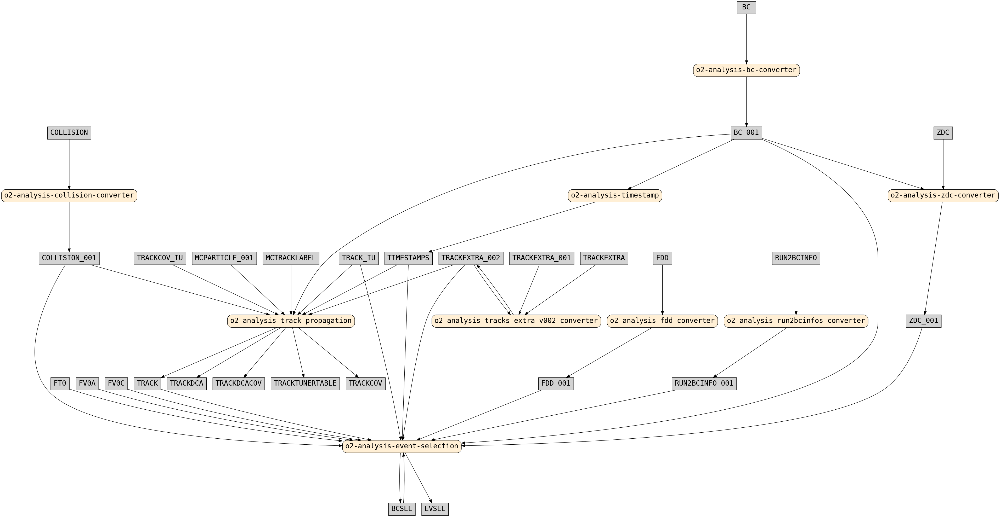

# Dependency finder

Dependency finder is a tool to explore input/output dependencies between O2Physics workflows and tables.

## Usage overview

The [`find_dependencies.py`](https://github.com/AliceO2Group/O2Physics/blob/master/Scripts/find_dependencies.py) script is available in the O2Physics repository and must be executed inside the O2Physics environment:

```bash
$O2PHYSICS_ROOT/share/scripts/find_dependencies.py <options>
```

The full list of options is displayed when the option `-h` is provided:

```text
usage: find_dependencies.py [-h] [-t TABLE [TABLE ...]] [-w WORKFLOW [WORKFLOW ...]] [-T TABLE_REV [TABLE_REV ...]] [-W WORKFLOW_REV [WORKFLOW_REV ...]] [-c] [-g {pdf,svg,png}]
                            [-x EXCLUDE [EXCLUDE ...]] [-l LEVELS]

Find dependencies required to produce a given table or to run a given workflow.

optional arguments:
  -h, --help            show this help message and exit
  -t TABLE [TABLE ...]  table(s) for normal (backward) search (i.e. find producers)
  -w WORKFLOW [WORKFLOW ...]
                        workflow(s) for normal (backward) search (i.e. find inputs)
  -T TABLE_REV [TABLE_REV ...]
                        table(s) for reverse (forward) search (i.e. find consumers)
  -W WORKFLOW_REV [WORKFLOW_REV ...]
                        workflow(s) for reverse (forward) search (i.e. find outputs)
  -c                    be case-sensitive with table names
  -g {pdf,svg,png}      make a topology graph in a given format
  -x EXCLUDE [EXCLUDE ...]
                        tables and workflows to exclude
  -l LEVELS             maximum number of workflow tree levels (default = 0, include all if < 0)
```

## Modes

Modes define the direction of search through the dependency tree.

Supported options are `-t`, `-w`, `-T`, `-W`.
Options can be used together and each option takes an arbitrary number of arguments.

### Backward mode

The backward mode searches for **parents** of the given object in the dependency tree.

#### Table producers (`-t`)

Gives a list of workflows that produce a given table.

Example: `-t BC_001`

```text
Table: BC_001

BC_001 <- ['o2-analysis-bc-converter']
```

Examples of use:

- Find a helper task (e.g. a converter) that produces a missing input table.
- Find a producer workflow to inspect how a table is filled.

#### Workflow inputs (subscriptions) (`-w`)

Gives a list of tables consumed by a given workflow.

Example: `-w o2-analysis-bc-converter`

```text
Workflow: o2-analysis-bc-converter

o2-analysis-bc-converter <- ['BC']
```

Examples of use:

- Find dependencies of a Hyperloop wagon (i.e. the list of directly required workflows) (with the `-l 1` option).
- Resolve unclear table name aliases in subscriptions.

### Forward mode

The forward mode searches for **children** of the given object in the dependency tree.

#### Table consumers (`-T`)

Gives a list of workflows that consume a given table.

Example: `-T BC`

```text
Table: BC

BC -> ['o2-analysis-bc-converter']
```

Examples of use:

- Find workflows affected by the modification of a table.
- Find a workflow which consumes a table that is not supposed to be required.

#### Workflow outputs (`-W`)

Gives a list of tables produced by a given workflow.

Example: `-W o2-analysis-bc-converter`

```text
Workflow: o2-analysis-bc-converter

o2-analysis-bc-converter -> ['BC_001']
```

Examples of use:

- List all output tables of a workflow that contains multiple structs.
- See the table descriptions of tables whose description names are different from their type names.
- See the table descriptions of tables table whose description names are generated in macros.

## Dependency levels (`-l`)

If provided with an integer number, dependencies are searched recursively up to the provided number of workflow levels.
The levels are indicated with indentation in the output.

If the provided number is negative, all levels are considered.

If not provided, only direct dependencies (`-l 0`) are considered.

Example: `-t timestamps -l 1`

```text
Table: timestamps

timestamps <- ['o2-analysis-timestamp']

Workflow dependency tree:

o2-analysis-timestamp <- ['BC_001']
  BC_001 <- ['o2-analysis-bc-converter']
    o2-analysis-bc-converter <- ['BC']
```

## Exclude (`-x`)

Workflows and tables can be excluded from the search using the `-x` option.

## Graphical output (`-g`)

The dependency tree can be visualised in a graph. (Requires [Graphviz](https://graphviz.org/) installed.)

Example: `-w o2-analysis-event-selection -l 1 -x o2-analysis-onthefly-tracker o2-analysis-track-propagation-tester -g png`

```text
Workflow: o2-analysis-event-selection

o2-analysis-event-selection <- ['BC_001', 'FDD_001', 'FT0', 'FV0A', 'FV0C', 'RUN2BCINFO_001', 'TIMESTAMPS', 'ZDC_001', 'BCSEL', 'COLLISION_001', 'TRACK', 'TRACKEXTRA_002', 'TRACK_IU']
  BC_001 <- ['o2-analysis-bc-converter']
    o2-analysis-bc-converter <- ['BC']
  FDD_001 <- ['o2-analysis-fdd-converter']
    o2-analysis-fdd-converter <- ['FDD']
  RUN2BCINFO_001 <- ['o2-analysis-run2bcinfos-converter']
    o2-analysis-run2bcinfos-converter <- ['RUN2BCINFO']
  TIMESTAMPS <- ['o2-analysis-timestamp']
    o2-analysis-timestamp <- ['BC_001']
  ZDC_001 <- ['o2-analysis-zdc-converter']
    o2-analysis-zdc-converter <- ['BC_001', 'ZDC']
  BCSEL <- ['o2-analysis-event-selection']
  COLLISION_001 <- ['o2-analysis-collision-converter']
    o2-analysis-collision-converter <- ['COLLISION']
  TRACK <- ['o2-analysis-track-propagation']
    o2-analysis-track-propagation <- ['BC_001', 'COLLISION_001', 'MCPARTICLE_001', 'MCTRACKLABEL', 'TIMESTAMPS', 'TRACKCOV_IU', 'TRACKEXTRA_002', 'TRACK_IU']
  TRACKEXTRA_002 <- ['o2-analysis-tracks-extra-v002-converter']
    o2-analysis-tracks-extra-v002-converter <- ['TRACKEXTRA', 'TRACKEXTRA_001', 'TRACKEXTRA_002']

Making dot file in: o2-analysis-event-selection.gv
Making graph in: o2-analysis-event-selection.png
```

The output graph `o2-analysis-event-selection.png` is shown below:

<div align="center">

</div>
