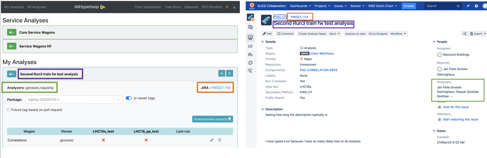
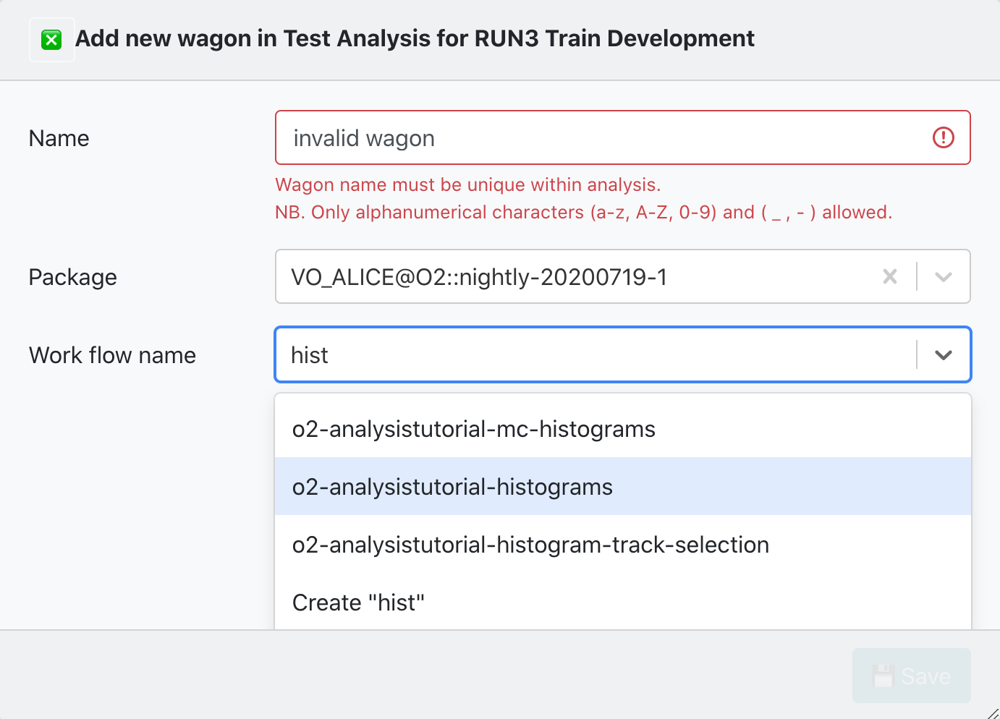
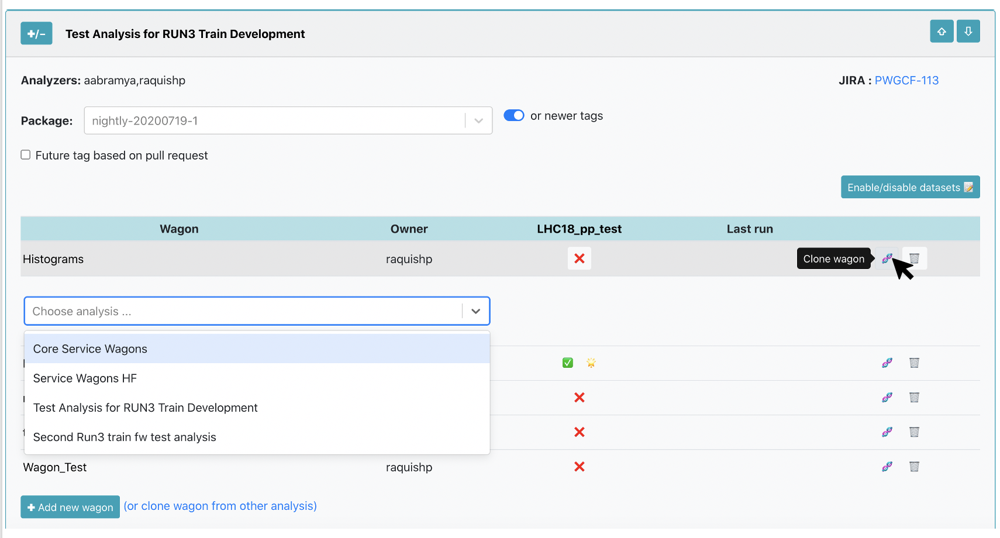
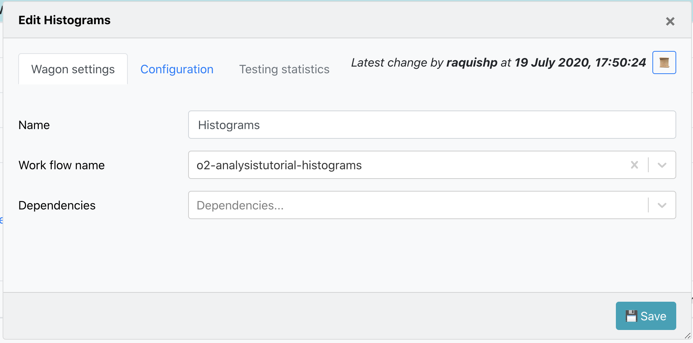
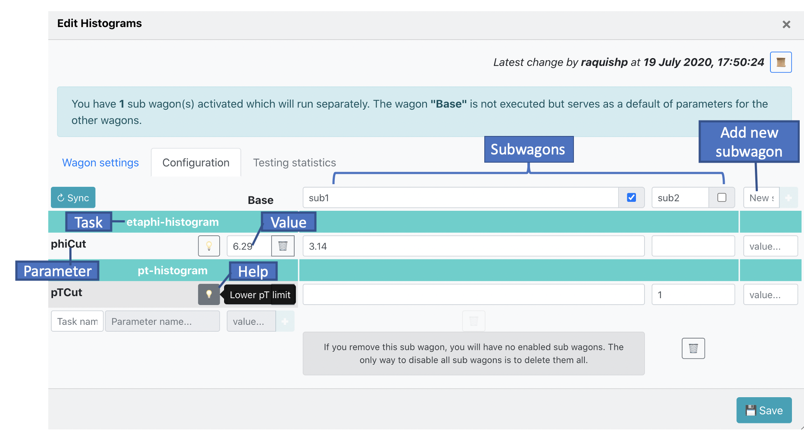
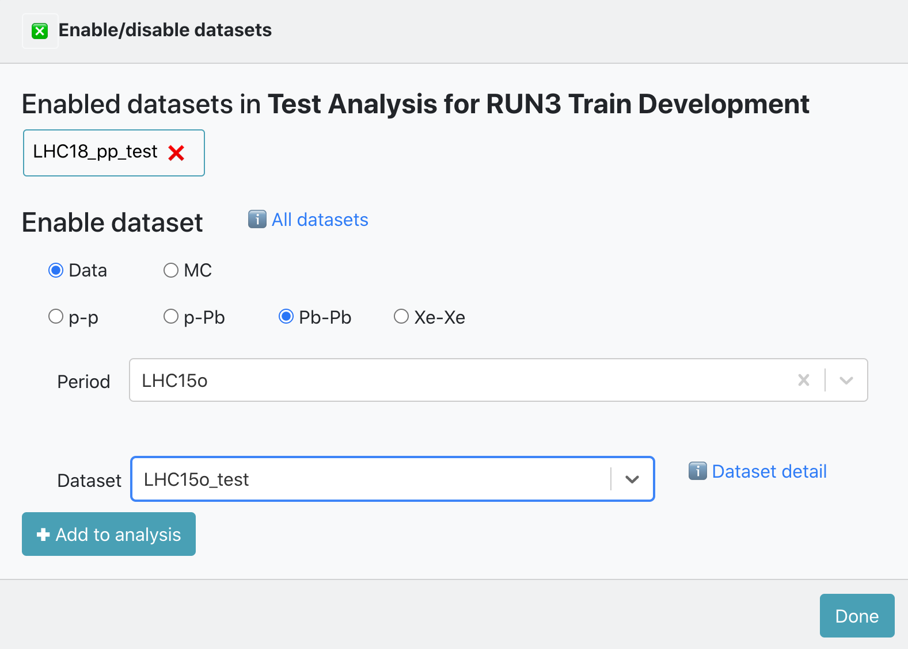
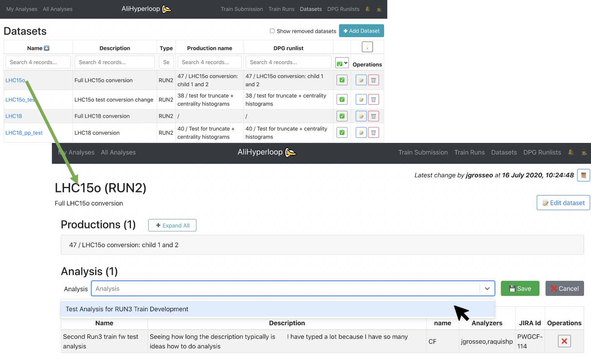
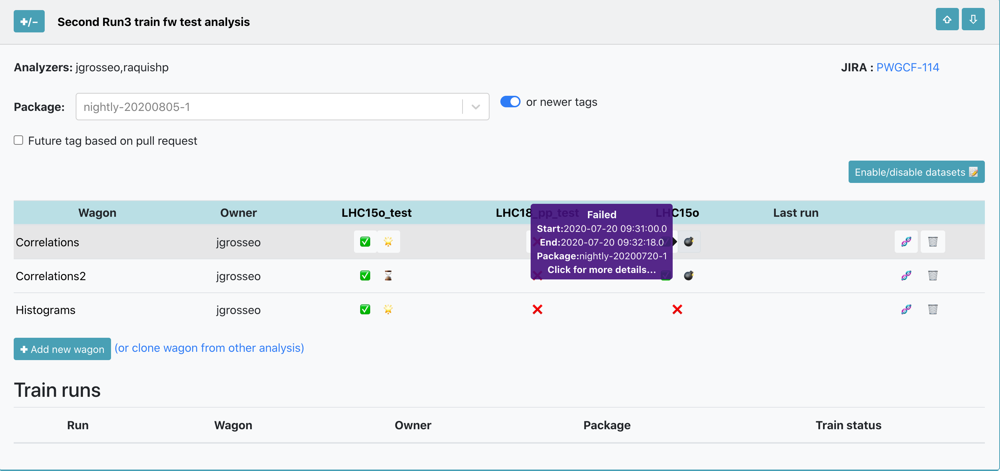
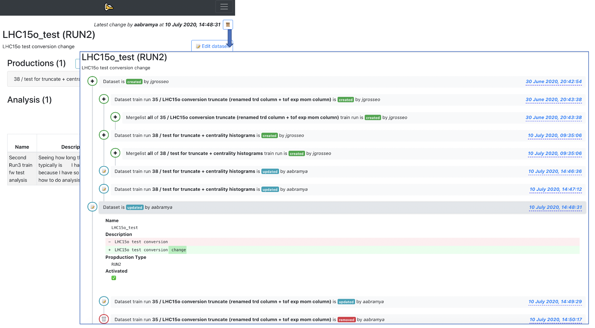

# Hyperloop system

The hyperloop train system is used to submit your analysis in a train to the Grid.

## Preconditions

* Have installed in your browser a <a href="https://alice-doc.github.io/alice-analysis-tutorial/start/cert.html" target="_blank">valid AliEn certificate</a>. If you can access https://alimonitor.cern.ch/hyperloop/ without getting "access denied", then everything is fine.

## Concept

The Hyperloop framework is a tool to run and manage analysis trains on AliEn. It is based on the concept of the LEGO train system used during Run 2. It builds on existing infrastructure, the analysis framework, MonALISA and LPM, and is compatible with O2. If you are a Run 2 train expert, and you don't have much time, you can just jump to this section: [_Run 2 LEGO train expert_](#legoexpert). 

In order to run trains on the Grid, the code has to be contained in an AliEn package. Therefore, the train uses the regularly deployed O2 tags. 
Hyperloop supports Run 3 data and converted Run 2 data. 

Hyperloop provides a web interface for users and operators which allows to:

* register train wagons
* configure trains (wagons, input datasets)
* test the wagons and the train in a well-defined environment
* study the test results
* submit the train to the Grid
* study the resource consumption of the train for each wagon

The views available in the Hyperloop framework are:

* For a user, there is a personalized webpage **My Analyses** which displays all the analyses where the user belongs to. The user can create, configure and enable wagons in this page. 
* In the **All Analyses** page, there is a read only view of all analyses available in the system. 
* For a train operator, the **Train Submission** page displays only datasets which have enabled wagons, and allows train composition, as well as submitting, modifying and killing a train.
* For a train operator, the **Train Runs** page displays all trains available in the system, and allows submitting, modifying and killing a train.
* For a user, the **Datasets** page displays a read view only of all the datasets available in the system. For a train operator, the **Datasets** page allows creation, configuration and deletion of datasets. 
* For the DPG experts, the **DPG Runlists** page allows creation, configuration and deletion of runlists. For the users it offers a read only view of all DPG runlists available in the system.

##  Creating or joining an analysis

The Analyses to which a user belongs to, is defined through a <a href="https://alice.its.cern.ch/jira/secure/Dashboard.jspa" target="_blank">JIRA</a> ticket.
In the JIRA page, create an issue by clicking on the button `Create`, and fill the information with the following parameters:

* In _Project_ select your PWG. 
* In _Summary_ write the name of your _Analysis_.
* In _Components_ select your PAG.
* In _Run 3 analysis_ choose `Yes`.
* In _Analyzers_ select all the users that will be part of this analysis. All the analyzers will have writing permits to all components in the analysis.
* (Optional) In _Description_ give a brief description of the analysis.
The rest of the parameters are not relevant for the Hyperloop train system.

After all the parameters have been set, click on `Create` and your _Analysis_ will be available in the _My Analyses_ and _All Analyses_ page.

The synchronization from JIRA to the Hyperloop train system can take up to 30 minutes.

## My Analyses
### Adding and configuring a wagon to an analysis
##### 1. Adding a new wagon:
Using the _My Analyses_ page, inside of the _Analysis_ you want to add the wagon to, click on `✚ Add new wagon`.

There are 2 parameters required to create a new wagon:
*  Name: The _newWagonName_ has to be unique within an _Analysis_, and it only accepts alphanumerical characters, no spaces.
*  Work flow name: You can either select from a list of _workflow_Names_ from an existing package tag. Or create a _workflow_Name_ which belongs to a [pull request](#pullrequest).

By clicking on `💾 Save` the wagon will be added, and you will be redirected to [_Edit **Wagon**_](#editwagon) where you can modify the wagon's configuration.

##### 2. Cloning a wagon:

*  Using the _My Analyses_ page, click on the button `🧬` to clone a wagon. 

A list of _Analyses_ you belong to will be displayed. You have to select the _Analysis_ where you want to clone the _Wagon_ to, and name the _NewWagon_ (the wagon name has to be unique within _Analysis_). By clicking on `🧬 Clone`, a new wagon will be added with the same configuration, including subwagons, as the _Wagon_.

*  Using the _All Analyses_ page:

You can get to the _All Analyses_ page by using the main menu, or by the link in _My Analyses_ page: `(or clone wagon from other analysis)`. In the _All Analyses_ page, a read only view of all the analyses available in the system will be displayed. Browse and click on the _Analysis_ you want to clone the wagon from, and follow the procedure mentioned above.

#####  3. Edit a wagon:

*  You can edit a wagon by clicking on the _Wagon_ name in the _My Analyses_ page. There are different tabs: Wagon settings, Configuration, Testing Statistics.
*  In _Wagon settings_ you can modify the wagon name, work flow name, and select wagon's dependencies. The dependencies offered are wagons from the same _Analysis_ or from [_Service wagons_](#servicewagons).

* In _Configuration_ the wagon configuration corresponding to the workflow will be available in the _Base_. The configuration is divided per _Task_, hence if you need to add a new parameter, you will need add it in the following order: task, parameter and value.

  
* If you need to run the same workflow, but modify one (or more) of the parameter's value, you can use a subwagon instead of creating a new wagon. In order to create a subwagon, type the name of the new subwagon, the name has to be unique within the wagon, and type the value of at least one parameter in the configuration. The configuration of a subwagon will be kept the same as the _Base_ and overwrite the parameters that are different. When there are subwagons activated, the wagon's _Base_ will not run.

* In order to update the configuration with the latest version of the workflow, click on the button `↻ sync`. By synchronizing the configuration, the parameters which no longer belong to the workflow will be removed, and the values of the wagon's _Base_ will be updated as well if they have not been modified by the user.

### Enabling datasets

#### 1. Using the _My Analyses_ page:

*  Inside of an analysis, click on the button `Enable/disable datasets 📝`. 

*  There is a list of _Enabled datasets in **Analysis**_. You can disable a dataset for that analysis by clicking on the button `❌`.
*  Inside of _Enable dataset_ you can search for an active dataset by filtering by data type, collision system, anchor and period. And add it to your analysis by clicking on the button `✚ Add to analysis`. Or you can click the button `ℹ️ All datasets` to be redirected to the [**Datasets**](#datasets) page.

#### 2.  Using the _Datasets_ page:
*  You can browse and click on the _Dataset_ you want to add to your analysis.

*  Inside of the _Dataset_ view page, click on the button `✚ Add dataset to analysis`. It will display a list of all the analyses you belong to. Select the _Analysis_ you want to add the dataset to, and click on `💾 Save`.

### Enabling a wagon

You can enable a wagon in the _My Analyses_ page. Inside of the _Analysis_ there are the datasets available for that analysis, or you can [_enable/disable_ datasets](#enabledatasets). There are 3 options for enabling a wagon:

  1. Latest package tag: You can select a package tag with the option `or newer`. This means that your wagon can be tested and composed in a train with the package tag chosen or the latest package tag available.
  2. Fixed package tag: You can select a package tag and disable the option `or newer`. This means that your wagon can be tested and composed in a train with that package tag only.
  3. Pull request: Select the option `☑️ Future tag based on pull request`. There will be a list of the latest merged/unmerger pull requests available with their corresponding description. By choosing a pull request, your wagon will be tested as soon as the pull request is merged in a package tag. Then your wagon will be composed in a train with the latest package tag available.
  
 

  After choosing the package tag to be used, click on the button `❌` to enable your wagon in a dataset, the icon will change from `❌` to `✅`. If you hover over `✅` you can see the information about the enabled wagon: package tag, time and username. If you need to disable a wagon in a dataset, click on the button `✅`. After enabled, the wagon will be automatically tested and you can follow the progress of the test on the button next to `✅`: `⌛️` queued,`⏳` ongoing,`🌟` done, `❗️` warning and `💣` failed.
  
  If a wagon has dependencies, there is no need to enable the dependencies as well. The wagon's dependencies will be automatically tested by the system as well.
  
### Service wagons

The _Service wagons_ are wagons which are dependencies to other wagons. They are created by experts, and you can add it as a dependency to your wagon in [edit wagon](#editwagon). 

* For the users, in the _My Analyses_ page, there is a read only view of the _Service Analyses_ available on the top of the page.
* For the experts, if you need to create _Service wagons_, you need to have an analysis with the project type _O2 Hyperloop Service Wagons (OHSW)_ which can be [created in JIRA](#joinanalysis). Once the analysis is created, you can [add a new wagon](#addwagon) inside of the analysis available in _My Analyses_.

### Relation of pull requests

When creating or enabling wagons, you can use a pull request instead of a package tag. By doing this, you don't need to wait until your code has been merged and released in a package tag.

1. [Adding a new wagon](#addwagon): You can create a wagon with your unmerged or unreleased workflow. If the workflow is not available, add manually the configuration of the wagon, and subwagons if needed. You can synchronize the wagon's configuration once the package tag that includes your pull request has been released.
2. [Enabling a wagon in a dataset](#enablewagon): If you need to enable your wagon with workflow that is unmerged or unreleased, use a `Future tag based on pull request`. There is a list of the latest merged and unmerged pull requests available in the system, you can see the pull request number and description. Select the _pull request tag_ and enable the wagon in a dataset. By doing this, the wagon will be queued to test, and the test will begin once the _pull request_ has been merged to a package tag, and the package tag is released. And then, if the test is successful, it'll be composed in a train with the latest package tag available.

## For the Run 2 LEGO train expert. What has changed?

* There are different webpages for users and train operators: 
  1. **My Analyses**, the user will see only _Analyses_ where the user belongs to, this is [defined through JIRA](#joinanalysis). The user has writing permits to all elements in this webpage. 
  2. **All Analyses** is a read only view of all the _Analyses_ available in the system. The only action permitted is [cloning a wagon](#clonewagon). 
  3. **Train Submission** is a webpage designed for operators. It displays only datasets which have enabled wagons, allowing train composition. Submitting, modifying and killing a train is also allowed.
  4. **Train Runs** is a webpage designed for operators. It displays all train runs available in the system. The actions permitted are submitting, modifying and killing a train.
  5. **Datasets**, for the users, it is a read only view of all the _Datasets_ available in the system. For the train operators, it allows creation,configuration and deletion of _Datasets_. The _Datasets_ are directly created from runlists already defined in the _DPG Runlists_ webpage instead of copying from a text file in the twiki page like the LEGO trains. 
  6. **DPG Runlists** is a webpage designed for the DPG. For the DPG experts, it allows creation, configuration and deletion of runlists, instead of defining them in a twiki page. For the users it offers a read only view of all DPG runlists available in the system.

* There is a history feature for wagons and datasets. You can access it by clicking on the button `📜` available inside of a wagon/dataset view. A detailed view of what has been created/updated/removed from the wagon/dataset is shown, as well as the username and the time when the change was made.

* There are automated notifications. These notifications are created per user, and display changes made to tools, like _Datasets_, that are being used by the user. They are displayed per _Analysis_ in the _My Analyses_ page, or globally in the button `🔔` which can be found on the top menu.

* There is an impersonation feature `🕵` that can be used by experts in order to help users if they have a problem with the UI.

* When [enabling a wagon](#enablewagon) in a dataset the user can choose whether to enable it with a fixed package tag, latest package tag or a [pull request](#pullrequest).

* After [enabling a wagon](#enablewagon) in a dataset, the wagon is automatically tested, and the user can follow the test status (`⌛️`,`⏳`,`❗️`,`🌟`,`💣`) in the _My Analyses_ page.
