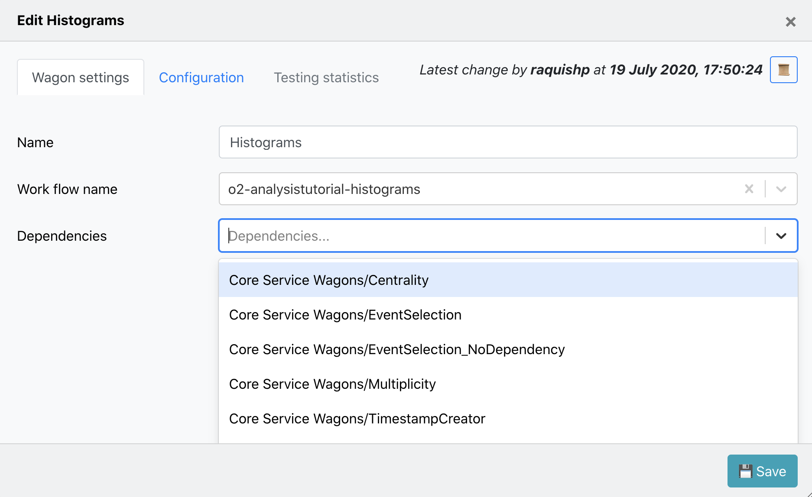

# Hyperloop system

The hyperloop train system is used to submit your analysis in a train to the Grid.

## Preconditions

* Valid AliEn certificate. Please follow the instructions here TODO
* Installed in your browser. Please follow the instructions at TODO

## Concept

## For the Run 2 LEGO train expert. What has changed?
* There are different webpages for users and train operators: 
  1. **My Analyses**, the user will see only _Analyses_ where the user belongs to, this is [defined through JIRA](#joinanalysis). The user has writing permits to all elements in this webpage. 
  2. **All Analyses** is a read only view of all the _Analyses_ available in the system. The only action permitted is [cloning a wagon](#clonewagon). 
  3. **Train Submission** is a webpage designed for operators. It displays only datasets which have enabled wagons, allowing train composition. Submitting, modifying and killing a train is also allowed.
  4. **Train Runs** is a webpage designed for operators. It displays all train runs available in the system. The actions permitted are submitting, modifying and killing a train.
  5. **Datasets**, for the users, it is a read only view of all the _Datasets_ available in the system. For the train operators, it allows creation,configuration and deletion of _Datasets_. The _Datasets_ are directly created from runlists already defined in the _DPG Runlists_ webpage instead of copying from a text file in the twiki page like the LEGO trains. 
  6. **DPG Runlists** is a webpage designed for the DPG. It allows creation, configuration and deletion of runlists, instead of defining them in a twiki page.

* There is a history feature for wagons and datasets. You can access it by clicking on the button `📜` available inside of a wagon/dataset view. A detailed view of what has been created/updated/removed from the wagon/dataset is shown, as well as the username and the time when the change was made.

* There are automated notifications. These notifications are created per user, and display changes made to tools, like _Datasets_, that are being used by the user. They are displayed per _Analysis_ in the _My Analyses_ page, or globally in the button `🔔` which can be found on the top menu.

* There is an impersonation feature `🕵` that can be used by experts in order to help users if they have a problem with the UI.

* When [enabling a wagon](#enablewagon) in a dataset the user can choose whether to enable it with a fixed package tag, latest package tag or a [pull request](#pullrequest).

* After [enabling a wagon](#enablewagon) in a dataset, the wagon is automatically tested, and the user can follow the test status (`⌛️`,`⏳`,`❗️`,`🌟`,`💣`) in the _My Analyses_ page.

##  Creating or joining an analysis

## Adding and configuring a wagon to an analysis
#### 1. Adding a new wagon:
Using the _My Analyses_ page, inside of the _Analysis_ you want to add the wagon to, click on `✚ Add new wagon`.

There are 2 parameters required to create a new wagon:
*  Name: The _newWagonName_ has to be unique within an _Analysis_, and it only accepts alphanumerical characters, no spaces.
*  Work flow name: You can either select from a list of _workflow_Names_ from an existing package tag. Or create a _workflow_Name_ which belongs to a [pull request](#pullrequest).

By clicking on `💾 Save` the wagon will be added, and you will be redirected to [_Edit **Wagon**_](#editwagon) where you can modify the wagon's configuration.

#### 2. Cloning a wagon:

*  Using the _My Analyses_ page, click on the button `🧬` to clone a wagon. 

A list of _Analyses_ you belong to will be displayed. You have to select the _Analysis_ where you want to clone the _Wagon_ to, and name the _NewWagon_ (the wagon name has to be unique within _Analysis_). By clicking on `🧬 Clone`, a new wagon will be added with the same configuration, including subwagons, as the _Wagon_.

*  Using the _All Analyses_ page:

You can get to the _All Analyses_ page by using the main menu, or by the link in _My Analyses_ page: `(or clone wagon from other analysis)`. In the _All Analyses_ page, a read only view of all the analyses available in the system will be displayed. Browse and click on the _Analysis_ you want to clone the wagon from, and follow the procedure mentioned above.

####  3. Edit a wagon:

*  You can edit a wagon by clicking on the _Wagon_ name in the _My Analyses_ page. There are different tabs: Wagon settings, Configuration, Testing Statistics.
*  In _Wagon settings_ you can modify the wagon name, work flow name, and select wagon's dependencies. The dependencies offered are wagons from the same _Analysis_ or from [_Service wagons_](#servicewagons).

* In _Configuration_ the wagon configuration corresponding to the workflow will be available.

## Enabling datasets

### 1. Using the _My Analyses_ page:

*  Inside of an analysis, click on the button `Enable/disable datasets 📝`. 

*  There is a list of _Enabled datasets in **Analysis**_. You can disable a dataset for that analysis by clicking on the button `❌`.
*  Inside of _Enable dataset_ you can search for an active dataset by filtering by data type, collision system, anchor and period. And add it to your analysis by clicking on the button `✚ Add to analysis`. Or you can click the button `ℹ️ All datasets` to be redirected to the [**Datasets**](#datasets) page.

### 2.  Using the _Datasets_ page:
*  You can browse and click on the _Dataset_ you want to add to your analysis.

*  Inside of the _Dataset_ view page, click on the button `✚ Add dataset to analysis`. It will display a list of all the analyses you belong to. Select the _Analysis_ you want to add the dataset to, and click on `💾 Save`.

## Enabling wagon

## Service wagons

## Relation of pull requests

